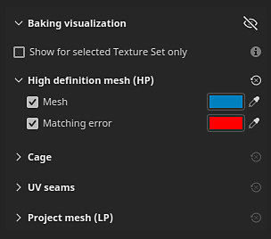

# Configuración de visualización de horneado

La visualización Horneado es un panel dentro del área de visualización de Painter en el modo Horneado. Permite ajustar la configuración relacionada con la visualización de mallas en la ventana gráfica.

## Configuración general

| Configuración | Descripción |
| --- | --- |
| **Ocultar mallas para hornear** | Si se habilita, este icono ocultará la malla alta de la caja y de la caja en la ventana gráfica. 

 |
| **Mostrar solo para conjunto de texturas seleccionado** | Si se activa, solo se podrán ver en la ventana gráfica las mallas de jaula y alta poly del conjunto de texturas activo actualmente. |

### Malla de alta definición (HP)

| Configuración | Descripción |
| --- | --- |
| <b>Malla</b> | Si se activa, se muestran las mallas de alta densidad en la vista 3D. Cuando están desactivadas, las mallas de alta densidad también se descargan de la memoria y pueden ayudar a mejorar el rendimiento. Utilice la opción de color junto a este ajuste para controlar el color de la superficie de malla en la ventana gráfica. |
| <b>Error coincidente</b> | Si está activado, muestra las áreas de las mallas de alto contenido de poli que se encuentran fuera del shell de la malla de la jaula en el color dado. Esta configuración ayuda a identificar las áreas que se perderán durante el proceso de cocción y que podrían provocar la pérdida de detalles o información. Utilice la opción de color junto a este ajuste para controlar el color de las áreas de intersección en la ventana gráfica. |

### Jaula

| Configuración | Descripción |
| --- | --- |
| <b>Superficie de la jaula</b> | Si se activa, la superficie de malla de la jaula se mostrará en la vista 3D. La superficie de la jaula se define mediante el botón de color situado junto al ajuste. |
| <b>Opacidad de la superficie de la jaula</b> | Haga que la malla sea más o menos transparente para administrar la visibilidad de los detalles en la malla subyacente. |
| <b>malla metálica de jaula</b> | Si se activa, la malla metálica de la malla de la jaula será visible en el área de visualización. El color de la malla metálica se puede ajustar con el botón de color situado junto a este ajuste. |
| <b>Opacidad de la malla metálica de jaula</b> | Hacer la malla metálica más o menos transparente. |

### Dobleces de UV

| Configuración | Descripción |
| --- | --- |
| <b>Faltan costuras en los bordes duros</b> | Si se activa, los bordes duros de la superficie de la malla que no sean costuras UV se resaltarán con el color definido por el botón junto al ajuste. Los bordes resaltados solo son visibles en la jaula y en la malla de baja polietileno. Los bordes se pueden ver en las vistas 2D y 3D. Este ajuste ayuda a identificar los bordes que tienen vértices normales divididos sin una costura de desenvolvimiento UV, lo que podría provocar problemas de horneado más adelante. |

### Malla del proyecto

<table data-preserve-html="true">
<colgroup><col/><col/><col/></colgroup><tbody><tr><th scope="col">Configuración</th>
<th scope="col">Configuración secundaria</th>
<th scope="col">Descripción</th>
</tr><tr><td><b>Malla del proyecto</b></td>
<td> </td>
<td>
Si se activa, las mallas de bajo contenido de poli sobre las que se cuecen las mallas de alto contenido de polietileno se podrán ver en la ventana gráfica. Si <b>Ocultar mallas horneadas</b> está habilitado, esta configuración también se habilita automáticamente para evitar una ventana gráfica vacía.

Utilice la opción de color junto a este ajuste para ajustar el color de la malla del proyecto.

</td>
</tr><tr><td rowspan="7"><b>Material neutro</b></td>
<td><b>Calidad</b></td>
<td>Controla la calidad del reflejo del specular en la superficie de la malla de baja polimerización. El uso de un valor alto proporcionará una mayor fidelidad en los reflejos, pero un valor alto puede afectar al rendimiento. Un valor bajo puede introducir costuras en el sombreado con mapas normales (Nota: esto es solo un problema de visualización).</td>
</tr><tr><td><b>Rugosidad</b></td>
<td>Controla la rugosidad del material de malla de baja densidad en las ventanas gráficas.</td>
</tr><tr><td><b>Metálico</b></td>
<td>Controla la metalidad del material de malla de baja polietileno en las ventanas gráficas.</td>
</tr><tr><td><b>Intensidad OA</b></td>
<td>Controla en qué medida la Oclusión ambiente horneada contribuye al sombreado de malla de bajo contenido de poli en la ventana gráfica.</td>
</tr><tr><td><b>Normal doblada</b></td>
<td>Si está activada, utilice las normales de doblado al horno para mejorar el sombreado de malla de baja densidad en la ventana gráfica.</td>
</tr><tr><td><b>Cantidad de difusión de normal doblada</b></td>
<td>Controla en qué medida las normales de doblado afectan al sombreado difuso.</td>
</tr><tr><td><b>Cantidad especular de normal doblada</b></td>
<td>Controla en qué medida afectan las normas dobladas al sombreado del specular.</td>
</tr></tbody></table>
