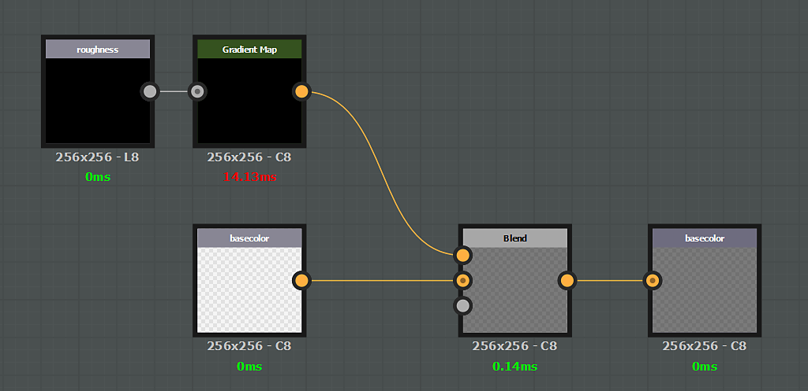

# Filtro específico del canal

Un efecto puede ser específico de un canal determinado. En ese caso, si desea afectar a un canal específico, debe crear una entrada Y una salida que identifique este canal. Como regla general, la estructura de entrada / salida siempre debe respetar una regla 1:1. Si desea introducir un canal específico, debe generar la salida del mismo canal.

Ejemplo de un filtro que afecta solo al canal **basecolor** :

>[!NOTE]
>
> No es posible combinar la configuración genérica (nodos de entrada/salida) y canales específicos (basecolor/basecolor).

## Administración de componentes de Alpha

Los canales almacenados como RGBA admiten alfa (color base, por ejemplo). Para estos canales, la entrada/salida alfa se puede almacenar directamente en la salida de color del Substance. Sin embargo, el motor del Substance no admite el Alpha para imágenes en escala de grises: debe gestionarse mediante un mapa secundario. Para obtener el componente alfa de un canal específico en un gráfico de sustancias, cree una entrada de escala de grises denominada &#39;**channelname\_Alpha**&#39;, como por ejemplo: **basecolor\_Alpha**, **roughness\_Alpha**, etc.\
Para generar la salida de este componente alfa, cree un nodo de salida con la convención del mismo nombre.

>[!NOTE]
>
> La salida específica de &quot;**\_Alpha**&quot; por canal no funciona con **materiales** normales. Para ocultar un canal con una máscara, se debe crear una salida específica con la siguiente convención de nomenclatura :
> 
> * Identificador : **canales\_Alpha**
> * Uso : **canales\_Alpha**

## Lista de usos e identificadores de entrada/salida

>[!NOTE]
>
> Es posible usar **usage** o **identifier** en un nodo de entrada (el uso tiene la prioridad).

| Nombre del canal | Uso | Alpha de identificador/identificador |
| --- | --- | --- |
| *Oclusión de ambiente* | **ambientOcclusion** | **ambientOcclusion / ambientOcclusion\_Alpha** |
| *Ángulo de Anisotropía* | **anisotropiángulo** | **anisotropyAngle / anisotropyAngle\_Alpha** |
| *Nivel de Anisotropía* | **anisotropylevel** | **anisotropyLevel / anisotropyLevel\_Alpha** |
| *Color base* | **basecolor** | **baseColor / baseColor\_Alpha** |
| *Máscara de fusión* | **fusionando máscara** | **blendingmask / blendingmask\_Alpha** |
| *Difusión* | **difusa** | **difusa / difusa\_Alpha** |
| *Desplazamiento* | **desplazamiento** | **desplazamiento / desplazamiento\_Alpha** |
| *Emissive* | **emisor** | **emisor / emisor\_Alpha** |
| *Brillo* | **brillo** | **brillo / brillo\_Alpha** |
| *Height* | **height** | **height / height\_Alpha** |
| *IOR* | **ior** | **ior / ior\_Alpha** |
| *Metálico* | **metálico** | **metálico / metálico\_Alpha** |
| *Normal* | **normal** | **normal / normal\_Alpha** |
| *Opacidad* | **opacidad** | **opacidad / opacidad\_Alpha** |
| *Reflejo* | **reflejo** | **reflejo / reflejo\_Alpha** |
| *Rugosidad* | **rugosidad** | **rugosidad/rugosidad\_Alpha** |
| *Dispersión* | **dispersión** | **dispersión / dispersión\_Alpha** |
| *Specular* | **specular** | **specular / specular\_Alpha** |
| *Specular level* | **nivel especular** | **specularLevel / specularLevel\_Alpha** |
| *Transmisivo* | **transmisivo** | **transmisivo / transmisivo\_Alpha** |
| *Usuario 0* | **usuario0** | **usuario0 / usuario0\_Alpha** |
| *Usuario 1* | **usuario1** | **usuario1 / usuario1\_Alpha** |
| *Usuario 2* | **usuario2** | **usuario2 / usuario2\_Alpha** |
| *Usuario 3* | **usuario3** | **usuario3 / usuario3\_Alpha** |
| *Usuario 4* | **usuario4** | **usuario4 / usuario4\_Alpha** |
| *Usuario 5* | **usuario5** | **usuario5 / usuario5\_Alpha** |
| *Usuario 6* | **usuario6** | **usuario6 / usuario6\_Alpha** |
| *Usuario 7* | **usuario7** | **usuario7 / usuario7\_Alpha** |

## Ejemplos

{width="650px"}

En este ejemplo, el canal alfa Color base se extrae mediante un nodo de escala de grises para sobrescribir el canal **Roughness**.

{width="650px"}

En este ejemplo, el canal **Roughness** se multiplica por el **color base**.
