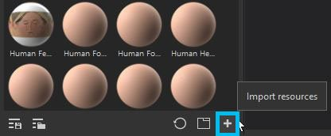

# Adición de recursos mediante la ventana de importación

## Abrir la ventana de importación

Hay tres formas diferentes de abrir la ventana de importación en Substance 3D Painter:

* Mediante **Archivo > Importar recursos...Entrada de menú**

* Mediante el **botón dedicado** en la ventana Activos

* A través de **arrastrar y soltar** de uno o más archivos o carpetas en la ventana Activos

{width="700px"}

## Configuración de la ventana de importación

* **1 - Agregar recursos**: Permite seleccionar archivos adicionales para importar, lo que los agregará a la lista que se muestra en la ventana Importar.
* **2 - Quitar recursos seleccionados:** Quita los archivos seleccionados en la lista.
* **3 - Filtro desplegable**: Permitir filtrar la lista de archivos por uso. Esto resulta útil para aislar recursos que tienen el tipo &#39;undefined&#39;.
* **4 - Uso** : Hay varios tipos de uso diferentes disponibles. La lista de usos propuestos puede cambiar según el formato de archivo que esté importando. El uso se puede preseleccionar para el archivo si el formato de archivo solo tiene un tipo de uso (por ejemplo, los ajustes preestablecidos de Painter .sppr se definirán automáticamente como tales) O si su creador lo ha predefinido en el gráfico original de Designer.
* **5 - Prefijo** : El prefijo puede ser una ruta de carpeta para definir dónde almacenar un recurso.
* **6 - Nombre de archivo** : Nombre del recurso actual. A veces se puede indicar la carpeta donde se almacenó el recurso, esta información no se utilizará durante el proceso de importación.
* **7 - Ubicación de importación** : Puede ser cualquiera de:
  * **Sesión actual** : En una sesión temporal, los recursos se perderán después de reiniciar la aplicación.
  * **Nombre del proyecto**: En el archivo de proyecto abierto actualmente. Los recursos están incrustados en el archivo **spp**.
  * **Estante &quot;nombre de estante&quot;** : En la biblioteca actual definida como editable. Consulte esta página para obtener más información : [Configuración de bibliotecas](../../interface/settings/libraries-configuration.md).

Puede seleccionar varios recursos en la ventana de importación (utilizando los métodos abreviados del sistema habituales) para editar rápidamente su uso.
