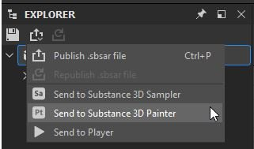

# Recepción de recursos desde otras aplicaciones de Substance 3D

A partir de la versión 7.2.0, también puede recibir y actualizar recursos enviados desde Designer y Sampler a través de la función Enviar a. Como para esto necesita poder acceder a Sampler y Designer, esta función solo está disponible si utiliza Painter mediante Substance 3D Texturing o Substance 3D Collection.

Una vez que se envíe el recurso, aparecerá en el panel Recursos de Painter y se importará a la ubicación predeterminada de la biblioteca en el disco. También puedes **actualizar** los activos enviados si has realizado algún cambio en Designer o Sampler **en la misma sesión** (siempre y cuando no se haya cerrado ninguna de las aplicaciones).

## Envío de un recurso de Designer a Painter

1. En el panel Explorador, seleccione el paquete principal.
1. Haga clic en el menú desplegable de Publish (también puede hacer clic con el botón derecho en el paquete principal).
1. Seleccione la opción **Enviar a Substance 3D Painter** (se iniciará automáticamente Painter si aún no está abierto).
1. El activo enviado aparecerá en la ventana Activos.

## Envío de un recurso de Sampler a Painter

1. En la barra de herramientas del lado derecho, abra el panel Compartir.
1. Haz clic en **Enviar a Substance 3D Painter** (se iniciará automáticamente Painter si aún no está abierto).
1. El activo enviado aparecerá en la ventana Activo.

