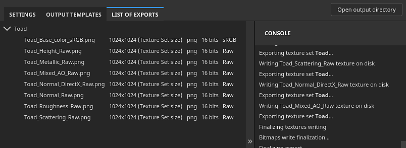

# Lista de exportaciones

{width="550px"}

La <b>Lista de la pestaña de exportación </b>de la <b>ventana de exportación </b>muestra las texturas exportadas de cada conjunto de texturas, con una consola que indica el estado de la exportación, incluidos los mensajes de error.
