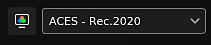

# Gestión de colores

La gestión de color consiste en el manejo y la conversión de colores. Desde importar recursos a mostrar colores en pantalla para finalmente exportar texturas. La calibración del color es importante para garantizar el mismo aspecto en todas las aplicaciones.

En la aplicación, la administración del color se controla mediante la integración de [OpenColorIO](https://opencolorio.org/) (OCIO para abreviar) versión 2. OCIO es el estándar en películas y animación para convertir y mostrar colores. Para activar la gestión de color, solo tiene que crear un nuevo proyecto o abrir uno existente y activar la configuración dedicada.

>[!NOTE]
>
> La gestión de color está disponible desde la versión 7.4.0.

## Configuración del proyecto

Ajustes de gestión de color:

* [Gestión de color con Adobe ACE - ICC](color-management-with-adobe-ace-icc.md)
* [Gestión de color con OpenColorIO](color-management-with-opencolorio.md)

## Vocabulario

Puede resultar útil conocer algunos términos técnicos relacionados con la gestión de color para comprender mejor el flujo de trabajo asociado:

| Palabra clave | Descripción |
| --- | --- |
| **Espacio de color** | Sistema de coordenadas en el que se definen los colores. |
| **Espacio de trabajo** | Espacio de color utilizado dentro de la aplicación para fusionar texturas, pintura, etc. |
| **Mostrar transformación** | Transformar visualización convierte los colores lineales del espacio de trabajo al espacio de color del monitor para mostrar los colores de forma perceptual (para que los vean los ojos humanos). Las transformes de visualización a menudo incluyen una pasada de asignación de tonos para comprimir colores para que se ajusten al rango limitado de valores permitido por una pantalla. |
| **Configuración** | Un archivo de configuración de OCIO. Define qué es el espacio de trabajo, una lista de espacios de color y una lista de transformaciones de visualización. |
| **ACE** | ACE significa Academy Color Encoding System y es el estándar en muchas aplicaciones para intercambiar archivos de imagen digital. Dos versiones de este estándar se incluyen dentro de la aplicación de forma predeterminada. |
| **Asignación de tonos** | Es el proceso de asignar valores de color de HDR. (alto rango dinámico) a LDR (rango dinámico bajo). Este proceso ayuda a mostrar aproximadamente la visualización de una amplia gama de colores. |

## Lista de canales con gestión de color

Dentro de la aplicación, los canales que tienen o no gestión de color (datos/passthrough) están predefinidos.

| Canal | Se gestiona el color |
| --- | --- |
| **Oclusión ambiental** | No |
| **Ángulo de anistotropía** | No |
| **Nivel de anisotropía** | No |
| **Color base** | **Sí** |
| **Máscara de fusión** | No |
| **Color de capa** | **Sí** |
| **Normal de capa** | No |
| **Opacidad de capa** | No |
| **Rugosidad de capa** | No |
| **Nivel especular de capa** | No |
| **Difuso** | **Sí** |
| **Desplazamiento** | No |
| **Brillo** | No |
| **Height** | No |
| **Ior** | No |
| **Metálico** | No |
| **Normal** | No |
| **Opacidad** | No |
| **Reflejo** | No |
| **Rugosidad** | No |
| **Dispersión** | No |
| **Color de dispersión** | **Sí** |
| **Color de brillo** | **Sí** |
| **Opacidad de brillo** | No |
| **Rugosidad de brillo** | No |
| **Specular** | **Sí** |
| **Specular edge color** | **Sí** |
| **Specular level** | No |
| **Translucidez** | No |
| **Transmisivo** | **Sí** |
| **Usuario X (0-15)** | Depende de la configuración de [Conjunto de texturas](../../interface/texture-set/texture-set-settings.md). De forma predeterminada, los canales de usuario no tienen gestión de color. 

 |

## Selector de color

Cuando la administración de color está habilitada, el comportamiento del [selector de color](../../interface/color-picker.md) cambia ligeramente:

* Los colores se editan en función de la visualización actual seleccionada.
* Se añade información adicional a la interfaz.

Para obtener más información, consulte la [página de documentación](../../interface/color-picker.md) del selector de color.

## Controles de ventana

Las vistas 2D y 3D tienen gestión de color y disponen de una configuración específica en la parte superior de la ventana gráfica para controlar qué visualización transforma a usar:

* **Botón izquierdo**: Active o desactive el transformo de visualización de la ventana gráfica. Si está desactivada, la ventana gráfica mostrará los colores como RAW/passthrough. Este botón está activado de forma predeterminada.
* **Menú desplegable derecho**: Especifique el transforme de visualización que se utilizará para convertir los colores y mostrarlos en la pantalla. El valor predeterminado se basa en la configuración de OCIO. Esta configuración no se guarda con el proyecto, ya que puede depender del monitor.

>[!NOTE]
>
> En el modo solo (visualización de canales individualmente), la gestión de color se desactiva automáticamente al visualizar canales de datos (consulte la lista anterior).

## Ajustes de exportación

La configuración del proyecto controla los ajustes de exportación principales (consulte la información anterior).

Dentro de la ventana [exportar texturas](../../export/export.md) hay una palabra clave que se puede usar para anexar a los nombres de archivo el espacio de color usado por textura: **$colorSpace**.

<table>
<tr style="border: 0;">
<td style="border: 0;" valign="top">

{width="320px"}

</td>
<td style="border: 0;" valign="top">

{width="500px"}

</td>
</tr>
</table>

## Anulación de espacios de color

Puede ser necesario especificar un espacio de color alternativo para que un recurso difiera de los valores predeterminados. Esto se puede realizar mediante el menú de espacio de color.

### Cambio del espacio de color de un recurso

Dentro de la [ventana de propiedades](../../interface/properties.md) es posible reemplazar el espacio de color de un recurso específico (donde se usa actualmente).

Para ello, expanda la sección de espacio de color y utilice el menú desplegable para especificar el nuevo espacio de color:

### Cambio del espacio de color del mapa de entorno

Dentro de la [configuración de visualización](../../interface/display-settings/display-settings.md), habilita el espacio de color **Anular mapa de entorno** y, a continuación, elige un espacio de color en la lista que coincida con tu recurso.

