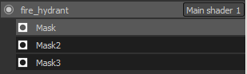

# Control dinámico de capas de materiales

{width="450px"}

**Control dinámico de capas de materiales** es un flujo de trabajo específico en el que los materiales genéricos se mezclan dentro de un sombreado en lugar de en una sola textura. La principal ventaja de este flujo de trabajo es que la fusión es dinámica y permite controlar y conservar un cierto nivel de calidad aplicando mosaicos a los materiales genéricos dentro del sombreador. Si bien los materiales son genéricos, las máscaras utilizadas para mezclar los materiales son específicas de la malla y, por lo tanto, no se repiten.

{width="400px"}

Para habilitar el flujo de trabajo de capas de material, se necesita un sombreado específico.\
El sombreador &quot;**pbr-material-layering**&quot; incluido de forma predeterminada en Substance 3D Painter permite fusionar 4 materiales con 3 máscaras.

## Pilas de subcapas

En este sombreador, las subpilas se pueden definir y el sombreador puede muestrear directamente. Ejemplo con el sombreado &quot;pbr-material-layering&quot; incluido con Substance 3D Painter :

```
//: stacks [ 

//:   { 

//:     "id": "Mask", 

//:     "channels": [ 

//:   {"id": "opacity"} 

//:  ] 

//:   }, 

[...] 

//: ]
```


 En este ejemplo, el sombreador creará 3 subpilas en un conjunto de texturas determinado con un canal de &quot;opacidad&quot; en cada una. Se puede acceder a las subpilas en la ventana de lista TextureSet :

Dado que los **canales** de las pilas de subcapas están definidos **en el sombreador** , es imposible agregar nuevos canales en la configuración del conjunto de texturas. Para añadir o quitar un canal, es necesario actualizar el archivo de sombreado.

El número máximo de canales admitidos se define por el número total de muestras admitidas por el hardware.\
Aunque Substance 3D Painter admite texturas sin enlace (y, por lo tanto, una cantidad ilimitada de texturas) para materiales cargados como parámetros, los canales que proporciona el motor para las pilas de capas se limitan a 32 (en Windows). Este límite también incluye otras texturas, como la Normal y la Oclusión Ambiental horneada en la malla del proyecto.

## Entradas de materiales

Aunque es posible configurar subpilas para definir materiales además de máscaras, a menudo es más práctico definir solo las entradas de material en el sombreador y utilizar materiales directamente desde el estante. La mayoría de las veces estos materiales también existen en la aplicación final como Unity o Unreal Engine 4. La convención de nomenclatura para declarar materiales es similar a la siguiente en el sombreado &quot;pbr-material-layering&quot; :

```
//: materials [ 

//:   { 

//:      "id": "Material1", 

//:      "label": "Material 1", 

//:      "default": "", 

//:      "size": 1024, 

//:      "default_color": [0.5, 0.5, 0.5] 

//:   }, 

[...] 

//: ]
```


 Este es el resultado cuando se han cargado algunos materiales (materiales de Substance o ajustes preestablecidos de materiales) :

La resolución del material se puede definir con el parámetro &quot;size&quot;. También es posible cargar materiales de forma predeterminada cuando el sombreado se crea con el parámetro &quot;predeterminado&quot; (utilizando el nombre o la etiqueta del recurso que se debe cargar).

Para acceder a los materiales y a la máscara en el sombreador en sí, simplemente conéctelos con la palabra clave &quot;param auto&quot; :

```
//: param auto Material1.channel_basecolor 

uniform sampler2D color1; 

 

//: param auto Mask.channel_opacity 

uniform sampler2D mask;
```


En este flujo de trabajo específico, la parte más importante son los parámetros de máscara y sombreado. Por lo tanto, en la ventana de exportación de Substance 3D Painter, se recomienda habilitar el ajuste &quot;**Exportar parámetros de sombreado**&quot;. Esto creará un archivo **JSON** en el disco junto a las texturas que contendrán información sobre la configuración de las subpilas, los materiales utilizados y los sombreadores y sus parámetros. Parámetros Exportación e importación

Por el momento, no se admite el empaquetado de máscaras en una sola textura durante la exportación. Sin embargo, una solución sencilla sería utilizar las funciones de secuencias de comandos y llamar a Herramientas por lotes de Substance para realizar el empaquetado con un Substance.


Este archivo JSON se puede utilizar para configurar las pilas de capas y los sombreadores de un proyecto.\
Esto permite hacer de un lado a otro entre varias aplicaciones fácilmente compartiendo parámetros comunes.


