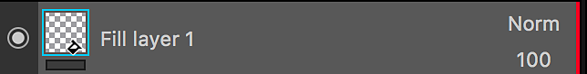
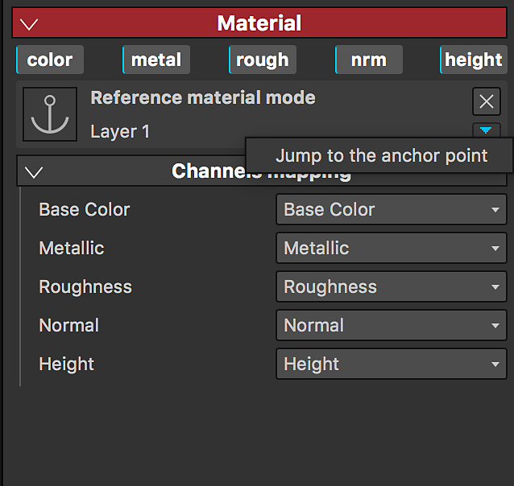

# Punto de anclaje

Un punto de ancla es una forma de exponer cualquier recurso o elemento de la pila de capas y hacer referencia a él en diferentes áreas de la pila de capas para diferentes propósitos y con un conjunto diferente de ajustes. Te abren todo un nuevo conjunto de posibilidades, te permiten enlazar de forma eficaz capas o máscaras y hacer que un solo punto de ancla afecte a varios aspectos de tu proyecto, lo que transforma a Substance 3D Painter en una experiencia verdaderamente no lineal.

>[!NOTE]
>
> Solo se puede hacer referencia a un punto de ancla dentro de la misma textura que se ha creado. La creación de vínculos entre un anclaje y sus referencias no es posible en los conjuntos de texturas.

## Adición de un punto de ancla

Punto de anclaje está disponible en el menú Efectos. Se pueden añadir en capas y máscaras.

## Uso de un punto de ancla como referencia

Otra capa puede hacer referencia a un punto de ancla: esto creará una instancia del contenido del punto de ancla en la capa que hace referencia a él.

Los puntos de ancla se pueden utilizar como referencia en los siguientes recursos:

* Capa de relleno
* Efecto de relleno
* Entrada de un filtro de substancia (Efecto, Procedimiento, Generador)

Solo se pueden usar como referencias los puntos de ancla que estén **debajo** de la capa que hace referencia a ella.\
Si mueve un punto de ancla por encima de una capa que haga referencia a él, se romperá la referencia. Puede deshacer esta acción si desea cancelarla.

## Búsqueda de referencias para un punto de ancla

Al hacer clic en un punto de ancla, puede ver en las propiedades la lista de capas en las que este punto de ancla se utiliza como referencia.

## Buscar un punto de ancla

Cuando utilice una capa/efecto de relleno con un punto de ancla como referencia, puede saltar al punto de ancla.

