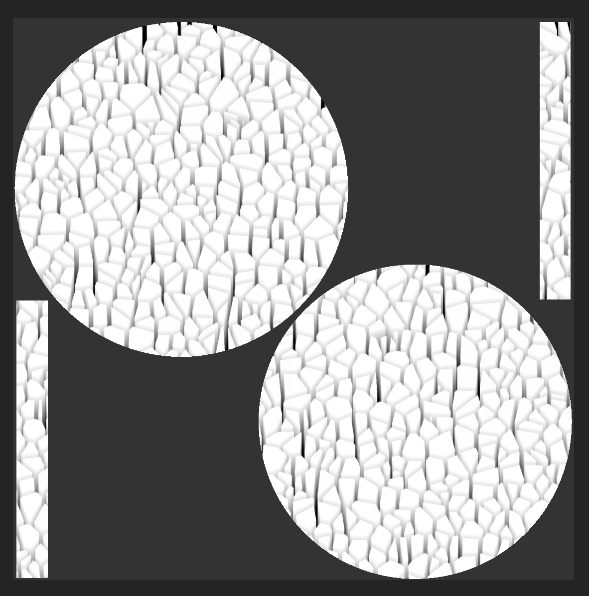

# Distancia direccional

<table>
  <tr style="border: 0;">
    <td style="border: 0;" valign="top"> <strong>En:</strong> Efectos/color, distancia, dirección, fuga, lluvia</td>
    <td style="border: 0;" valign="top">Descripción El filtro de Distancia direccional crea un degradado de distancia que se desplaza en la dirección elegida. Se usa en una capa de textura para crear rayas direccionales, fugas y otros efectos basados en la distancia. También puede utilizar el filtro de Distancia direccional como máscara para que el canal de height añada dimensionalidad a su canal normal.</td>
  </tr>
</table>

## Entradas

| Nombre de entrada | Descripción |
| --- | --- |
| **Mapa de distancia:** Escala de grises | Utilice una textura personalizada o un punto de ancla. |

## Parámetros

| Nombre del parámetro | Descripción |
| --- | --- |
| **Distancia:** | Ajuste la distancia recorrida por el degradado de distancia en el espacio de imagen normalizado, donde 1 es la longitud del lado más corto de la imagen de entrada. |
| **Ángulo:** | Ajuste la dirección del degradado de distancia por turnos, donde 0 puntos horizontalmente a la derecha o a lo largo de un vector (1,0). |
| **Contraste:** | Ajuste el contraste o la atenuación del resultado. |
| **Multiplicador de Mapa de distancia:** | Ajuste cuánto afecta el Mapa de distancia a la distancia máxima. Este parámetro no tiene efecto cuando la entrada de Mapa de distancia no está conectada. |

## Ejemplos

En el ejemplo siguiente, usamos el filtro de Distancia direccional para hacer que el generador de Celdas 2 aparezca en 3 dimensiones.

Esto se consigue creando una capa de relleno con el canal de height activado y establecido en el valor 1.

Después, añade una máscara negra a la capa de relleno y, en la máscara, añade un relleno con la escala de grises establecida en **Celdas 2**. Esto crea la siguiente máscara.

>[!NOTE]
>
> Puedes ver la máscara en la **Ventana gráfica** manteniendo presionada la tecla Alt y haciendo clic en el icono de máscara, o con la capa de relleno seleccionada, usa el menú desplegable del canal en la **Ventana gráfica** para seleccionar **Máscara**.

A continuación, añada un filtro a la máscara y seleccione el filtro de Distancia direccional.

Ajuste la configuración de Filtro para obtener el resultado deseado, pero la máscara debe tener un aspecto similar al del ejemplo siguiente.

Vuelva a la vista de material para ver el efecto en la ventana gráfica.
