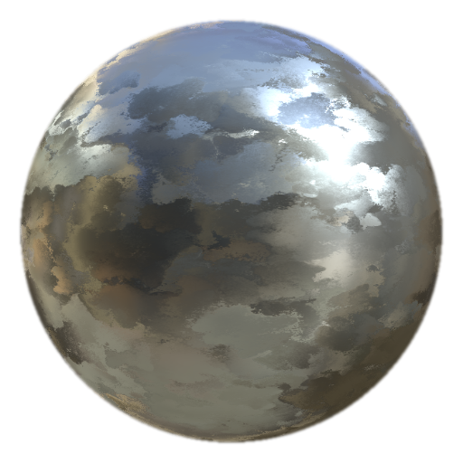

# Acabado mate galvanizado

<table>
<tr style="border: 0;">
<td width="33.33%" style="border: 0;" valign="top">

<b>En:</b> Efectos/acabado, superficie

</td>
<td width="100.00%" style="border: 0;" valign="top">

## Descripción

El filtro galvanizado MatFinish forma parte de una colección de acabado metálico y se utiliza para crear un efecto de metal galvanizado.

Se utiliza en una capa de relleno. Ajuste el color, la rugosidad, el metal y otras propiedades de la capa de relleno base y, a continuación, añada el filtro para el tratamiento de superficie final.

</td>
</tr>
</table>

## Entradas

| Nombre de entrada | Descripción |
| --- | --- |
| Escala de grises <b>Custom Flake:</b> | Utilice una textura de copos personalizada o un punto de ancla. |
| <b>Posición:</b> Color | Utilice el mapa de posición hecha un bake. |
| <b>Normales del espacio mundial:</b> Color | Utilice el mapa hecho un bake de las normas espaciales mundiales. |

## Parámetros

| Nombre del parámetro | Descripción |
| --- | --- |
| <b>Raíz:</b> | Asigne un valor aleatorio para crear una variación diferente sin cambiar la configuración general. |
| <b>Escala:</b> | Ajuste la escala global del acabado. |
| <b>Intensidad de los copos:</b> | Ajusta la intensidad de los copos. |
| <b>Usar volante personalizado:</b> | Alternar el uso de una textura de copos personalizada. |
| <b>Asignación triplanar:</b> | Alternar asignación triplanar. |

