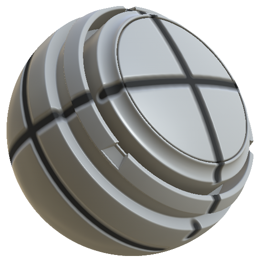

# Línea de cierre MatFX

<table>
<tr style="border: 0;">
<td width="33.33%" style="border: 0;" valign="top">

<b>En:</b> Efectos/desenfoque, escala de grises

</td>
<td width="100.00%" style="border: 0;" valign="top">

## Descripción

El filtro Línea de corte MatFX crea detalles de línea de panel o de costura en un material.

Se utiliza en capas de textura o pilas de materiales para añadir líneas cerradas, costuras repujadas y detalles de height y color de apoyo.

</td>
</tr>
</table>

## Parámetros

| Nombre del parámetro | Descripción |
| --- | --- |
| <b>Ancho de cavidad:</b> | Ajuste la anchura de la cavidad. |
| <b>Intensidad de Pendiente:</b> | Ajusta la intensidad del efecto de pendiente. |
| <b>Fuerza de Relieve:</b> | Ajuste la intensidad del relieve. |
| <b>Intensidad de Height:</b> | Ajusta la intensidad del efecto height. |

### Material

| Nombre del parámetro | Descripción |
| --- | --- |
| <b>Color de línea:</b> | Ajustar el color de la línea. |
| <b>Opacidad del material de origen:</b> | Ajuste la opacidad del material de origen. |
