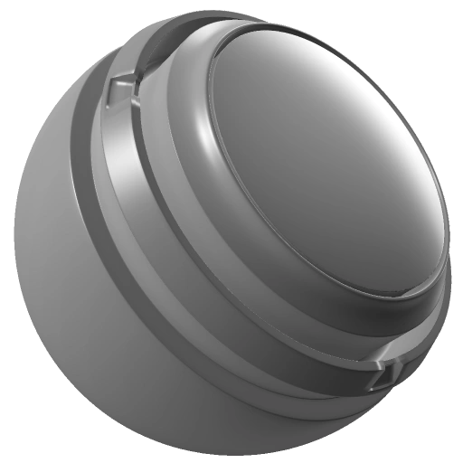

# Distancia 3D

<table>
  <tr style="border: 0;">
    <td style="border: 0;" valign="top"> <strong>En:</strong> máscara, generador</td>
    <td style="border: 0;" valign="top"><strong>Descripción</strong> El generador de distancia 3D define un punto en el espacio 3D (punto de origen) y muestra la distancia desde ese punto con un degradado monocromo. Las áreas de la superficie de la malla más cercanas al punto son más oscuras y las más alejadas son más claras (de forma predeterminada).  Se requiere un mapa de posición hecho un bake como entrada de imagen. <a href="../../../baking/baking.md">Obtenga más información sobre cómo hacer un bake aquí</a>.  La distancia 3D genera una textura monocromática (en blanco y negro). Por lo tanto, resulta útil para generar máscaras que creen un degradado lejos de una posición determinada.  </td>
  </tr>
</table>

## Entradas

| Nombre de entrada | Descripción |
| --- | --- |
| **Posición** | Utilice el mapa de posición hecha un bake para calcular la distancia. |

## Parámetros

| Nombre del parámetro | Descripción |
| --- | --- |
| **Invertir** | Invierte el degradado. |
| **Posición X** | Transforme el punto de origen a lo largo del eje x. |
| **Posición Y** | Transforme el punto de origen a lo largo del eje y. |
| **Posición Z** | Transforme el punto de origen a lo largo del eje z. |
| **Radio** | Ajuste el tamaño de la difuminación de distancia. |
| **Desplazamiento** | Mueva las posiciones inicial y final del degradado hacia o fuera del punto de origen. Al alejarse del punto de origen (aumentando el desplazamiento), se genera un área oscura más grande cerca del punto de origen. Al acercarse al punto de origen, se aclara el degradado y se puede eliminar por completo si **Offset** está establecido en 0. |
| **Contraste** | Ajuste el contraste del degradado esférico. |
