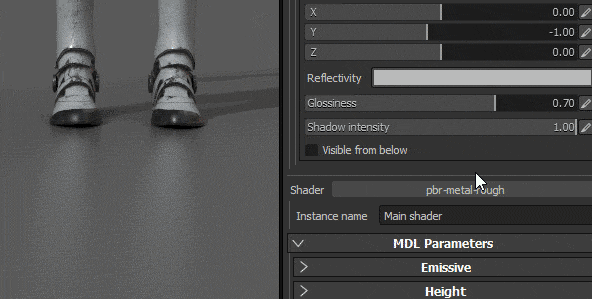

# Ajustes de visor y MDL

{width="400px"}

## Entorno

Idéntico al punto de visión normal, el mapa ambiental utilizado en Iray controlará la iluminación.\
El mapa de entorno se puede cambiar haciendo clic en el botón o arrastrando y soltando una textura HDR en él.

* **Exposición del entorno** : Controle el nivel de exposición del mapa de entorno HDR.
* **Rotación de entorno** : para cambiar la textura del entorno y rotar la iluminación alrededor de la escena.

>[!NOTE]
>
> Al ser un renderizador basado en la física, la textura del entorno definirá en gran medida la iluminación y el aspecto de la escena.

## Cúpula

La cúpula es la forma sobre la que se proyectará el mapa de entorno en el fondo.\
Hay tres tipos de domos disponibles, que se pueden utilizar según la escena:

* **Esfera infinita** : El entorno se proyecta en el fondo sobre una esfera para simular el horizonte, siempre lejos de la escena
* **Esfera** : El entorno se proyecta sobre una esfera regular, que se puede escalar
* **Esfera con suelo** : De forma similar a la forma anterior, esta también tiene un control para acoplar la parte inferior de la esfera para simular un piso.

>[!NOTE]
>
> La Esfera con suelo tiene un control para definir el tamaño/radio del suelo, sin embargo un gran radio creará distorsiones en el entorno.\
>  Dependiendo del tipo elegido, la iluminación puede verse afectada.

Hay disponibles configuraciones adicionales:

| *Configuración* | *Descripción* |
| --- | --- |
| **Radio** | El tamaño de la esfera (si no es infinito) |
| **Escala de textura** | Cuánto se estirará la textura para el tipo **Esfera con suelo**. |
| **Borrar color** | Si está activada, sustituya la imagen de fondo del mapa de entorno por un color uniforme. Esto afectará a la iluminación. |

### Configuración de tierra

La configuración del suelo permite especificar dónde se encuentra el suelo.\
De forma predeterminada, el valor se establece para corregir la parte inferior del cuadro delimitador de la escena.

| ***Configuración*** | ***Descripción*** |
| --- | --- |
| **Valor X, Y, Z** | Defina la ubicación del suelo en los tres ejes.   El valor 0,0,0 corresponde al centro del cuadro delimitador de la escena. |
| **Reflectividad** | Define la intensidad y el color del reflejo del suelo.   Un valor de brillo del blanco significa que el suelo es 100% reflectante, mientras que el negro significa no reflectante en absoluto. 

 |
| **Brillo** | Define lo brillante (o rugoso) que es el reflejo. 

 |
| **Intensidad de sombra** | Este parámetro define la opacidad final de la sombra una vez calculada la iluminación. |
| **Visible desde abajo** | Define si el suelo es visible desde abajo o no. Si está marcado, significa que el suelo ocultará cualquier elemento por encima de él. |

## Parámetros de MDL y sombreado

Iray utiliza MDL para definir los materiales utilizados para la representación de un objeto. Para obtener más información, consulte la [página oficial de NVIDIA con el formato](http://www.nvidia.com/object/material-definition-language.html) .

De forma predeterminada en Substance 3D Painter, una MDL se asocia con un sombreador GLSL, lo que permite cambiar entre la ventana gráfica normal y Iray sin tener que configurar nada.\
Los parámetros del MDL se muestran en la parte inferior de la configuración del visualizador. A continuación se muestran los parámetros del MDL predeterminado (compatible con el sombreador PBR Metallic/Roughness).

>[!NOTE]
>
> Para cargar los MDL personalizados, se requiere un sombreador de glsl personalizado.\
>  En el sombreado, se pueden añadir algunos metadatos para especificar la ruta de moldeo :
> 
> //- Declare el material iray mdl para utilizarlo con este sombreador. //: metadata { //: &quot;mdl&quot;:&quot;mdl::alg::materials::Physical\_Metallic\_roughness::Physical\_Metallic\_roughness&quot; //: }
> 
> * **mdl** : defina el material del molde Iray que se utilizará con el sombreador. La sintaxis de la ruta es la siguiente:  *mdl::folder1::folder2::mdl\_filename::material\_name* donde *folder1::folder2::mdl\_filename* es la ruta de acceso dentro de una de las carpetas *mdl* del estante a un archivo mdl y *::material\_name* es el nombre de un material declarado dentro de este archivo mdl. (ej.: &quot;mdl&quot; : &quot;mdl::alg::materials::físicamente\_metálico\_roughness::físicamente\_metálico\_roughness&quot;)

>[!NOTE]
>
> Para cada instancia de material de un proyecto se establecerá un MDL. Por lo tanto, para separar las propiedades de materiales entre el conjunto de texturas, defina una nueva instancia de Materiales para configurar por separado los MDL.

El MDL predeterminado de Substance 3D Painter admite las siguientes propiedades:

| *Configuración* | *Descripción* |
| --- | --- |
| **Intensidad de emisión** | Multiplicador del canal Emissive. Un valor alto comenzará a emitir luz. 

 |
| **Refracción** | Controla la cantidad de refracción. |
| **IOR** | Define el índice de refracción del material.   Nota : Aire = 1,0, Agua = 1,2, Vidrio = 1,5. |
| **Dispersión** | Controla cuánta luz se dispersa por la superficie. |
| **Absorción** | Controla cuánta luz se absorbe a través de la superficie. |
| **Color de absorción** | Simula cambios de color cuando la luz atraviesa la superficie. |
