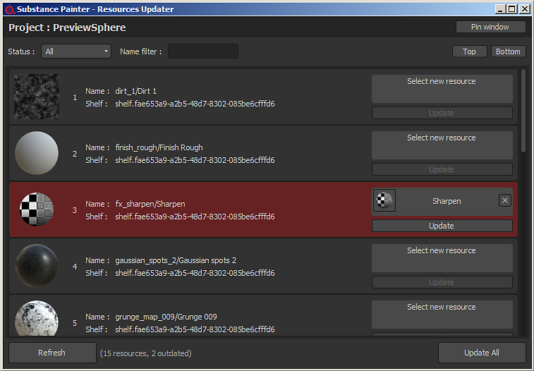

# Resources Updater

El complemento **Resources Updater** permite examinar los recursos presentes en el proyecto abierto actualmente.\
Cada recurso puede ser reemplazado por otro presente en el estante. Los recursos mostrados en rojo son considerados como &quot;obsoletos&quot;, significa que una versión diferente del mismo recurso está presente en el estante y es (probablemente) más reciente.
