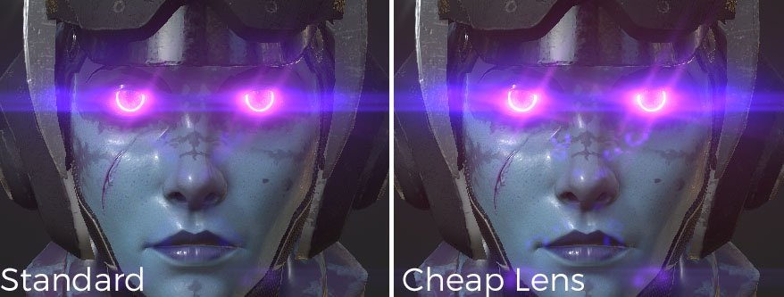
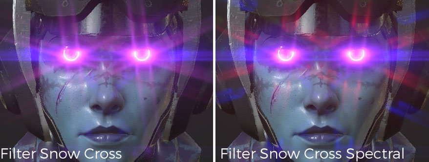

# Brillo

Descripción de los parámetros :

| Configuración | Descripción |
| --- | --- |
| **Luminancia** | Este es el brillo general del efecto de deslumbramiento. Al establecer este valor en 0,0, se desactiva completamente el efecto.  Los valores realistas se producen en el rango de 0,5 a 4,0, hasta un máximo de 16,0. |
| **Umbral** | Solo se extraen los píxeles más brillantes que el umbral para generar el brillo.  Para obtener resultados de aspecto natural, se recomiendan valores entre 0,0 y 1,0. |
| **Reasignar** **Factor** | Si se especifica un valor distinto de 1.0, el componente de alta luminancia extraído se expande (o comprime) de forma no lineal. Si pasa un valor superior a 1,0, el brillo se hace más fuerte para los píxeles brillantes.  Utilice esta opción para ajustar la asignación de luminancia del deslumbramiento de forma aislada, sin que afecte a otros efectos. La luminancia después del paso brillante aumenta en una curva suavizada, con valores de luminancia de 1,0 que se acercan a **Factor de reasignación** y valores superiores a 1,0 que se acercan a **Factor de reasignación****** ^2). |
| **Forma** | La forma define el aspecto de los reflejos. Hay disponibles diferentes modelos:<ul data-preserve-html="true"><li data-preserve-html="true"><strong>Bloom</strong> : Solo efecto floración.</li><li data-preserve-html="true"><strong>Destello de lente:</strong> Floración / fantasmas (destello de lente) / imagen posterior.</li><li data-preserve-html="true"><strong>Estándar:</strong> Tipo que incluye un buen equilibrio de todos los elementos básicos.</li><li data-preserve-html="true"><strong>Lente barata:</strong> Visualización nítida y otras representaciones de una lente barata. </li><li data-preserve-html="true"><strong>Después de la imagen:</strong> Escriba con una imagen posterior muy fuerte. </li><li data-preserve-html="true"><strong>Filtro de pantalla cruzada:</strong> Objetivo con generador de filtro de estrella en forma de cruz conectado.</li><li data-preserve-html="true"><strong>Espectral de filtro de pantalla cruzada</strong>: Lente con generador de filtro de estrella en forma de cruz con fuerte espectro unido.</li><li data-preserve-html="true"><strong>Snow de filtro cruzado</strong> : Lente con generador de filtro de estrella en seis direcciones unidas.</li><li data-preserve-html="true"><strong>Filtrar Snow Espectral Cruzado</strong> : Lente con generador de filtro de estrella con fuerte espectro en seis direcciones unidas.</li><li data-preserve-html="true"><strong>Filtrar cruz soleada</strong> : Lente con generador de filtro de estrella en ocho direcciones unidas.</li><li data-preserve-html="true"><strong>Filtrar espectral cruzado soleado</strong> : Lente con generador de filtro de estrella con fuerte espectro en ocho direcciones unidas.</li><li data-preserve-html="true"><strong>Racha horizontal</strong>: Este tipo de destello de lente produce fuertes rayas de estrellas horizontales.</li><li data-preserve-html="true"><strong>Racha vertical</strong>: Escriba con rayas de estrella fuertes en dirección vertical. Smears para cámara digital CCD, etc.</li></ul> |

## Ejemplos de formas

