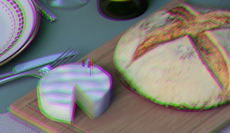

# Aberración lateral

Simula la aberración cromática desplazando los canales de color hacia fuera desde el centro de la imagen, reproduciendo el halo de color visible en los bordes de los objetivos reales de la cámara.

| <b>Parámetro</b> | <b>Descripción</b> |
| --- | --- |
|  |  |
| --- | --- |
| <b>Importe</b> | Controla la intensidad del efecto de halos de color. Los valores más altos producen una separación de canal más pronunciada hacia los bordes. |
| <b>Radio</b> | Controla el tamaño de la región central no afectada. Los valores más pequeños acercan el efecto de aberración al centro, lo que afecta a una mayor parte de la imagen. |
| <b>Suavizado</b> | Controla el smoothness de la transición entre el centro corregido y los bordes aberrados. |
| <b>Proporción</b> | Establece la proporción de la región afectada. El valor 1 crea una forma circular; los valores mayores que 1 crean un patrón elíptico más ancho. |
| <b>Centro X</b> | Posición horizontal del centro óptico desde el que se irradia la aberración. |
| <b>Centro Y</b> | Posición vertical del centro óptico desde el que se irradia la aberración. |
| <b>Aberraciones acromáticas</b> | Cambia los colores de la aberración de los tonos arcoíris estándar a tonos verde/violeta. |
