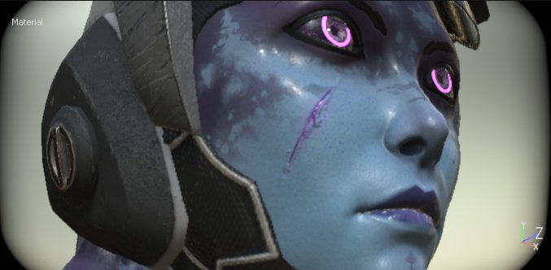

# Distorsión de lente

La Distorsión del objetivo es un fenómeno óptico que provoca una hinchazón o contracción del perímetro de la imagen. La hinchazón se conoce como distorsión de barril, y la contracción se conoce como distorsión de corsé.\
Cuanto mejor sea el objetivo de la cámara, menos se producirán estos fenómenos. Este efecto se puede utilizar para simular lentes imperfectas y, por lo tanto, imágenes más realistas.

| *Configuración* | *Descripción* |
| --- | --- |
| **Potencia** | Controla la velocidad con la que se aplica la distorsión desde los bordes de la pantalla. |
| **FOV** | Controla la cantidad de distorsión de la lente (campo de visión simulado). |
| **Redondez de borde** | Controla la forma redonda en los bordes o en la ventana gráfica. |
| **Suavizado de bordes** | Controla la dureza o el smoothness de los bordes negros de la ventana gráfica. |
