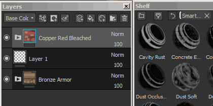
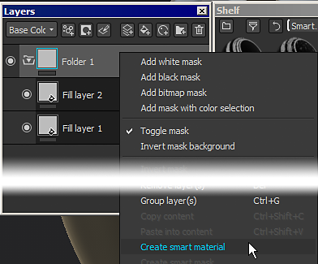

# Materiales inteligentes y máscaras

Substance 3D Painter admite el uso de **ajustes preestablecidos de capa** avanzados. Estos ajustes preestablecidos se pueden usar para **compartir rápidamente entre** conjuntos de texturas o proyectos, un **proceso de texturizado similar** mientras se mantienen los resultados diferentes, **adaptados a la topología de malla** .

>[!NOTE]
>
> Tenga en cuenta que una vez añadido en la pila de capas, no hay forma de recuperar qué material inteligente se utilizó. En caso de que sea necesario actualizar un material inteligente, el proceso deberá realizarse manualmente.\
> Sin embargo, los recursos individuales se pueden actualizar con [Resources Updater](plugins/resources-updater.md) .

## ¿Cómo se usan Materiales inteligentes/máscaras?

Los materiales inteligentes se pueden utilizar en cualquier lugar de la pila de capas, mientras que las máscaras inteligentes solo se pueden utilizar en la pila de efectos.\
Para obtener más información sobre las diferencias, consulte : [Pila de capas](../interface/layer-stack/layer-stack.md) y [Efectos](effects/effects.md)

### Añadir un Material inteligente

Los materiales inteligentes se pueden agregar de dos formas diferentes:

* Arrastrando y soltando un material inteligente del estante en la pila de capas :\
  
* Haciendo clic en el botón del Material inteligente para abrir una mini-estantería :\
  

### Añadir una Máscara inteligente

Dado que las Máscaras inteligentes son ajustes preestablecidos de efectos, solo se pueden añadir a pilas de efectos (para máscara específicamente).

* Para añadir una Máscara inteligente, solo tienes que **arrastrar y soltar** una desde el estante a la capa **target** :\
  
* Si arrastras y sueltas **varias** Máscaras inteligentes, se acumularán :\
  
* Sin embargo, es posible **reemplazar** toda la pila de efectos presionando **CTRL** durante el arrastrar y soltar :\
  

### ¿Cómo se crean Materiales inteligentes/máscaras?

Para crear Materiales inteligentes, se requiere una **carpeta**.\
El contenido de los Materiales inteligentes se incluirá en la carpeta. A continuación, solo tiene que hacer clic con el botón derecho en la carpeta y seleccionar &quot;**Crear material inteligente**&quot;. El Material inteligente se añadirá al estante actual y se le asignará un nombre según el que se haya seleccionado.

Para crear una máscara inteligente, simplemente haz clic con el botón derecho sobre una capa y elige &quot;**Crear máscara inteligente**&quot;.

## ¿Cómo compartir/recuperar un material inteligente/máscara?

Los ajustes preestablecidos se guardan **en el disco** y se pueden recuperar de su carpeta dedicada.\
Para encontrar la **ubicación del estante**, consulte : [Agregando contenido al disco duro](../content/importing-assets/adding-content-on-the-hard-drive.md) .

Entonces cualquiera puede simplemente **importar** el archivo en su estante de Substance 3D Painter para usar el ajuste preestablecido.
