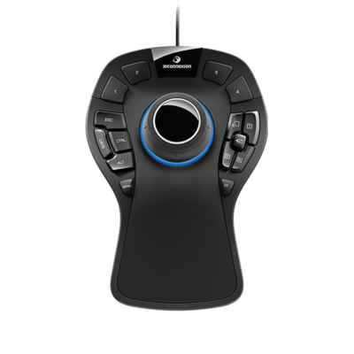
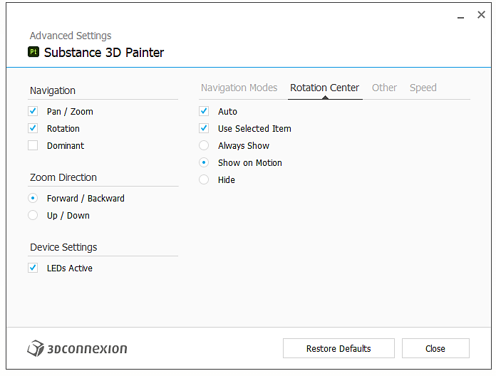

# SpaceMouse® de 3Dconnection

El SpaceMouse® de 3D Connection es un dispositivo que permite navegar fácilmente en 3D. Se puede utilizar para manipular la cámara/modelo 3D en la ventana gráfica de la aplicación.

* SpaceMouse® es compatible desde la versión 7.4.2.
* Para usar correctamente este dispositivo, asegúrese de instalar el controlador más reciente de [3Dconnection](https://3dconnection.com/uk/drivers/).

>[!NOTE]
>
> Los usuarios que utilicen el modelo compacto y necesiten rotar con frecuencia el mapa de entorno pueden optar por asignar la tecla MAYÚS al botón izquierdo.

## Tutorial

## Información general

El mando de control principal o SpaceMouse® le permite rotar, desplazar y hacer zoom en la ventana gráfica de maneras que no son posibles con los controles normales del ratón/lápiz y teclado. El dispositivo se puede utilizar en combinación con el ratón y las tabletas con el lápiz.

Todos los modelos y versiones deben ser compatibles con la aplicación:

| Modelo | Descripción | Visual |
| --- | --- | --- |
| **Modelo compacto** | Modelo base con control del mando. | 

 |
| **Modelo Pro** | Control del mando y botones adicionales para el método abreviado de teclado. | 

 |
| **Modelo empresarial** | Control del mando, botones adicionales y visualización contextual. | 

 |

>[!NOTE]
>
> Los modelos Compact, Pro y Enterprise se han probado y validado para que funcionen correctamente con la aplicación.

## Menú radial

Se puede acceder al menú directamente desde el dispositivo:

* En el modelo Compacto, haga clic en el botón izquierdo y elija propiedades en el menú radial:

  {width="250px"}
* En los modelos Pro y Enterprise, se puede acceder al menú de propiedades pulsando el botón Menú.

Como alternativa, haga clic con el botón derecho en el icono de conexión 3D en la bandeja del sistema (junto al reloj del sistema) y elija **Abrir configuración de conexión 3D**. Este menú es sensible al contexto en función de la última ventana activa. Su barra de título indica a qué programa corresponde, si no es Adobe Substance 3D Painter, cambie a la ventana de Painter y luego vuelva a la ventana de configuración:

## Configuración predeterminada

{width="400px"}

En el panel de configuración de SpaceMouse®, los ajustes predeterminados para Painter están disponibles en la última versión de los controladores. No se necesita configuración adicional, simplemente conecte el dispositivo y será plug and play.

Asegúrese de seleccionar el dispositivo correcto en el menú desplegable superior; de forma predeterminada, debe seleccionar el dispositivo correcto.

El regulador &quot;velocidad&quot; cambia la sensibilidad en todos los ejes y direcciones.

### Configuración avanzada

Al hacer clic en el botón &quot;Configuración avanzada&quot;, le permite cambiar el comportamiento detallado de los controles principales.

Cualquier configuración predeterminada se puede modificar. Hay dos secciones importantes con las fichas **Modos de navegación** y **Centro de rotación**.

#### Modos de navegación

{width="400px"}

Defina el comportamiento y el comportamiento del mando en 3D:

| Configuración | Descripción |
| --- | --- |
| Modo de objeto | El control es el propio objeto 3D, es el valor predeterminado. |
| Modo de cámara | Controle la cámara libremente en 3D. |
| Modo de cámara de destino | Controle la cámara dirigiéndose siempre a un punto del espacio 3D. |
| Modo helicóptero | Controla un helicóptero en el espacio 3D. |
| Bloquear horizonte | Bloquear la cámara para que el horizonte sea siempre horizontal. Painter ya ofrece una opción similar en su configuración, pero se puede controlar por separado aquí. Está bloqueado de forma predeterminada. |

#### Centro de rotación

{width="400px"}

Defina el comportamiento del icono de giro pequeño:

| Configuración | Descripción |
| --- | --- |
| Automático | Mueva el destino de giro o cámara automáticamente; si está desactivado, siempre se adhiere al giro del origen de la malla. |
| Mostrar siempre | El punto de giro siempre se muestra en la ventana gráfica 3D incluso cuando no interactúa con el dispositivo. |
| Mostrar en movimiento | El punto de pivotación se muestra en la ventana gráfica 3D solo al interactuar con el dispositivo. Esta es la opción predeterminada. |
| Ocultar | Elimine completamente el punto de giro en la ventana gráfica 3D. |

>[!NOTE]
>
> El punto de giro se ha diseñado específicamente para Painter, pero se puede ocultar si es necesario.

### Botones

{width="400px"}

Al hacer clic en **Botones**, es posible asignar comandos, macros o menús radiales. Consulte la [documentación de conexión 3D](https://3dconnection.com/uk/support/faq/) para obtener más detalles.
