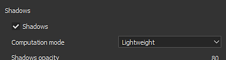

# Activación de la subsuperficie en un proyecto

Para activar correctamente la dispersión subsuperficial en Substance 3D Painter, primero deben establecerse algunos parámetros.\
Esta página proporciona una guía sobre los parámetros que se deben activar.

## 1 - Ajustes del conjunto de texturas

En el [Conjunto de texturas](../../interface/texture-set/texture-set.md), agregue un canal **Dispersión** si aún no está presente :

>[!NOTE]
>
> El canal de dispersión funciona como una **máscara** sobre la **superficie superficial**: si el canal es negro no hay subsuperficie en absoluto, mientras que si es blanco la intensidad subsuperficial será máxima. Este canal es un valor de escala de grises **negro de forma predeterminada** . Añada una capa de relleno en la pila de capas para controlar el color predeterminado o utilice una capa de pintura para controlar manualmente la intensidad.

## 2 - Ajuste global del subsuelo

Habilite la configuración de dispersión de subsuperficie principal en [Configuración de visualización](../../interface/display-settings/display-settings.md) (debajo de la configuración de Post-Effects) :

>[!NOTE]
>
> La activación/desactivación del efecto Subsuperficie afecta a todo el proyecto. Puede resultar útil utilizar este parámetro global si es demasiado pesado en términos de rendimiento.

## 3 - Ajustes de Sombreador

En la ventana [Configuración de Sombreador](../../interface/shader-settings/shader-settings.md) con sombreadores predeterminados, se encuentra un grupo &quot;**Parámetros de SSS**&quot; con dos configuraciones.\
Cambie la escala y el color para que se ajusten al material de destino. Para obtener más información sobre esta configuración, consulte: [Parámetros de subsuperficie](subsurface-parameters.md)

## Bono : Activación de sombras

El efecto Dispersión subsuperficial funciona bien, pero puede parecer extraño si está solo.\
La activación de la sombra puede ayudar a conseguir el aspecto final en la ventana gráfica y mejorar el realismo del material final.

En la ventana [Configuración del entorno](../../interface/display-settings/environment-settings.md), habilite la configuración &quot;**Sombras** &quot;:

