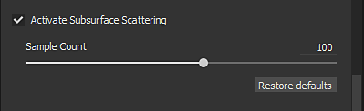

# Parámetros de subsuperficie

La implementación de subsuperficies en tiempo real de Substance 3D Painter es un efecto de dispersión subsuperficial del espacio de pantalla. Los parámetros para controlarlo se explican en esta página.\
La implementación actual se basa en el método &quot;Perfiles de reflejo aproximados para la dispersión eficiente de subsuperficies&quot; [publicado por PIXAR](http://graphics.pixar.com/library/ApproxBSSRDF/).

Para ver ejemplos de materiales basados en estos parámetros, consulte: [Tipo De Material Subsuperficial](subsurface-material-type.md).

## Parámetros sombreador/MDL

Disponible en la ventana [Configuración de Sombreador](../../interface/shader-settings/shader-settings.md).

| *Configuración* | *Descripción* |
| --- | --- |
| **Habilitar** | Activar o desactivar el efecto Dispersión subsuperficial en esta instancia de sombreador/mdl.  Se puede utilizar para desactivar el efecto de SSS en el material que no lo necesita. |
| **Tipo de dispersión** | Define el comportamiento de la absorción de luz en el material:<ul data-preserve-html="true"><li data-preserve-html="true"><strong> translúcido</strong>: adecuado para materiales genéricos como el jade o el mármol, donde la luz puede penetrar profundamente en un objeto.</li><li data-preserve-html="true"><strong> Aspecto</strong>: adecuado para la piel orgánica, donde la luz se absorbe rápidamente y solo la dispersión cerca de la superficie.</li><li data-preserve-html="true"><strong>Red Shift/Rayleigh</strong>: más preciso que el ajuste de la piel para simular la piel superficial humana o de la criatura.</li></ul> |
| **Escala** | Controla el radio/profundidad de la absorción de luz en el material. Este comportamiento del parámetro cambia en función del tamaño de la malla en la escena.Comparación entre una escala de 0,0, 0,2 y 1,0 en una cabeza de tamaño humano:   

 |
| **Color** | Color de la luz cuando el material lo absorbe.Comparación entre tres colores:   

 |

### Parámetros de configuración de visualización

Disponible en la ventana [Configuración de pantalla](../../interface/display-settings/display-settings.md).

>[!NOTE]
>
> Este parámetro **solo afecta a** la versión **en tiempo real** del efecto de dispersión subsuperficial.

| *Configuración* | *Descripción* |
| --- | --- |
| **Recuento de muestras** | Controla la cantidad de muestras que se realizarán para generar el desenfoque de subsuperficie en el espacio de pantalla. Más muestras significan menos ruido pero afectarán a las actuaciones.Comparación entre 8, 32 y 64 muestras cuando se mira cerca de una superficie:   

  **Nota:** La cantidad de ruido también se puede reducir habilitando [Configuración de la cámara](../../interface/display-settings/camera-settings.md) sin aumentar la cantidad de muestras. |
