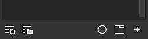

# Recursos

La ventana Activos le permite acceder a los recursos predeterminados que vienen con la aplicación (conocidos como **Activos iniciales**), así como a cualquier recurso [importado](https://helpx.adobe.com/substance-3d/unlisted/documentation/spdoc/adding-content-to-the-shelf-142213317.html) (que se puede encontrar en **Sus activos**).

* En el disco, la biblioteca **Starter assets** se almacena dentro de la carpeta de instalación de la aplicación, mientras que los activos importados a la biblioteca **Your assets** se encuentran de forma predeterminada en la carpeta Documents.
* Para obtener más información sobre dónde se almacenan los activos en el disco, consulte [Adición de contenido en el disco duro](../../content/importing-assets/adding-content-on-the-hard-drive.md).
* También es posible añadir una ubicación de biblioteca diferente. Por eso, echa un vistazo a [Agregar una nueva biblioteca](adding-a-new-library.md).

## Información general

La ventana Activos está dividida en tres secciones principales de forma predeterminada:

1. El área de filtro
1. La lista de activos
1. La barra inferior

### Área de filtro

Para obtener más información, consulte la [página de exploración](navigation.md).

#### Lista de activos

#### Barra inferior

