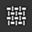

# Navegación

Existen varios medios de navegación en la ventana Activos: ruta de exploración, campo de búsqueda e icono de tipos de activos. Todos los tipos de navegación son co-dependientes, por lo que puede combinar esas búsquedas a su favor.\
Por ejemplo, si ha seleccionado Materiales en los iconos de tipo de recurso, pero ha utilizado la ruta de exploración para desplazarse a la carpeta Máscaras inteligentes, el panel Recursos no mostrará ningún resultado; tendrá que volver a Todas las bibliotecas si desea mostrar Materiales o anular la selección de Materiales si desea examinar las Máscaras inteligentes.

## Rastros

Las rutas de exploración le permiten navegar rápidamente por la biblioteca. Al hacer clic en las flechas, se muestra cómo se almacenan los recursos en el disco y se puede seleccionar cualquiera de las ubicaciones mostradas. Si está atenuado, significa que no hay activos del tipo seleccionado dentro de esa carpeta, pero aún puede navegar a esa ubicación.

## Campo de búsqueda

El campo de búsqueda se puede utilizar para filtrar los recursos que contienen la consulta con tipo. Tenga en cuenta que no sólo realiza búsquedas por el título de los recursos, sino también por su ubicación y cualquier etiqueta contenida en el recurso.\
Las búsquedas escritas también pueden ser más avanzadas que las palabras clave. Consulte [Consultas de búsqueda avanzada](advanced-search-queries.md).

## Tipos de activos

>[!NOTE]
>
> Los iconos de tipos de activos se pueden seleccionar de varias formas manteniendo la tecla **Ctrl** al hacer clic.

La selección predeterminada es Materiales, pero al hacer clic en otros iconos de tipos de activos, se muestran otros tipos de recursos.

| Tipos de activos | Descripción |
| --- | --- |
| Materiales 

 | Contienen .sbsar importados como *material base* y materiales creados a partir de una capa de relleno (puede obtener más información sobre la creación de ajustes preestablecidos [aquí](https://helpx.adobe.com/es/substance-3d/unlisted/documentation/spdoc/creating-and-saving-a-preset-180191514.html)). Son materiales básicos que se pueden usar en capas de relleno y se aplicarán a toda la superficie de la malla o el conjunto de texturas. |
| Materiales inteligentes 

 | Contengan materiales más complejos que consten de varias capas guardadas dentro de una carpeta (los Materiales inteligentes también son ajustes preestablecidos que puede crear). Al igual que los materiales base, los Materiales inteligentes se aplicarán a la totalidad de su malla/conjunto de texturas, pero también tendrán en cuenta la información individual de la malla, como la curvatura, la Oclusión o cualquier otro detalle de la superficie. Para obtener estos detalles de la superficie y usar Materiales inteligentes correctamente, primero debe [hacer un bake](../../baking/baking.md) la malla. |
| Máscaras inteligentes 

 | Contienen máscaras más complejas que utilizan efectos o generadores de varias capas. Puedes [crear](https://helpx.adobe.com/es/substance-3d/unlisted/documentation/spdoc/managing-assets-217187091.html) ajustes preestablecidos de Máscaras inteligentes tú mismo.De forma similar a los Materiales inteligentes, las Máscaras inteligentes necesitan información hecha un bake de su malla para funcionar correctamente. |
| Filtros 

 | Contiene archivos .sbsar importados como *filter*.Los filtros son efectos que toman la textura que ya tienes y la transforman de alguna manera. Algunos filtros solo funcionan con información en blanco y negro, algunos solo con entradas de material, lo que significa que no todos los filtros se pueden usar en máscaras. |
| Pinceles 

 | Contiene pinceles, partículas y herramientas. Estos son todos los ajustes preestablecidos que se pueden [crear](https://helpx.adobe.com/es/substance-3d/unlisted/documentation/spdoc/managing-assets-217187091.html) en Painter.**Los pinceles** son ajustes preestablecidos básicos en blanco y negro que usan una alfa. Puede usar pinceles para realizar pinturas en cualquiera de los canales o en todos ellos, o en una máscara.**Las partículas** tienen las mismas características que los pinceles, pero también tienen un conjunto adicional de parámetros que simulan la interacción física con la malla. Pueden producir los efectos de derrames, goteos, lluvia o cualquier otro que requiera una simulación física.**Herramientas** puede contener el comportamiento Pincel o Partícula, pero además este ajuste preestablecido también se guarda con información de canales de material. |
| Alfas 

 | Contienen una variedad de alfa, así como varios fabricantes de pinceles que permiten [crear](https://helpx.adobe.com/es/substance-3d/unlisted/documentation/spdoc/managing-assets-217187091.html) pinceles con efectos más elaborados (similares a Photoshop, trazos dinámicos, rodillo de pintura). Los Alpha son imágenes en escala de grises en las que las partes negras aparecen transparentes cuando se usan. |
| Texturas 

 | Contiene grunges, procedimientos, mapas con bake, normales de superficie dura y LUT.**Grunges** son imágenes en escala de grises con ruidos y texturas interesantes. Se pueden utilizar para añadir variación a la superficie de la malla, ya sea mediante máscara o conectándolos directamente en un canal.Los **procedimientos** también son texturas en escala de grises que comprenden ruidos o incluso patrones regulares. Sin embargo, a diferencia de algunos grunges estáticos, los procedimientos son mapas de bits dinámicos que se pueden escalar sin repetición y tienen variaciones infinitas (mediante semilla aleatoria).**Mapas con bake** representan la información de superficie y forma extraída de la malla. Para obtener más información sobre cómo hacer un bake, consulte aquí.**Las normales de superficie dura** son detalles que puede marcar directamente en su malla mediante el canal Normal.**LUT** (tablas de búsqueda) son texturas de perfil de color que se pueden usar en la configuración de visualización para simular un comportamiento de perfil de color en la ventana gráfica. Puede obtener más información sobre los perfiles de color [aquí](../../features/post-processing/color-profile.md). |
| Mapas de entorno 

 | Contienen imágenes importadas como *entorno* (normalmente .hdr o .exr). Los mapas de entorno son imágenes de fondo que generan automáticamente una configuración de iluminación. Puede utilizar un mapa de entorno arrastrándolo directamente a la ventana gráfica o a través de la configuración de visualización. |
