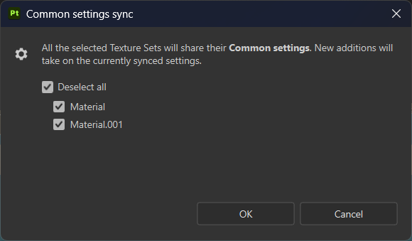
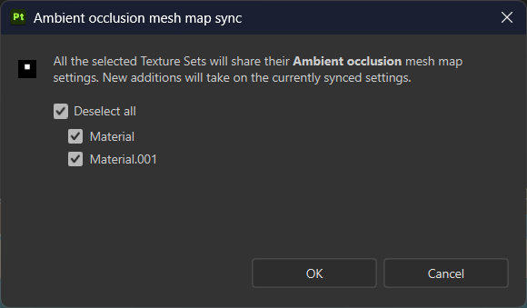
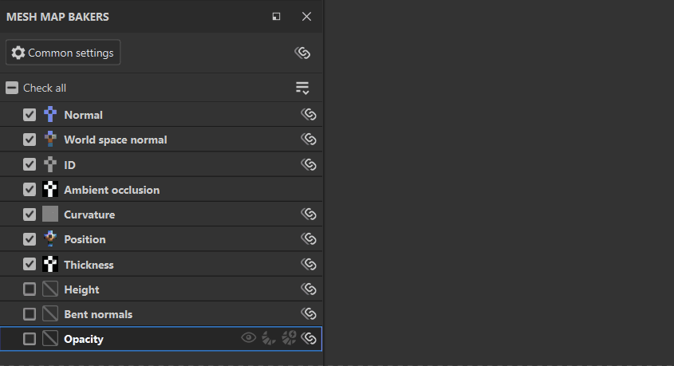

# Panel Panaderos de mapa de malla

<table>
  <tr style="border: 0;">
    <td style="border: 0;" valign="top"></td>
    <td style="border: 0;" valign="top">El <strong>panel de marcadores de mapas de malla</strong> le permite seleccionar los mapas que se van a hornear y acceder a la configuración de cada tipo de mapa.</td>
  </tr>
</table>

## Controles por mapa

Cada mapa de la lista de mapas de malla tiene una serie de controles disponibles:

1. **Compruebe** o **desmarque** el procesamiento del mapa.
1. **Visualice** el mapa en la ventana gráfica.
1. **Horneado rápido** solo este mapa.
1. Activar **Auto-rebake** para el mapa de malla seleccionado. **Se volverá a hornear automáticamente** mapas cuando se realicen cambios en los parámetros de horneado o la corrección de sesgo.
1. **Sincronizar** configuración para este tipo de mapa entre conjuntos de texturas. Desactive esta opción para personalizar la configuración de procesamiento de los mapas individuales.

## Administrar ajustes de mapa de malla

Hay varias formas de administrar el proyecto para que la configuración de procesamiento se comparta entre los mapas de malla o los conjuntos de texturas. En el caso de proyectos complejos, comprender cómo compartir la configuración puede ayudar a simplificar el proceso de procesamiento.

Hay dos tipos de ajustes que puede compartir entre los conjuntos de texturas:

* Configuración de horneado: Estos son parámetros que puedes cambiar en los **ajustes comunes** y los **paneles de ajustes de mapa de malla**.
* Comprobar estado: Utilícelos para activar o desactivar el baking para mapas de malla específicos.

### Sincronización de ajustes de horneado entre conjuntos de texturas

Cuando el proyecto tiene varios conjuntos de texturas, las opciones de Sincronizar entre conjuntos de texturas aparecerán en el **panel Paneles de mapa de malla**.

Al seleccionar el **botón Sincronizar configuración** en la parte superior del **panel Marcadores de mapa de malla**, se abre la **ventana de sincronización de configuración común**.

Desde esta ventana, puede seleccionar los conjuntos de texturas en los que sincronizar la configuración común. Con todos los conjuntos de texturas seleccionados, al cambiar los ajustes comunes de cualquier conjunto de texturas, se cambiarán para todos los demás conjuntos de texturas.

Del mismo modo, si usa el **botón Sincronizar configuración** junto a un mapa de malla individual, podrá seleccionar conjuntos de texturas para compartir la configuración específica del mapa de malla.

#### Compartir ajustes entre conjuntos de texturas sin sincronizar

En ocasiones, puede que desee mantener los mapas de malla no sincronizados en los conjuntos de texturas, pero también desea copiar los ajustes de horneado de un conjunto de texturas a otro.

Para copiar la configuración común en conjuntos de texturas específicos sin sincronizar, seleccione **Sincronizar toda la configuración con más conjuntos de texturas...** en el menú desplegable **Paneles de mapa de malla**.

También puedes usar **Sincronizar toda la configuración con todos los conjuntos de texturas** para copiar la configuración en todos los conjuntos de texturas del proyecto.

Como alternativa, si desea copiar los ajustes de un único mapa de malla en conjuntos de texturas específicos:

1. Haga clic con el botón derecho en el mapa de malla.
1. Seleccione **Aplicar configuración de &lt;mapa de malla> a más conjuntos de texturas...**

*En el ejemplo anterior, cada conjunto de texturas comienza con configuraciones diferentes para AO. Sin configurar el mapa de malla AO para que se sincronice, usamos **Aplicar configuración de oclusión ambiental a más conjuntos de texturas...**para que podamos empezar a modificar la configuración de AO para el nuevo conjunto de texturas a partir de la misma línea de base.*

### Administrar la comprobación de estado para mapas de malla

Comprobar estado determina si se incluye un mapa determinado al hornear mapas de malla. Hay muchas formas de administrar el estado de comprobación para el conjunto de texturas actual:

* Compruebe o desmarque mapas individuales.
* Use **Comprobar todo** o **Desmarcar todo** para comprobar o desmarcar todos los mapas de malla.
* Utilice **Invertir mapas de malla comprobada** en el menú desplegable **Paneles de mapa de malla** para cambiar el estado de comprobación de todos los mapas.

>[!TIP]
>
> Puede hacer clic y arrastrar desde una casilla de verificación para comprobar o desmarcar varios mapas rápidamente (consulte la animación anterior).

*En el ejemplo anterior, usamos **Invertir mapas de malla comprobada**para cambiar rápidamente la selección y luego hornear mapas de malla que aún no se han horneado.*

Al trabajar con varios conjuntos de texturas, también puede copiar el estado marcado de los mapas a otros conjuntos de texturas seleccionando **Aplicar activado a más conjuntos de texturas...**, o copiar el estado marcado a todos los conjuntos de texturas con **Aplicar activado a todos los conjuntos de texturas**.

*En el ejemplo anterior, aún no hemos horneado el Height, las normales dobladas ni la opacidad en el conjunto de texturas **Material.001**. Ya tenemos estos mapas de malla seleccionados en el conjunto de texturas **Material**, por lo que usamos **Aplicar activado a más conjuntos de texturas...**y seleccionamos **Material.001**para copiar el estado marcado. A continuación, horneamos los mapas. Observe que la visualización recorre los mapas de malla dos veces a medida que se hornean los mapas. Esto se debe a que se están horneando para ambos conjuntos de texturas.*