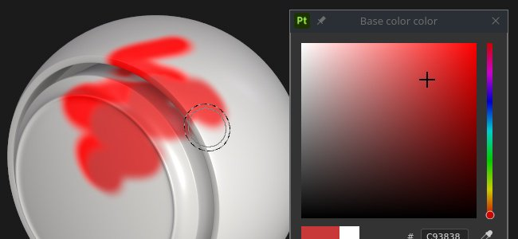
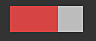
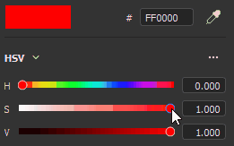
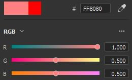
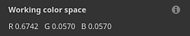

# Selector de color

El selector de color permite definir un color para pintar o proyectar en la malla. Se puede utilizar para seleccionar colores de imágenes externas o para ajustar uno existente dentro de la aplicación.

La ventana del selector de color aparece al hacer clic en cualquier campo de color de Painter, que se puede encontrar en Propiedades o en cualquier configuración o menú adicional, como Visualización o Parámetros de Sombreador.

## Descripción general del selector de color

Una vez abierto, el selector de color es semipersistente, lo que significa que permanecerá abierto hasta que cambie el contexto, por ejemplo, al cambiar de una capa de pintura a una de relleno. Es posible mover la ventana y colocarla en cualquier lugar en cualquiera de las pantallas disponibles. Sin embargo, a diferencia de otras ventanas, el selector de color no se puede acoplar.

La ventana tiene un diseño vertical y se compone de tres secciones:

* Selector de degradado (o espectro)
* Reguladores (RGB/HSV)
* Muestras

{width="200px"}

### Selector de degradado (espectro)

| Nombre y imagen | Descripción |
| --- | --- |
| **Selector de pantalla** 

 | Permita elegir qué pantalla utilizar para editar colores (espectro y reguladores). El valor predeterminado coincide con la visualización utilizada por la ventana gráfica principal.  **Nota:** Esta configuración solo está disponible cuando está habilitada la [administración de color](../features/color-management/color-management.md). |
| **Espectro** 

 | El regulador vertical es el tono general. Permite seleccionar el tono de color que se mostrará en el campo de degradado.Una vez seleccionada la sombra general, es posible mantener pulsado y arrastrar el cursor de forma de cruz en el campo de degradado para seleccionar el color deseado.  **Nota:** Cuando se habilita la [administración de color](../features/color-management/color-management.md), HDR. los colores de la pantalla actual se fijarán (en el espacio de color de trabajo). De este modo, se evita el valor HDR. de salida en los canales con gestión de color. |
| **Color actual y anterior** 

 | El rectángulo izquierdo indica el color final que se obtendrá del selector de color.El rectángulo derecho muestra el color anterior (cuando se abrió el selector de color). Es posible hacer clic en él para restaurar el color anterior y convertirlo en el actual. |
| **Campo hexadecimal** 

 | Los campos hexadecimales representan el color actual como valores hexadecimales. Los componentes del RGB se representan como un par de letras.Por ejemplo, #FF0000 representa el color rojo.  **Nota:** Cuando está habilitada la [administración de color](../features/color-management/color-management.md), el campo hexadecimal siempre funciona en el espacio de color sRGB estándar para facilitar la copia y el pegado de valores en el software, independientemente de la pantalla o el espacio de trabajo actual que utilice el proyecto. |
| **Cuentagotas** 

 | El cuentagotas se puede utilizar para seleccionar un color de un origen externo. Para usarlo, **haz clic** en el icono y mueve el ratón una y otra vez para copiar el color deseado.  **Nota:** Al seleccionar un color dentro del área de visualización, es posible utilizar el modificador **Shift** para seleccionar el canal actual editado directamente. De este modo, se evita la conversión de color con pérdida entre la textura original y el color que se muestra en pantalla. Esto también es útil para seleccionar colores sin tener que cambiar del modo de visualización **Material**. 

  **Nota:** Los campos de color también tienen un cuentagotas junto a ellos y se pueden usar para seleccionar colores rápidamente sin tener que abrir el selector de color. 

  **Nota:** En el sistema operativo Mac, es posible que el cuentagotas no pueda seleccionar colores fuera de la interfaz de la aplicación debido a la configuración de privacidad. Para solucionar este problema, asigne los derechos adecuados a la aplicación en: `System Preferences > Security & Privacy > Privacy > Screen Recording` |

### Configuración de color

| Configuración | Descripción |
| --- | --- |
| **Espacio de color del cuentagotas** | Especifique el espacio de color para el color seleccionado fuera de la ventana gráfica.El valor **auto** usa el espacio de color sRGB estándar de la configuración del proyecto. 

 **Nota:** Esta configuración también se aplica a los cuentagotas junto a los botones de color.  **Nota:** Los colores seleccionados dentro de la ventana gráfica también utilizan este perfil cuando no se utiliza el modificador Mayús. |

### Reguladores

Los reguladores de color permiten un ajuste manual de valores individuales.

Los reguladores se pueden establecer en dos modos diferentes, **HSV** o **RGB**. Para cambiar el modo, utilice el menú desplegable dedicado.

#### HSV

**HSV** es sinónimo de **H** ue, **S** saturación y **V** valor.

**Tono** permite recorrer las familias de colores globales, de forma muy similar al regulador de degradado vertical.

**Saturación** controla la riqueza del color seleccionado y pasa de la escala de grises a la saturación completa.

**Value** determina qué tan oscuro o claro es un color y oscila entre el negro completo y el blanco completo.

#### RGB

**RGB** significa **R** ed, **G** reen y **B** lue.

Estos son los componentes principales que se utilizan digitalmente para almacenar colores en gráficos de equipo. Cada regulador representa la cantidad de componente presente en el color final.

Ejemplo: la imagen de abajo tiene un color que contiene un 100 % de rojo, pero un 50 % de azul y verde.

Es más común tener los reguladores del RGB medidos a través de valores entre 0 y 255. Esto se puede hacer deshabilitando la opción **Valores de punto flotante**.

### Ajustes de reguladores

El menú de configuración permite configurar algunos comportamientos adicionales:

| Configuración | Descripción |
| --- | --- |
| **Reguladores dinámicos** | Si se activa, el color de fondo de los reguladores se ajustará en función del color actual. |
| **Valores de punto flotante** | Si se habilita, los valores de los reguladores se representan pasando de 0.0 a 1.0. Si se deshabilita:<ul data-preserve-html="true"> <li data-preserve-html="true"><strong>HSV</strong>: el regulador tono se mide en grados (como una rueda de color). Porcentajes de uso de Saturación y Valor. </li> <li data-preserve-html="true"><strong>RGB</strong>: los componentes se representan como un valor que va de 0 a 255.</li> </ul> |

## Espacio de color de trabajo

Esta sección muestra el valor de color final dado el espacio de color de trabajo actual.

Al pasar el cursor sobre el título del **espacio de color de trabajo** con el ratón, se puede mostrar el nombre del espacio de color actual.

>[!NOTE]
>
> Esta sección solo está disponible cuando está habilitada la [administración de color](../features/color-management/color-management.md).

## Muestras

Las muestras de color ofrecen una forma de guardar los colores para poder reutilizarlos en un momento posterior. Las muestras están disponibles en las proyecciones y las sesiones.

### Añadir muestra

Al hacer clic en este botón, se creará una nueva muestra de color en el conjunto actual.

El color de la muestra se crea únicamente si el último color (el que aparece junto al botón) es diferente del color editado actualmente.

>[!NOTE]
>
> Los colores de muestra se administran y se guardan como colores sRGB, sea cual sea la configuración actual de [administración de color](../features/color-management/color-management.md) establecida en.

### Color de muestra

Haga clic en un color de muestra para cargarlo.

Al pasar el ratón por encima de la muestra, se mostrará su valor hexadecimal.

>[!NOTE]
>
> Cuando se habilita la [administración de color](../features/color-management/color-management.md), la visualización de los colores se ajusta en función de la visualización seleccionada actualmente.

### Ajustes de muestra

Haga clic con el botón derecho en un color de muestra para abrir el menú y eliminarlo.

### Menú Ajustes

Utilice el menú de configuración para eliminar todas las muestras.

>[!NOTE]
>
> Las muestras se guardan dentro de un archivo de configuración disponible en la carpeta de documentos del usuario. Para obtener más información, consulte la página [Ubicación de estantes y activos](../pipeline-and-integration/resource-management/shelf-and-assets-location.md).
