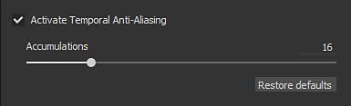
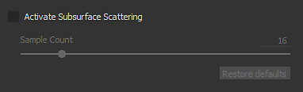

# Configuración de la cámara

Esta sección de **Configuración de visualización** controla el comportamiento de la cámara, así como el aspecto final de la ventana gráfica.

## Cámara

| *Configuración* | *Descripción* |
| --- | --- |
| **Campo de visión** | Permite controlar el campo de visión de la cámara (en grados) |
| **Distancia de enfoque** | Define la distancia a la que se encuentra el punto de enfoque.  Este punto lo utiliza el efecto Profundidad de campo. 

 **Nota:** La distancia de enfoque se puede establecer automáticamente haciendo clic en un punto de la malla con el método abreviado **CTRL + botón central del ratón** |
| **Apertura** | Define la anchura de la Profundidad de campo. 

 **Nota:** Si Iray está controlando este parámetro, cambiarlo volverá a activar un cálculo. |

## Efectos de posprocesamiento

Consulte la [página Post-Effect](../../features/post-processing/post-processing.md) para obtener más información.

## Suavizado temporal

Cuando se habilita, el **Suavizado temporal** (**TAA**) quitará los bordes dentados en la ventana gráfica.\
**TAA** funciona acumulando información en varios marcos de procesamiento, lo que significa que el efecto se deshabilita hasta que la cámara deja de moverse o se realizan otras operaciones.

| *Configuración* | *Descripción* |
| --- | --- |
| **Acumulaciones** | Define cuántos fotogramas se acumularán para reducir el suavizado.<ul data-preserve-html="true"> <li data-preserve-html="true">16: Valor recomendado para la mayoría de los casos</li> <li data-preserve-html="true">64: Útil para limpiar valores de alto contraste (como sombreador de pruebas de Alpha y tramado combinados)</li> </ul>  **Nota:** Esta configuración no tiene ningún impacto en el rendimiento; sin embargo, un valor alto puede tardar más en producir buenos resultados. |

{width="500px"}

El suavizado también se puede usar para filtrar el sombreador **Alpha-Test** si la configuración &quot;**Interpolado alfa**&quot; está habilitada:

{width="500px"}

## Dispersión de subsuperficie

Consulte la página [Dispersión subsuperficial](../../features/subsurface-scattering/subsurface-scattering.md) para obtener más información.

## Perfil de color

Consulte la [página Perfil de color](../../features/post-processing/color-profile.md) para obtener más información.

## Asignación de tonos

| Configuración | Descripción |
| --- | --- |
| **Función** | Especifique la función utilizada para ajustar los valores de color que superan las capacidades de visualización del monitor (reasignación de valores de HDR a un rango de LDR).Los valores posibles son:<ul data-preserve-html="true"><li data-preserve-html="true"><strong>Lineal</strong> (predeterminado): sin transformación, los valores por encima de 1.0 se fijan.</li><li data-preserve-html="true"><strong>ACE</strong>: Utilice la curva de asignación de tonos ACE Filmic.</li></ul> 

 **Nota:** Algunos motores de juegos y software de procesamiento usan el asignador de tonos de ACE. Al habilitar esta función, se ayuda a igualar los colores entre las aplicaciones y se evitan diferencias. |
