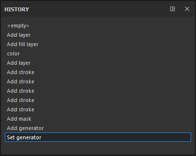

# Historial

\
La ventana Historial muestra todas las acciones y modificaciones que se han realizado en el proyecto abierto actualmente.

* Se puede hacer clic en cada elemento de la lista para volver al estado del proyecto cuando se creó o aplicó la acción.
* Crear una nueva acción cuando no se encuentra en el último elemento de la lista borrará las acciones futuras existentes y las reemplazará por una nueva.
* Las acciones son globales para el proyecto, por lo que crear una capa en dos conjuntos de texturas diferentes aparecerá en la misma lista.

Aunque toda la información se guarda en un proyecto (para poder volver a pintar o texturizar todo), no se podrá acceder a la lista Historial si el proyecto se cierra y se vuelve a abrir. La lista de historial solo está disponible durante la sesión actual.
