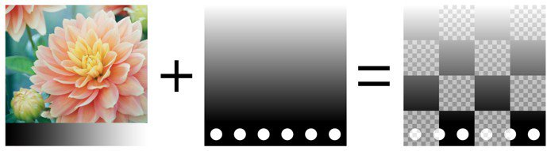
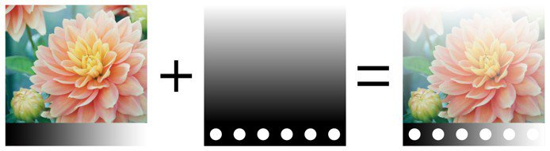
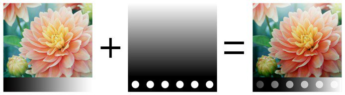

# Modos de fusión

Las capas y los efectos tienen acceso a muchos **modos de fusión**. Permiten mezclar el resultado de una capa con las otras capas inferiores de diferentes maneras.

No todos los modos de fusión son adecuados para todos los casos de uso. Por ejemplo, los modos de fusión **Mapa normal** solo son útiles para el **canal normal** en un conjunto de texturas.

## Orden del modo de fusión

Para comprender cómo y cuándo se aplica un modo de fusión, es importante comprender el orden en que se realizan las operaciones en la **pila de capas**:

1. Se calcula la capa de la parte inferior.
1. La capa superior se calcula y se mezcla con la capa inferior en función del modo de fusión (por ejemplo: Multiplicar).
1. La máscara se aplica para dar el aspecto final a la capa superior.

## Cambio Del Modo De Fusión

El modo de fusión se puede cambiar para **cada canal** de una capa. Para cambiar entre los canales, utilice el menú desplegable de la parte superior izquierda disponible en la ventana de pila de capas.

Para cambiar el modo de fusión, solo tiene que hacer clic en el menú desplegable Modo de fusión de una capa específica:

>[!NOTE]
>
> Es posible cambiar rápidamente entre los modos de fusión con los siguientes métodos abreviados si el menú desplegable tiene el enfoque:
> 
> * Métodos abreviados de teclado Flecha arriba o Flecha abajo
> * Rueda del ratón arriba o abajo

## Lista de modos de fusión

A continuación se muestra una lista de todos los modos de fusión disponibles en las capas y los efectos de Substance 3D Painter. La mayoría de los modos de fusión funcionan mediante operaciones en RGB (o en escala de grises), pero algunas operaciones también se realizan mediante un modo diferente, que es [HSV (tono, saturación, valor)](https://en.wikipedia.org/wiki/HSL_and_HSV). Todos los modos de fusión se realizan internamente en **espacio de gamma lineal**.

| *Nombre* | *Descripción* |
| --- | --- |
| Normal | Muestra la capa superior sobre la capa inferior sin transformación (modo de copia). Si la capa superior tiene transparencia (alfa), mostrará la capa inferior a través de los píxeles transparentes. 

 |
| Passthrough | Acopla la capa Inferior en la capa Superior. Especialmente útil en los siguientes casos:<ul data-preserve-html="true"> <li data-preserve-html="true">Para aplicar un efecto en todas las capas situadas debajo de la capa Superior</li> <li data-preserve-html="true">Para difuminar o clonar las capas situadas debajo de la capa superior</li> </ul> 

 **Nota:** **Los efectos** se pueden **arrastrar y soltar** directamente en la pila de capas, de este modo se creará una capa con el modo de fusión establecido en PassThrough para todos sus canales. |
| Desactivar | Descarta la fusión de la capa, mostrando solo las capas anteriores. Se puede utilizar para optimizar el cálculo de un canal ignorándolo en la capa Superior. 

 |
| Reemplazar | Sobrescribe la capa inferior. Esto resulta útil, por ejemplo, para evitar mezclar información con las capas siguientes. Reemplazar funciona de manera diferente a la fusión Normal porque también ignorará el alfa presente en la capa Superior, lo que podría dar como resultado píxeles transparentes. 

 |
|  |  |
| Multiplicar | Multiplica la capa Superior por la capa Inferior. El resultado siempre será un color más oscuro. 

 |
| Dividir | Divide las capas inferiores por la información de color de la capa actual. La imagen resultante suele ser más clara y, a veces, puede parecer quemada. 

 |
| División inversa | Es idéntico al modo de fusión Dividir, pero las capas Superior e Inferior se intercambian en la operación de fusión. 

 |
| Oscurecer (Mín.) | Mantiene el valor de color mínimo entre la capa Superior y la capa Inferior. 

 |
| Aclarar (Máx.) | Mantiene el valor de color máximo entre la capa Superior y la capa Inferior. 

 |
|  |  |
| Sobreexposición lineal (añadir) | Añade el valor de color de la capa Superior a la capa Inferior. El resultado puede dar colores que estén por debajo de 0 o más que 1, en cuyo caso el resultado se sujetará/recortará si el canal no es HDR. Este modo de fusión resulta útil para acumular información de height, por ejemplo. 

 |
| Restar | Resta el color de la capa superior de la capa inferior. El resultado puede dar colores que estén por debajo de 0, en cuyo caso el resultado se sujetará/recortará si el canal no es HDR. 

 |
| Restar inverso | Es idéntico al modo de fusión Restar, pero las capas Superior e Inferior se intercambian en la operación de fusión. 

 |
| Diferencia | Resta el color de la capa superior de la capa inferior, pero toma el valor absoluto del resultado (los valores negativos pasarán a ser positivos). 

 |
| Exclusión | Similar al modo de fusión Diferencia, pero producirá un resultado con un contraste más bajo. 

 |
| Adición firmada (AddSub) | Añade y resta información de color de la capa inferior en función de los colores de la capa superior. Los valores de escala de grises no tienen efecto, mientras que los colores más oscuros restan información y los colores más claros agregan información. 

 |
|  |  |
| Superponer | Combine los modos de fusión Pantalla y Multiplicar. Los valores de escala de grises de la capa Superior no tendrán efecto, pero los colores oscuros se Multiplicarán mientras que los colores brillantes aclararán los colores. 

 |
| Pantalla | La información de color de las capas Superior e Inferior se invierte y, a continuación, se multiplica entre sí, por lo que el resultado se invierte de nuevo. Esto produce un resultado visual que es lo contrario del modo de fusión Multiplicar y proporciona una imagen más brillante. 

 |
| Subexposición lineal | Suma la información de color de las capas Superior e Inferior y, a continuación, resta 1 al resultado. 

 |
| Subexposición de color | Divide la capa inferior por la capa superior. La capa Inferior se invierte antes de realizar la operación. Esta operación de fusión oscurece la capa Superior y aumenta su contraste para mostrar los colores de la capa Inferior. Cuanto más oscura sea la capa Inferior, más color se utilizará. 

 |
| Sobreexposición del color | Divide la capa inferior por la capa superior invertida. Esta operación aclara la capa inferior en función del valor de la capa superior. Cuanto más brillante sea la capa Superior, más afectarán sus colores a la capa Inferior. 

 |
|  |  |
| Luz suave | Similar al modo de fusión Superposición, pero aplicado con una curva diferente para fusionar la información de color, lo que da como resultado una imagen menos contrastada. 

 |
| Luz fuerte | Similar al modo de fusión Superposición (combina las operaciones Multiplicar y Trama). La diferencia es que se invierte el orden de funcionamiento, lo que da como resultado una imagen con colores más oscuros o más brillantes, pero con menos contraste. 

 |
| Luz intensa | Combina los modos de fusión Sobreexponer color y Subexponer color. La opción de esquivar se aplica a los colores que son más claros que el gris y la opción de quemar se aplica a los colores que son más oscuros que el gris. Los valores de gris no se ven afectados. El resultado es una imagen más contrastada. 

 |
| Luz lineal | Combina Sobreexposición lineal y Subexposición lineal. La opción de esquivar se aplica a los colores que son más claros que el gris y la opción de quemar se aplica a los colores que son más oscuros que el gris. Los valores de gris no se ven afectados. El resultado es similar a Luz intensa, pero con menos contraste. 

 |
| Luz focal | Aclara y oscurece la información de color en función de los colores de la capa Superior. Si los colores oscuros de la capa Superior son más oscuros que los colores de la capa Inferior, se podrán ver y, si no lo son, desaparecerán. El mismo principio se aplica a los colores brillantes. Este modo de fusión puede dar como resultado parches o manchas (ruido grande), y elimina completamente todos los tonos medios. 

 |
|  |  |
| Matiz | Realiza la operación con el modelo HSV. Mantiene solo el tono de la capa superior y utiliza la saturación y el valor de la capa inferior. El negro y los colores muy oscuros no tienen ningún Tono, por lo que los colores de la capa Inferior no cambiarán. 

 |
| Saturación | Realiza la operación con el modelo HSV. Mantiene solo la saturación de la capa superior y utiliza el tono y el valor de la capa inferior. El negro y los colores muy oscuros están desaturados, por lo que los colores de la capa Inferior se convertirán en valores de escala de grises. 

 |
| Color | Realiza la operación con el modelo HSV. Mantiene solo el tono y la saturación de la capa superior y utiliza el valor de la capa inferior. El negro y los colores muy oscuros no tienen ningún tono y están desaturados, por lo tanto, los colores de la capa inferior se convertirán en valores de escala de grises. 

 |
| Valor | Realiza la operación con el modelo HSV. Mantiene solo el valor de la capa superior y utiliza el tono y la saturación de la capa inferior. 

 |
|  |  |
| Combinación de mapa normal | Operación de mezcla de Whiteout. Conserva los detalles mientras te aseguras de que las normales planas siguen funcionando correctamente. Consulte [Pintura de mapa normal](../../painting/advanced-channel-painting/normal-map-painting.md) para obtener más información. 

 |
| Detalle de mapa normal | Operación de Fusión Orientada a Detalle (Asignación Normal Reorientada), más precisa que Combinación de Mapa Normal. Preservar mapas normales planos y la intensidad de las dos fuentes. Para asegurarse de que el resultado de la normal de la capa superior se reorienta para que siga la superficie de la capa inferior. Consulte [Pintura de mapa normal](../../painting/advanced-channel-painting/normal-map-painting.md) para obtener más información. 

 |
| Detalle inverso de mapa normal | El mismo comportamiento que para la operación de fusión Detalle de mapa normal, sin embargo es la capa Inferior la que se transforma para ajustarse a la superficie de la capa Superior. Consulte [Pintura de mapa normal](../../painting/advanced-channel-painting/normal-map-painting.md) para obtener más información. 

 |

&#x200B;>>
