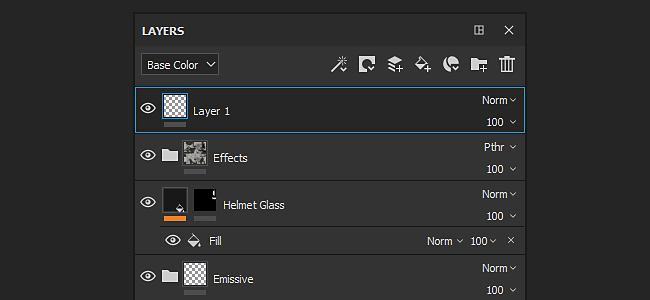

# Pila de capas

La **Pila de capas** te permite manipular las capas de un conjunto de texturas. Una capa contiene la pintura y los efectos que crearán la textura en el objeto 3D de la escena. Puede ocultar y mostrar capas, colocarlas en carpetas y cambiar su opacidad y modo de fusión.

Consulte las siguientes páginas para obtener más información:

* [Creación de capas](creating-layers.md)
* [Administración de capas](managing-layers.md)
* [Máscara y efectos](masking-and-effects.md)
* [Modos de fusión](blending-modes.md)
* [Creación de instancias de capas](layer-instancing.md)
* [Máscara de geometría](geometry-mask.md)

## Información general

La pila de capas muestra capas con una jerarquía específica : la capa de la parte inferior se dibujará primero en la malla, la capa de la parte superior seguirá. Por lo tanto, la capa en la parte superior de la pila es el último elemento, mientras que la capa en la parte inferior es la primera. El mismo principio se aplica a las carpetas, pero el contenido de la carpeta tiene prioridad. Esto significa que el contenido de una carpeta se procesará antes que las capas que están en el mismo nivel.

**Características comunes:**

* Cada capa es **multicanal**.
* La herramienta de pintura pintará **en todos sus canales respectivos**, dependiendo de la configuración del material (qué canal esté viendo actualmente en la pila de capas no tiene ningún impacto).
* Cada capa tiene un **modo de fusión** y una **opacidad** por canal (puedes cambiar entre canales a través del menú desplegable superior izquierdo).

**Tipos de capas :**

* **Capa De Pintura** : Este tipo de capa se puede pintar con pinceles y partículas
* **Capa de relleno** : Esta capa no se puede pintar. En su lugar, puede cargar un material en ella para rellenar los canales. (También puede manipular la transformación para repetir el material, por ejemplo).
* **Carpeta** : Este tipo de capa solo tiene por objeto contener otras capas, se utiliza principalmente para organizar la pila de capas

En cada capa puedes **añadir una máscara** que permita aplicar el contenido solo a partes específicas de los canales del conjunto de texturas actual.\
Puede pintar en la máscara manualmente (en escala de grises con un pincel) o utilizar filtros y sustancias para obtener resultados más dinámicos o de procedimiento.

## Modo de visualización

El menú desplegable superior izquierdo de la pila de capas controla el modo de vista de la pila de capas. Dado que una capa puede cubrir varios canales, no es posible mostrar todas estas propiedades a la vez. Por lo tanto, el modo de visualización se puede utilizar para definir el contexto de visualización actual. Al utilizar este menú desplegable, es posible especificar los canales que se deben utilizar para mostrar en las miniaturas de capa, así como controlar el modo de fusión y la opacidad solo para este canal.

La lista de este menú desplegable se basa en la lista de canales disponibles en la configuración de [Conjunto de texturas](../texture-set/texture-set-settings.md).

## Acciones

La lista superior derecha de iconos son las acciones comunes que se pueden realizar en la pila de capas :

| Acción | Descripción |
| --- | --- |
| Añadir efecto 

 | Cree un efecto nuevo y agréguelo a la capa seleccionada actualmente. Para obtener más información sobre los efectos, consulte las [páginas dedicadas](../../features/effects/effects.md). |
| Crear máscara 

 | Abra el menú de acciones Máscara , que contiene los siguientes elementos:<ul data-preserve-html="true"><li data-preserve-html="true">Añadir máscara blanca</li><li data-preserve-html="true">Añadir máscara negra</li><li data-preserve-html="true">Añadir máscara de mapa de bits</li><li data-preserve-html="true">Añadir máscara con selección de color</li><li data-preserve-html="true">Añadir máscara con la combinación de altura</li></ul> |
| Crear nueva capa de pintura 

 | Crea una nueva capa de pintura encima de la seleccionada actualmente. |
| Crear nueva capa de relleno 

 | Crea una nueva [capa de relleno](../../painting/fill-projections/fill-projections.md) encima de la seleccionada actualmente. |
| Añadir nuevos materiales inteligentes 

 | Inserta un nuevo material inteligente encima de la capa seleccionada actualmente.Al hacer clic en este botón, se abrirá una miniestantería para examinar la lista de materiales inteligentes disponibles en [Assets](../../interface/assets/assets.md). |
| Agregar nueva carpeta 

 | Cree una nueva carpeta vacía encima de la capa seleccionada actualmente. |
| Eliminar capa 

 | Eliminar el elemento seleccionado actualmente (capa, carpeta o efecto). |
