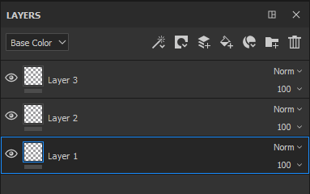

# Administración de capas

Estas son las posibles manipulaciones dentro de la pila de capas :

| *Acción* | *Demostración* |
| --- | --- |
| Haga clic y arrastre para mover una capa. Al mover una capa, puede verse una barra que indica dónde se colocará la capa :<ul data-preserve-html="true"><li data-preserve-html="true"><strong>Barra sobre una capa</strong> : la capa se colocará sobre la capa</li><li data-preserve-html="true"><strong>Barra entre dos capas</strong>: la capa se colocará entre las dos capas</li><li data-preserve-html="true"><strong>Barra debajo de una capa</strong> : la capa se colocará debajo de la capa</li></ul> | 

 |
| **Mover a una carpeta** : haz clic y suelta una capa sobre una carpeta para colocarla dentro | 

 |
| **Selección múltiple** : se puede hacer de dos maneras diferentes:<ul data-preserve-html="true"><li data-preserve-html="true">Presione y mantenga la tecla Ctrl o Comando</li><li data-preserve-html="true">Pulse la tecla Mayús mientras hace clic en la primera y última capa</li></ul> | 

 |
| **Agrupando capas** : se puede crear una carpeta con la capa seleccionada actualmente mediante una de las siguientes acciones:<ul data-preserve-html="true"><li data-preserve-html="true">Haga clic con el botón derecho > Agrupar capas</li><li data-preserve-html="true">Presionar Ctrl+G o Comando+G</li></ul> | 

 |
