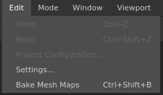

# Menú Edición

\
El menú de edición permite acceder rápidamente a las acciones de deshacer/rehacer, pero también a la configuración del proyecto y a la configuración global.

| Acción | Descripción |
| --- | --- |
| **Deshacer** | Retrocede un paso en la pila de [Historial](../history.md). |
| **Rehacer** | Dé un paso adelante en la pila de [Historial](../history.md). |
| **Configuración del proyecto** | Abra la ventana [configuración del proyecto](../project-configuration.md) del proyecto actual. |
| **Configuración** | Abra la ventana general [configuración de la aplicación](../settings/settings.md). |
| **Mapas de malla de cocción** | Abra la ventana [Horneado](../../baking/baking.md). |
