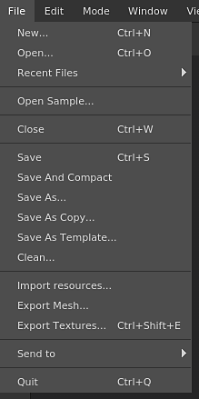

# Menú Archivo

{width="150px"}

El menú Archivo contiene las acciones para crear y guardar los proyectos, así como las acciones para exportar e importar recursos a un proyecto.

| Acción | Descripción |
| --- | --- |
| **Nuevo** | Abra la ventana de creación de nuevo proyecto. Consulte: [Creación de proyectos](../../getting-started/project-creation.md)para obtener más información. |
| **Abrir** | Abra un archivo de proyecto existente en el disco. |
| **Archivos recientes** | Enumere todos los proyectos abiertos recientemente. |
| **Abrir ejemplo** | Abra uno de los proyectos de ejemplo proporcionados con la aplicación. |
| **Cerrar** | Cierre el proyecto abierto. |
| **Guardar** | Guarda el proyecto actual en su lugar. |
| **Guardar y compactar** | Guarda el proyecto actual en su lugar y comprime (reduce el espacio en el disco). |
| **Guardar como** | Guarda el proyecto actual con un nuevo nombre y ubicación. |
| **Guardar como copia** | Guarde el proyecto actual con un nuevo nombre y ubicación como copia y mantenga abierto el proyecto actual. |
| **Guardar como plantilla** | Guarde la configuración actual del proyecto en un archivo de plantilla que se pueda utilizar para un nuevo proyecto. |
| **Limpiar** | Quita del proyecto actual los recursos que no uses (entrará en vigor después de **Guardar**). |
| **Importar recursos** | Abra la ventana de importación de recursos. |
| **Exportar malla** | Abra la ventana de exportación de malla que permite exportar el proyecto actual como un archivo de modelo 3D. |
| **Exportar texturas** | Abra la ventana de exportación de texturas que permite exportar el proyecto actual como texturas de mapa de bits. |
| **Enviar a** | Enumere todas las acciones **Enviar a** para enviar un proyecto a otra aplicación. |
| **Salir** | Cierre la aplicación. Si el proyecto actual tiene cambios sin guardar, se mostrará un mensaje. |

>[!NOTE]
>
> El guardado de un proyecto se puede realizar de dos maneras:
> 
> * **Incremental**: Método predeterminado, que se utiliza al realizar un guardado normal. Sólo la información que ha cambiado se actualizará en el archivo de proyecto del disco. Este método permite guardar el proyecto muy rápidamente sin tener que volver a escribir el archivo del proyecto por completo.
> * **Completo / Compacto** : Si se realiza una operación de limpieza o si el proyecto se guarda con la acción &quot;Guardar y compactar&quot;, el método volverá a escribir el proyecto en el disco por completo. Este método permite eliminar la fragmentación del proyecto y reducir el espacio. Consulte: [Los proyectos son muy grandes](../../technical-support/workflow-issues/project-issues/projects-are-really-big.md).
