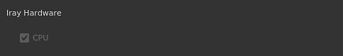

# Preferencias generales

Esta página explica la configuración principal de la aplicación.

## Opciones de interfaz

| Configuración | Descripción |
| --- | --- |
| **Idioma** | Defina el lenguaje utilizado por la interfaz en la aplicación. Esta configuración requiere reiniciar la aplicación para que surta efecto.Valores posibles:<ul data-preserve-html="true"><li data-preserve-html="true"><strong>Valor predeterminado (idioma del sistema)</strong>: recuperar el idioma compatible del sistema operativo</li><li data-preserve-html="true"><strong>Inglés</strong></li><li data-preserve-html="true"><strong>Alemán</strong></li><li data-preserve-html="true"><strong>Francés</strong></li><li data-preserve-html="true"><strong>Japonés</strong></li><li data-preserve-html="true"><strong>Chino</strong> (simplificado)</li></ul> |
| **Mostrar ayudante de teclado** | Si está activada, muestra los métodos abreviados de teclado en la parte inferior izquierda de las ventanillas al pulsar una tecla (como CTRL o MAYÚS). |
| **Mostrar ejes de mundo** | Si está activada, muestra el eje del mundo en la parte inferior derecha de la vista 3D. |
| **Color de fondo** | Selecciona los colores utilizados como fondo para las ventanas gráficas. Hay dos colores disponibles para crear un degradado. |
| **Mostrar solo el material seleccionado al pintar** | Si se activa, solo se mostrará el conjunto de texturas seleccionado actualmente en la vista 3D al pintar (ocultando temporalmente los otros conjuntos de texturas).  **Nota:** Se recomienda mantener esta configuración desactivada, ya que cambiar rápidamente la vista en el puerto de visualización puede afectar al rendimiento de [Texturas virtuales dispersas](../../features/sparse-virtual-textures.md). |
| **Escalado de ventana** | Permite reducir la resolución del puerto de visualización de las pantallas HDPI/Retina para mejorar el rendimiento.Posible valor:<ul data-preserve-html="true"><li data-preserve-html="true"><strong>Ninguno</strong>: sin escalado, la ventana gráfica se procesa con la resolución de pantalla nativa.</li><li data-preserve-html="true"><strong>Automático</strong>: divide la resolución de la pantalla entre dos (solo en pantallas HDPI).</li></ul> |

## Opciones de pila de capas

| Configuración | Descripción |
| --- | --- |
| **Escala de UV predeterminada para materiales** | Define el valor predeterminado de segmentación/repetición para las capas de relleno y el efecto de relleno en la pila de capas al aplicar materiales. |
| **Usar miniaturas simplificadas** | Si está activada, la pila de capas solo mostrará iconos en lugar de calcular miniaturas. El uso de iconos mejora el rendimiento. Esta configuración no se aplica a los proyectos que utilizan el flujo de trabajo de mosaico UV, ya que siempre mostrarán iconos. |

## Opciones de cámara

| Configuración | Descripción |
| --- | --- |
| **Velocidad de rotación** | Multiplicador de la velocidad de rotación predeterminada de la cámara en los puntos de visión. |
| **Velocidad de zoom** | Multiplicador de la velocidad de zoom predeterminada de la cámara en los puntos de visión.La dirección inversa permite invertir la dirección del zoom en función del movimiento del ratón. |
| **Velocidad de la rueda** | Multiplicador de la velocidad de zoom de la rueda del ratón.La dirección inversa permite invertir la dirección del zoom en función del movimiento de la rueda. |

## Opciones de horneado

| Configuración | Descripción |
| --- | --- |
| **Guardar archivos de escena preprocesados** | Si se activa, las mallas de alto contenido de polietileno preprocesadas utilizadas por los panaderos se guardarán en disco para su reutilización en el futuro. Esta configuración permite volver a hornear más rápido. |
| **Habilitar proceso de procesamiento de vista previa dinámica** | Si se activa, la ventana gráfica 3D y 2D mostrará la textura de panadero que se esté calculando en la malla. |
| **Habilitar Trazado de rayos de GPU** | Si está activado, los Panaderos intentarán utilizar la GPU para realizar el trazado de rayos en lugar de la CPU. La función permite a los panaderos actuar más rápido en general.Solo se puede activar en hardware compatible. Consulte [Requisitos del sistema](../../getting-started/system-requirements.md) para obtener más información. |

## Opciones de previsualización

| Configuración | Descripción |
| --- | --- |
| **Directorio de caché local** | Defina la ubicación secundaria en la que se encuentran las miniaturas de recursos cuando se generan.Esta configuración es útil para calcular y almacenar miniaturas de recursos cuando una ruta de acceso de recursos es de sólo lectura (como en una ruta de red con acceso de sólo lectura). De este modo, se evitan volver a calcular las miniaturas en cada inicio, ya que de lo contrario no se guardarían en el disco. |
| **Presupuesto de caché local (en MB)** | Defina el tamaño máximo de la caché para la caché local. |
| **Sombreador de previsualización de material** | Defina un sombreado para utilizarlo para generar miniaturas de materiales en los estantes. Esto resulta útil si los recursos utilizan un flujo de trabajo diferente del sombreado predeterminado. Esta configuración requiere reiniciar la aplicación para que surta efecto. |

## Archivos temporales

| Configuración | Descripción |
| --- | --- |
| **Directorio de caché** | Define la ubicación donde se escriben los archivos temporales. Esto incluye la caché de [Texturas virtuales dispersas](../../features/sparse-virtual-textures.md). Esta configuración puede ser reemplazada por [variables de entorno](../../pipeline-and-integration/configuration/environment-variables.md). |

## Texturas virtuales dispersas

| Configuración | Descripción |
| --- | --- |
| **Aceleración de soporte de hardware** | Si se habilita, la aplicación intentará utilizar las texturas dispersas con la GPU. Para obtener más información, consulte la página [Texturas virtuales dispersas](../../features/sparse-virtual-textures.md). Esta configuración puede ser reemplazada por [variables de entorno](../../pipeline-and-integration/configuration/environment-variables.md). |

## Hardware iraquí

Esta sección enumera todo el hardware compatible disponible que se puede utilizar al procesar con Iray.

La configuración de CPU está disponible en todos los equipos. Si el equipo tiene una **GPU Nvidia** con una versión de CUDA compatible, también aparecerá aquí.

>[!NOTE]
>
> Se recomienda desactivar la CPU y mantener activado únicamente el hardware de la GPU para garantizar el mejor rendimiento de procesamiento. Tener la CPU y la GPU activadas a la vez puede aumentar el tiempo de procesamiento.

## Privacidad

| Configuración | Descripción |
| --- | --- |
| **Enviar automáticamente estadísticas de uso** | Si está habilitado, envíe información anónima sobre la configuración del hardware del equipo junto con otros datos de uso. Estos datos nos ayudan a desarrollar y mejorar el software. |
