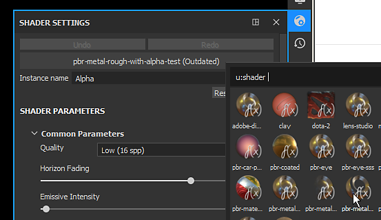
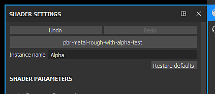
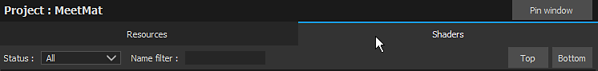

# Actualización de un sombreador

En ocasiones, puede ser necesario actualizar el sombreador utilizado por un proyecto para solucionar problemas o aprovechar las funciones más recientes. Esta página describe cómo hacerlo.

A continuación se muestran dos métodos paso a paso sobre cómo actualizar el sombreador de un proyecto:

* **Actualizar un Sombreador a través de la ventana de Sombreador**
* **Actualizar un Sombreador mediante el complemento Resource Updater**

Si un proyecto usa un **sombreador personalizado** (no enviado de forma predeterminada con Substance 3D Painter), consulta la página [Sombreador personalizado](https://substance3d.adobe.com/display/DRAFTPAINTER/Shader+API) para obtener una guía sobre cómo actualizarlo.

## Actualización de un Sombreador mediante la ventana Sombreador

### 1 - Abra la ventana Configuración de Sombreador

La ventana **Configuración de Sombreador** está disponible a la derecha de forma predeterminada en la barra de herramientas de Dock.

### 2 - Haga clic en el botón sombreador y seleccione el sombreador actualizado

Haga clic en el botón sombreador (debajo del botón deshacer/rehacer) y busque el sombreador que coincida con el que ya se utilizó.

### 3 - Sombreador actualizado

Una vez cargado el nuevo sombreador, la mención **outdated** se debe quitar y el modelo 3D debe aparecer normalmente en la ventana gráfica.

## Actualizar un Sombreador mediante el complemento Resource Updater

### 1 - Abra el actualizador de recursos

Dirígete a la izquierda de la interfaz para buscar la barra de herramientas **Complementos** y haz clic en el icono **Actualizador de recursos**.

### 2 - Cambiar a la pestaña Sombreador

En la nueva ventana que apareció, haga clic en la pestaña &quot;Sombreador&quot; para mostrar el sombreador presente en el proyecto actual.

### 3 - Encontrar el Sombreador y actualizarlo

En la ficha Sombreador debería aparecer una lista de todos los usuarios de recursos de Sombreador del proyecto actual. El Sombreador **obsoleto** está visible con un **fondo rojo** . Haga clic en el botón &quot;actualizar&quot; junto a un recurso para actualizarlo.

