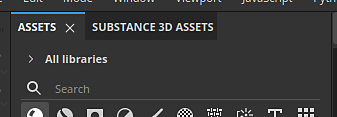

# Substance 3D Assets

El dock de <b>Substance 3D Assets</b> permite examinar la biblioteca en línea con el mismo nombre directamente dentro de la aplicación. La biblioteca original está disponible en la siguiente dirección: <https://substance3d.adobe.com/assets>

>[!NOTE]
>
> La ventana de Substance 3D Assets no está disponible con la versión de Steam de la aplicación.

## Ubicación

De forma predeterminada, la ventana se acopla como una pestaña junto a la ventana Activos generales. Si la ventana está cerrada, se puede volver a abrir desde la barra de herramientas acoplada situada en el extremo derecho de la interfaz.

### Examinar activos

Para examinar activos, puede utilizar la interfaz disponible en la ventana. La parte superior muestra un campo de búsqueda para refinar su búsqueda y también hay un filtro disponible.

### Descarga de recursos

Una vez que haga clic en el botón de descarga de un activo, comenzará la descarga y aparecerá dentro del gestor de descargas de la ventana. Para verlo simplemente haga clic en el botón inferior izquierdo de la ventana.

Esta lista solo muestra los activos descargados durante la sesión actual de la aplicación.

Una vez que un activo se haya descargado correctamente, aparecerá en la ventana normal de <b>Assets</b>.

>[!NOTE]
>
> La ubicación donde se descargan los recursos depende de la biblioteca predeterminada. Esta ubicación se puede cambiar en las preferencias. Consulte la [página de documentación](assets/adding-a-new-library.md) dedicada.

### Menú Control

El botón de la parte inferior derecha de la ventana ofrece algunas acciones:

* <b>Abrir ubicación de carpeta</b>: abra el explorador de archivos en la ubicación de la biblioteca actual. Esto permite examinar en el disco los activos descargados (incluidas las sesiones anteriores).
* <b>Volver a cargar la página</b>: vuelva a cargar la interfaz dentro de la ventana.
* <b>Página anterior</b>: desplácese a la interfaz anterior dentro de la ventana.
* <b>Página siguiente</b>: vaya a la siguiente interfaz dentro de la ventana.

