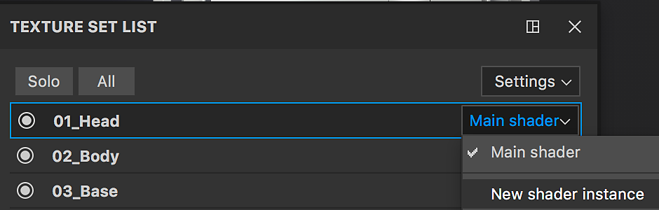

# Lista Conjunto de texturas

La ventana **Lista de conjuntos de texturas** muestra todos los identificadores de material del modelo 3D actual de un proyecto. Permite cambiar y ver la pila de capas asociada a cada material del modelo, así como sus ajustes específicos.

El objetivo principal de la ventana Lista de conjuntos de texturas es permitir el cambio de un material a otro para acceder a la pila de capas asociada a cada material.\
En el caso del flujo de trabajo [Material Layering](../../features/dynamic-material-layering.md), las **subpilas** se muestran **debajo** del nombre del conjunto de texturas.

>[!WARNING]
>
> Solo se puede editar o pintar un conjunto de texturas a la vez.

## Estado del conjunto de texturas

Los conjuntos de texturas pueden tener varios estados :

* **Seleccionado** : El conjunto de texturas actual se está editando. Al seleccionar un conjunto de texturas, se actualizará la ventana [Pila de capas](../layer-stack/layer-stack.md) y la [configuración de Sombreador](../shader-settings/shader-settings.md) según corresponda.
* **Visible/Oculto** : Consulte la sección de visibilidad a continuación para obtener más detalles.
* **Deshabilitado** : Esto significa que los conjuntos de texturas y su pila de capas asociada no se pueden adjuntar a un material en la malla. Consulte [Reasignación de conjunto de texturas](texture-set-reassignment.md) para obtener más información.

## Visibilidad

La visualización de un conjunto de texturas puede gestionarse mediante los iconos dedicados:

| *Icono* | *Acción* | *Descripción* |
| --- | --- | --- |
| 

 | Abrir menú | Abra un nuevo menú con las siguientes acciones:<ul data-preserve-html="true"><li data-preserve-html="true"><strong>Mostrar todo</strong>: Mostrará todos los conjuntos de texturas en la ventana gráfica.</li><li data-preserve-html="true"><strong>Ocultar todo</strong>: Ocultará todos los conjuntos de texturas en la ventana gráfica.</li><li data-preserve-html="true"><strong>Invertir Mostrar/Ocultar</strong>: Los conjuntos de texturas visibles se ocultarán y los conjuntos de texturas ocultos se volverán visibles.</li></ul> |
| 

 | Modo de enfoque | Aísle el conjunto de texturas activo actualmente y oculte el resto mientras este modo está activo. Haga clic de nuevo en este botón para salir del modo. |
| 

 | Visibilidad | Haga clic en este botón junto a un conjunto de texturas para ocultar o hacer visible un conjunto de texturas en la ventana gráfica. |

>[!NOTE]
>
> De forma predeterminada, solo se muestra el conjunto de texturas que se está seleccionando al **pintar**. Es posible cambiar este comportamiento en [Preferencias](../settings/settings.md) desmarcando &quot;**Mostrar solo el material seleccionado al pintar**&quot;.\
> Nota : ocultar otros conjuntos de texturas mientras se pinta **mejorar el rendimiento**.

## Menú contextual

Al hacer clic con el botón derecho en un nombre de conjunto de texturas, se abre un menú contextual con las siguientes acciones:

* **Mostrar/ocultar conjunto de texturas** : alternar la visibilidad del conjunto de texturas (como se describe en la sección anterior)
* **Editar nombre** : permite cambiar el nombre de un conjunto de texturas. Este nombre también se utilizará durante el proceso de exportación de las Texturas. También es posible cambiar el nombre haciendo doble clic en el nombre del conjunto de texturas.
* **Restablecer nombre a \*nombre original\*** : Restaure el nombre original del conjunto de texturas del material de malla si se ha cambiado.
* **Editar descripción** : permite añadir o cambiar la descripción asociada a un conjunto de texturas.

## Gestión de sombreador

El botón situado a la derecha de cada nombre de conjunto de texturas se puede utilizar para gestionar la asignación de sombreador.\
De forma predeterminada, cada conjunto de texturas comparte la misma instancia del sombreador. Sin embargo, a veces puede ser conveniente tener un sombreador diferente solo para una parte específica de la malla. Para ello, haz clic en el botón y elige &quot;**Nueva instancia del sombreador**&quot;. Desde allí, en la ventana [Configuración de Sombreador](../shader-settings/shader-settings.md) es posible cambiar el sombreador y sus parámetros sin que esto afecte a otros conjuntos de texturas.

{width="500px"}

## Configuración

El botón de configuración abre un nuevo menú que muestra varias acciones :

* **Ocultar descripciones vacías** (predeterminado) : Ocultar los campos de descripción si están vacíos
* **Ocultar todas las descripciones** : Ocultar los campos de descripciones aunque no estén vacíos
* **Mostrar todas las descripciones** : Mostrar los campos de descripciones aunque estén vacíos
* **Importar parámetros de sombreado** : Permitir la importación de un archivo json para configurar los parámetros de sombreador de los conjuntos de texturas
* **Reasignar conjuntos de texturas** : Consulte la [reasignación de conjuntos de texturas](texture-set-reassignment.md) para obtener más información.
