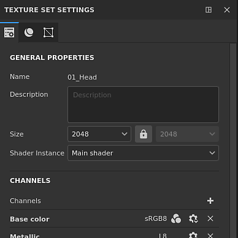

# Ajustes del conjunto de texturas

{width="300px"}

La **configuración del conjunto de texturas** controla los parámetros del conjunto de texturas seleccionado actualmente. Aquí es donde se puede gestionar la resolución, los canales y los mapas de malla asociados.

## Propiedades generales

| Configuración | Descripción |
| --- | --- |
| **Nombre** | Nombre del conjunto de texturas. Se hereda para el nombre de material asignado en el modelo 3D. |
| **Descripción** | Campo de texto que permite añadir información sobre un conjunto de texturas. Este texto se muestra en la lista [Conjunto de texturas](texture-set-list.md) y en las ventanas [Haciendo un bake](../../baking/baking.md). |
| **Tamaño** | Controla la resolución de los canales en píxeles dentro de un conjunto de texturas. Para usar resoluciones **no cuadradas** (por ejemplo, 2048x1024), deshabilite el **botón de bloqueo** entre los dos menús desplegables.Las resoluciones del conjunto de texturas son **dinámicas** debido al **flujo de trabajo no destructivo**. Esto significa que es posible trabajar a baja resolución para obtener buenas actuaciones y luego utilizar una resolución más alta más adelante para obtener una mejor calidad. Dentro de la aplicación, la resolución máxima de un canal es de 4096x4096 píxeles, mientras que al exportar el máximo es de 8192x8192 (si es compatible con la GPU). El cambio de la resolución puede desencadenar un cálculo prolongado del motor. |
| **Instancia del sombreador** | Defina qué [Sombreador](../shader-settings/shader-settings.md) se debe usar para procesar el conjunto de texturas especificado en el [punto de visión](../viewport/viewport.md). |

## Canales

### Lista de canales

La lista se puede modificar en cualquier momento agregando o quitando canales (a menos que el flujo de trabajo [Material Layering](../../features/dynamic-material-layering.md)lo reemplace).

| Botón / icono | Descripción |
| --- | --- |
| <b>Agregar canal</b>  

 | Haga clic en este botón para añadir un nuevo canal a la lista.El menú emergente que se abre se divide en tres categorías:<ul data-preserve-html="true"><li data-preserve-html="true"><strong>Canales compatibles</strong>: estos canales los puede utilizar el sombreador actual en la ventana gráfica.</li><li data-preserve-html="true"><strong>Canales no compatibles</strong>: estos canales son ignorados por el sombreador actual en la ventana gráfica.</li><li data-preserve-html="true"><strong>Canales de usuario</strong>: canales adicionales para pintar más información, normalmente no admitidos por los sombreadores.</li></ul>  **Nota:** No hay límite en la cantidad de canales que se pueden agregar; sin embargo, demasiados canales pueden afectar gravemente al rendimiento y requerirán más memoria. |
| <b>Quitar canal</b>  

 | Eliminar un canal de la lista.  **Nota:** La información de pintura dentro del proyecto no se elimina con el canal, por lo que el canal se puede agregar de nuevo más adelante si es necesario para recuperar la texturización (después de un nuevo cálculo). |
| <b>Nombre de canal</b>  

 | El nombre de un canal determinado.Se puede cambiar el nombre de los canales de usuario haciendo doble clic en el nombre actual: 

 |
| <b>Configuración de canal</b>  

 | Este botón abre el menú de ajustes del canal con varias acciones.La primera lista de acciones controla el tipo de almacenamiento y la precisión del canal:<ul data-preserve-html="true"><li data-preserve-html="true"><strong>sRGB8</strong>: Colores RGB, valores corregidos por gamma, almacenados en 8 bits.</li><li data-preserve-html="true"><strong>L8</strong>: Valores de escala de grises, almacenados en 8 bits.</li><li data-preserve-html="true"><strong>RGB8</strong>: Colores RGB, almacenados en 8 bits.</li><li data-preserve-html="true"><strong>L16</strong>: Valores de escala de grises, almacenados en 16 bits.</li><li data-preserve-html="true"><strong>RGB16</strong>: Colores de RGB, almacenados en 16 bits.</li><li data-preserve-html="true"><strong>L16F</strong>: Valores de escala de grises: positivos y negativos, almacenados en 16 bits flotantes.</li><li data-preserve-html="true"><strong>RGB16F</strong>: Colores RGB: positivos y negativos, almacenados en 16 bits flotantes.</li><li data-preserve-html="true"><strong>L32F</strong>: Valores de escala de grises: positivos y negativos, almacenados en 32 bits flotantes.</li><li data-preserve-html="true"><strong>RGB32F</strong>: Colores RGB: positivos y negativos, almacenados en 32 bits flotantes.</li></ul>  **Nota:** El tipo de almacenamiento **no es** un control de espacio de color/gamma. Los datos utilizados para almacenar la información de un canal (por ejemplo, sRGB8 o L32F) no afectan a la forma en que la aplicación los leerá. Por ejemplo, el canal Rugosidad seguirá considerándose como datos/RAW y el color base seguirá considerándose corregido por gamma.  La última acción del menú se puede usar para habilitar o deshabilitar la [administración de color](../../features/color-management/color-management.md) en el canal:<ul data-preserve-html="true"><li data-preserve-html="true"><strong>Canal de color</strong>: si está activado, el canal tiene gestión de color. Esta opción solo se puede modificar manualmente para los canales de usuario.</li></ul> |
| <b>Administración de color</b>  

 | Si está presente, indica que el canal tiene gestión de color. Solo los canales de usuario se pueden marcar como con gestión de color o no, el comportamiento de otros canales es fijo.Para obtener una lista detallada de los canales con o sin gestión de color, consulte: [Administración de color](../../features/color-management/color-management.md). |

### Ajustes de mezcla

Estos ajustes controlan distintos comportamientos sobre cómo se generan los canales, en particular, cómo se combinan los canales con las texturas hechas un bake (mapas de malla).

| Configuración | Descripción |
| --- | --- |
| **Mezcla normal** | Controla cómo se debe combinar el &quot;mapa de normales hecho un bake&quot; con el canal &quot;Normal&quot;. Los valores posibles son:<ul data-preserve-html="true"><li data-preserve-html="true"><strong> Reemplazar </strong> : Ignore el &quot;mapa de normales hecho un bake&quot; y solo utilizará el canal &quot;Normal&quot; para este conjunto de texturas. Se puede utilizar para realizar la pintura sobre un mapa de normales hecho un bake. Consulte la documentación de [pintura avanzada de canales](../../painting/advanced-channel-painting/normal-map-painting.md)para obtener más información. si el canal Normal no está presente o si la salida del canal Normal está vacía, se seguirá utilizando el mapa de normales hecho un bake.</li><li data-preserve-html="true"><strong> Combinar </strong> (predeterminado) : Utilice una función orientada a los detalles para combinar el canal &quot;Normal&quot; y el &quot;mapa de normales hecho un bake&quot;.</li></ul>  **Nota:** Esta configuración puede estar deshabilitada si falta el canal en la lista de canales. Si falta el canal, se utiliza el valor de mezcla predeterminado. |
| **Height al método normal** | Controla el método que se debe utilizar para convertir el canal de height en un mapa de normales. Los valores posibles son:<ul data-preserve-html="true"><li data-preserve-html="true"><strong>Agudo</strong>: producir un mapa de normales más definido con el riesgo de introducir ruido y suavizado. Adaptado para patrones repetitivos como telas.</li><li data-preserve-html="true"><strong>Suave (sobel)</strong> (predeterminado): producir un mapa de normales más suave con un filtro Sobel con el riesgo de perder detalles. Adaptado para la mayoría de los casos.</li></ul> |
| **Mezcla de Oclusión ambiental** | Controla cómo se debe combinar la &quot;oclusión ambiental hecha un bake&quot; con el canal &quot;Oclusión ambiental&quot;. Los valores posibles son:<ul data-preserve-html="true"><li data-preserve-html="true"><strong> Reemplazar </strong> : Ignore la &quot;oclusión ambiente al horno&quot; y solo utilizará el canal &quot;Oclusión ambiente&quot; para este conjunto de texturas. Se puede utilizar para realizar la pintura sobre una oclusión ambiental hecha un bake. Consulte la documentación de [pintura avanzada de canales](../../painting/advanced-channel-painting/ambient-occlusion-painting.md) para obtener más información.  </li><li data-preserve-html="true"><strong> Multiplicar </strong> (predeterminado) : Utilice una operación de multiplicación para combinar el canal &quot;Oclusión ambiente&quot; y la &quot;oclusión ambiente horneada&quot;.  </li></ul>  **Nota:** Esta configuración puede estar deshabilitada si falta el canal en la lista de canales. Si falta el canal, se utiliza el valor de mezcla predeterminado. |
| **Relleno UV** | Controla cómo se genera el relleno fuera de la Isla de UV. Los valores posibles son:  <ul class="steps" data-preserve-html="true"> <li class="step" data-preserve-html="true">    <strong>Vecino de espacio 3D</strong> (predeterminado): Mira el otro lado de la costura UV para encontrar el color de píxel vecino y úsalo en el borde UV. Este ajuste se recomienda al pintar costuras UV con patrones continuos. Ejemplo con relleno normal a la izquierda y el vecino 3D a la derecha:           </li> <li class="step" data-preserve-html="true">    <strong>Vecino de espacio 2D</strong>: Copie el píxel dentro de una Isla de UV en el borde exterior de la Isla de UV antes de generar el relleno. Esta configuración se recomienda cuando las Islas de UV tienen información muy opuesta y no se superponen. Ejemplo con una esfera en la que las bandas tienen cada una un color único por Islas de UV, a la izquierda con la configuración de vecino 2D y vecino 3D a la derecha (observe el sangrado):           </li> </ul>  **Nota:** Esta configuración de relleno se guarda por conjunto de texturas y se tiene en cuenta durante la exportación de texturas y la visualización en la ventana gráfica.Debido a cómo funciona el vecino de espacio 3D no se puede utilizar con el canal normal y utilizará la versión 2D en su lugar. |

## Mapas de malla

Los mapas de malla son texturas hechas un bake específicas de la malla y el conjunto de texturas que se utilizan para aumentar la calidad de las texturas con la ayuda de filtros, Materiales inteligentes y Máscaras inteligentes. Para obtener más información, consulta la documentación sobre [hacer un bake](../../baking/baking.md).
