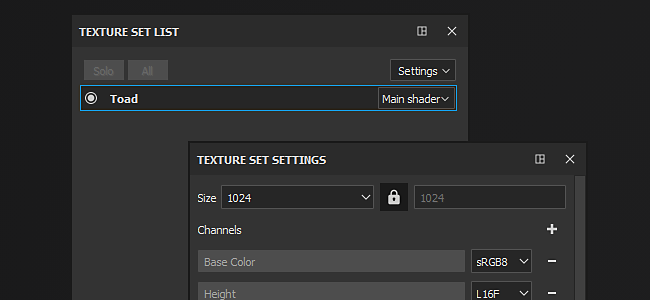

# Conjunto de texturas

Substance 3D Painter creará automáticamente un nuevo conjunto de texturas cada vez que encuentre un ID de material en una malla importada ([), a menos que un proyecto utilice el flujo de trabajo de Mosaico de UV (](../../features/uv-tiles/uv-tiles.md)).

Se espera que cada ID de material tenga UV únicos (o solapamiento lógico para la geometría simétrica).

Para obtener más información sobre las propiedades y manipulaciones del **Conjunto de texturas**, consulte:

* [Lista Conjunto de texturas](texture-set-list.md)
* [Ajustes del conjunto de texturas](texture-set-settings.md)
* [Reasignación de conjunto de texturas](texture-set-reassignment.md)
