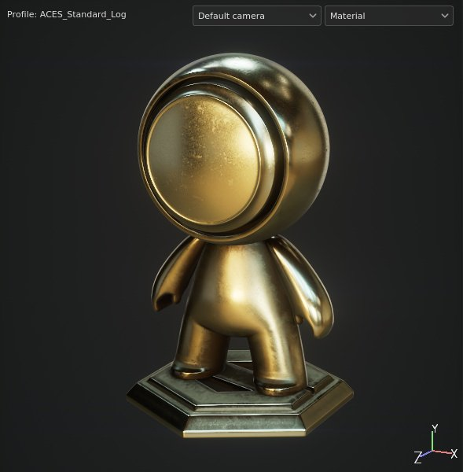

# Vista 3D

{width="370px"}

El Vista 3D muestra el modelo 3D en condiciones de iluminación, lo que ayuda a observar cómo se define el material de superficie. Aquí también es donde es posible realizar la pintura directamente sobre el modelo 3D.

## Perfil

En la parte superior izquierda de la ventana gráfica puede aparecer un texto que indica el perfil cargado actualmente. Para obtener más información, consulte la página [Perfil de color](../../features/post-processing/color-profile.md).

## Selección de cámara

Si el archivo de modelo 3D utilizado para crear el proyecto o importar la malla tiene cámaras definidas, se pueden importar al proyecto y utilizar para cambiar la ubicación y la orientación de la cámara. Este menú desplegable permite cambiar entre la cámara disponible en el proyecto. Si no hay otra cámara que no sea la predeterminada, no se mostrará el menú desplegable.

El cambio de cámara se puede hacer rápidamente con el [método abreviado de teclado](../settings/shortcuts.md) dedicado. Para obtener más información, consulte la página [Administración de cámaras](camera-management.md).

## Modo de visualización

Por defecto, el modo de visualización de la ventanilla se define en material para mostrar la iluminación del entorno. El menú desplegable permite cambiar el modo de visualización a solo, lo que aísla canales y mapas de malla individualmente.

Esta iluminación se puede controlar mediante la [configuración de la pantalla](../display-settings/display-settings.md), así como mediante otras configuraciones de representación. La orientación de la iluminación también se puede cambiar con la ayuda del [método abreviado del teclado](../settings/shortcuts.md).

## Eje

En la parte inferior derecha de la ventana gráfica se encuentra el eje de la vista 3D, que indica cómo se orienta la escena en comparación con la cámara.

## Configuración adicional

La visualización de la ventana gráfica puede verse afectada por otros ajustes:

* [Configuración del sombreador](../shader-settings/shader-settings.md)
* [Posprocesamiento](../../features/post-processing/post-processing.md)
