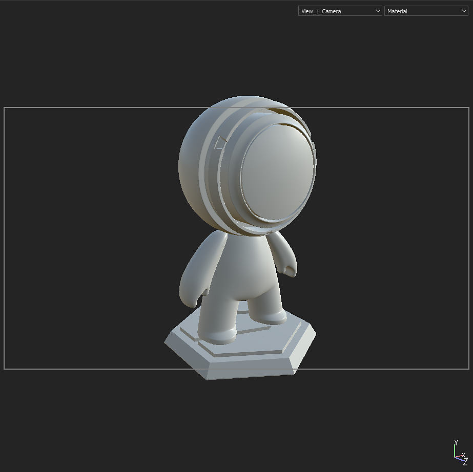

# Gestión de cámaras

Las cámaras creadas en Maya, Max, Blender, Modo y DAE se pueden importar en Substance 3D Painter.

>[!NOTE]
>
> Las cámaras ortográficas y las proporciones de visualización no se admiten correctamente en el formato ABC (Alembic).

## Importación de cámaras en Substance 3D Painter

Las cámaras deben incluirse en el archivo de malla, ya sea en formato FBX o ABC (Alembic).

Se importan el nombre, los parámetros de transformación, el campo de visión y la proporción de aspecto (si existe).

En la ventana Nuevo proyecto, seleccione el archivo de malla que incluye las cámaras y verifique que la casilla **Importar cámaras** esté marcada. Si activa **Reimportar malla** en la ventana **Editar > Configuración del proyecto**, también puede activar **Importar cámaras** si no las vio en la creación inicial del proyecto.

A continuación, haz clic en **Aceptar**:

<table>
  <tr style="border: 0;">
    <td style="border: 0;" valign="top"></td>
    <td style="border: 0;" valign="top"></td>
  </tr>
</table>

## Seleccionar cámaras

Cuando hayas importado cámaras en tu proyecto actual, puedes seleccionar qué cámara está activa en el **menú desplegable** del **Ventana gráfica 3D**.

De forma predeterminada, se selecciona la cámara de Painter denominada &quot;Cámara predeterminada&quot; y está en modo de perspectiva.

En el ejemplo anterior, se importan 3 cámaras, lo que proporciona un total de 4 cámaras en el menú desplegable cuando se incluye la cámara predeterminada.

## Controlar las cámaras

Cuando se selecciona una cámara importada, al mover la cámara en el área de visualización por panorámica, zoom o rotación, se cambia a la cámara predeterminada. Esto evita que las cámaras importadas se muevan a la escena.

>[!NOTE]
>
> Si necesita cambiar la posición de la cámara importada, puede actualizarla en la aplicación de edición de escenas elegida y volver a importar la escena con **Editar > Configuración del proyecto**.

Puede controlar los parámetros de las cámaras importadas en la **ventana de configuración de visualización**.

Use el menú desplegable **Ajuste preestablecido** para seleccionar la cámara que desea modificar.

Si se modifica alguno de los atributos, es posible volver a sus valores originales con el **botón Restaurar**.

Si se ha modificado un parámetro para una cámara importada, el nombre de la cámara aparece en cursiva y se añade &quot;\*&quot; al nombre de la cámara.

### Atributos de cámara

El campo de visión o FOV se expresa en grados.

La Distancia focal se expresa en mm.

En el modo Ventana gráfica (OpenGL), se desactivan la distancia de enfoque y la apertura. Para activarlos, deben activarse Post Effects y DOF.

### Relación de visualización

Si la relación de visualización está presente en el archivo de malla, se mostrará en la sección Cámara. Si una cámara no tiene una relación de visualización definida, aparecerá como **No especificada** (como la cámara predeterminada).

### Bloquear

Una cámara se puede bloquear haciendo clic en el icono de candado. El bloqueo de una cámara evita cambios en los parámetros de la cámara.

## Encuadre de la cámara

El marco de la cámara se puede alternar en **Configuración de la pantalla > Configuración de la ventana gráfica**:

También puede ajustar la opacidad del área que se encuentra fuera del marco con la opacidad de la **máscara de puerta**.

<table>
  <tr style="border: 0;">
    <td style="border: 0;" valign="top"></td>
    <td style="border: 0;" valign="top"></td>
  </tr>
</table>
