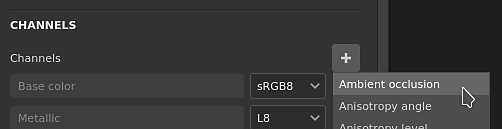

# Pintura oclusión ambiental

El canal de oclusión ambiental permite realizar la pintura de detalles en las sombras ambientales de un objeto. Se puede utilizar para añadir detalles del AO procedentes de materiales o simplemente para corregir errores de hace un bake manual cuando sea necesario.

&#x200B;>> 

En los gráficos de ordenador, la oclusión ambiental es una técnica de sombreado y de procesamiento que se utiliza para calcular la exposición de cada punto de una escena a la luz ambiente. El interior de un tubo suele estar más ocluido (y, por lo tanto, más oscuro) que las superficies exteriores expuestas, y cuanto más profundo sea el interior del tubo, más ocluida (y más oscura) será la iluminación. La oclusión ambiental se puede ver como un valor de accesibilidad que se calcula para cada punto de superficie.\
Fuente: &lt;https://en.wikipedia.org/wiki/Ambient_occlusion>

El **resultado** de este cálculo se almacena en un mapa de bits denominado mapa de Oclusiones ambientales. Este mapa se puede hacer un bake directamente en la aplicación, consulte: [Haciendo un bake](../../baking/baking.md).

## Oclusión ambiental de pintura

Para pintura de detalles de oclusión personalizados, se requiere un canal de Oclusión ambiental. Se puede agregar a través de la [configuración del conjunto de texturas](../../interface/texture-set/texture-set-settings.md):

Una vez que el canal se ha añadido a un conjunto de texturas, se puede utilizar cualquier capa para pintura de nueva información. Dado que el canal AO solo contiene información en escala de grises, se recomienda el modo de fusión **Normal** (pintura superpuesta) y **Multiplicar** (combinar).

Para obtener más información sobre ellos y cómo cambiarlos por canal, consulte: [Modos de fusión](../../interface/layer-stack/blending-modes.md).

## Pintar sobre el mapa adicional de la Oclusión ambiental

En algunas situaciones, puede ser útil realizar una pintura sobre la Oclusión ambiental hecha un bake para ocultar detalles o incluso corregir problemas que hacen un bake.

La configuración predeterminada de un proyecto en Substance 3D Painter combinará la Oclusión ambiental **channel** con el mapa de Oclusiones ambientales de **mapas adicionales** . Esto significa que pintar sobre el mapa adicional hecho un bake no es posible por defecto, los resultados de cada mapa (los mapas con bake y los canales) se multiplicarán juntos. Sin embargo, esto se puede cambiar con la siguiente configuración:

### 1 - Añadir un canal de Oclusión ambiental

Añadir un canal de oclusión ambiental en el conjunto de texturas actual :\

Establezca su modo de mezcla en &quot;**replace**&quot; en lugar de &quot;**multiply**&quot; :\

### 2 - Configuración de una capa de relleno con la oclusión ambiental hecha un bake

Cree una nueva capa de relleno y coloque la oclusión ambiental hecha un bake dentro de la ranura &quot;oclusión ambiental&quot; a través del panel Propiedades. No olvide cambiar el segmentado predeterminado de la capa de relleno si aún no está establecida en 1.\

### 3 - Cambio del modo de fusión de la capa de relleno

De forma predeterminada, el modo de fusión del canal AO en cualquier capa nueva está establecido en &quot;**Multiply**&quot;. Como es preferible usar la capa de relleno como base, elegimos el modo de fusión &quot;normal&quot; ya que el mapa de bits no tiene ningún alfa, reemplazará todo lo que hay debajo (incluido el color predeterminado del sombreador).\

### 4 - Creación de una capa de pintura sobre el mapa de oclusión ambiental hecho un bake

Cree una nueva capa (normal o de relleno) y cambie su modo de fusión a &quot;normal&quot; para el canal de AO. Una vez realizada esta configuración, cualquier elemento pintado en el canal del AO se hará cargo del mapa del AO hecho un bake que se encuentra en la capa inferior.\

