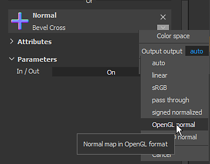

# Pintura de mapa de normales

Para pintar los detalles, pinte directamente los datos de Mapa de normales en la malla. Esta página reagrupa diferentes formas de administrar la pintura en mapa de normales.

## Pintar Detalles de mapa de normales

Para pintura de detalles de mapa de normales:

1. Añadir un canal normal en el conjunto de texturas actual (si aún no está presente)
1. Activar el canal normal en la herramienta de pintura actual
1. Cargue un recurso Normal en la ranura Normal de la sección Material de la herramienta de pintura actual.

A partir de ahí, pintar con un mapa de normales es muy similar a [Pintar mapa de altura](height-map-painting.md) , con la precisión añadida de una normal hecha un bake.

## Modos de fusión normales

Los mapas de normales tienen sus propios modos de fusión en la pila de capas:

* **Detalle del Mapa de normales** (predeterminado)
* **Detalle inverso del Mapa de normales**
* Combinación de Mapas de normales **1&rbrace;**

Para obtener más información, consulte la página [Modos de fusión](../../interface/layer-stack/blending-modes.md).

## Espacio de color normal

Al cargar un mapa de normales en la ranura de un material (propiedades de herramienta o capa de relleno), es posible cambiar el espacio de color predeterminado.

Esta configuración se puede utilizar para especificar el Formato de mapa de normales, ya que de forma predeterminada se espera un mapa de normales de DirectX (Y-) (no se ve afectado por la configuración del proyecto). Por lo tanto, al utilizar un mapa de normales OpenGL (Y+), es necesario hacer clic en la pequeña flecha para abrir el menú de espacio de color y, a continuación, cambiar el espacio de color del mapa de bits.

## Pintar sobre un mapa de normales hecho un bake

En algunas situaciones, puede ser útil poder realizar una pintura sobre el mapa de normales hecho un bake para ocultar detalles (o incluso corregir problemas que hacen un bake).\
La configuración predeterminada de un proyecto en Substance 3D Painter no lo permite, ya que calcula el canal normal y la normal hecha un bake por separado. Este comportamiento se puede cambiar a través de la [configuración del conjunto de texturas](../../interface/texture-set/texture-set-settings.md) .

### 1 - Cambio del modo de fusión Conjunto de texturas

De forma predeterminada, se crea un conjunto de texturas con el ajuste **mezcla normal** establecido en **combinar** .

Para invalidar/pintura el mapa de normales, es importante establecer esta configuración en **replace**. El mapa de normales desaparecerá de la ventana gráfica, pero eso es lo que se espera. Si se cambia este modo a **replace**, Substance 3D Painter solo tendrá en cuenta el canal normal y el canal de height al generar el mapa de normales final.

### 2 - Configuración de una capa de relleno con el mapa de normales hecho un bake

Cree una nueva capa de relleno y coloque la normal hecha un bake dentro de la ranura &quot;normal&quot; a través del panel Propiedades. No olvide cambiar el segmentado predeterminado de la capa de relleno si no se establece en 1.

### 3 - Cambio del modo de fusión de la capa de relleno

De forma predeterminada, el modo de fusión del canal normal en cualquier capa nueva se define en &quot;Detalles del Mapa de normales&quot;. Como es preferible usar la capa de relleno como base, elegimos el modo de fusión &quot;normal&quot; ya que el mapa de bits no tiene ningún alfa, reemplazará todo lo que hay debajo (incluido el color predeterminado del sombreado).

### 4 - Creación de una pintura en el mapa de normales hecho un bake

Cree una nueva capa (normal o de relleno) y cambie su modo de fusión a &quot;normal&quot; para el canal normal. Una vez realizada esta configuración, cualquier elemento pintado en el canal normal se hará cargo del mapa de normales hecho un bake que se encuentra en la capa inferior.

