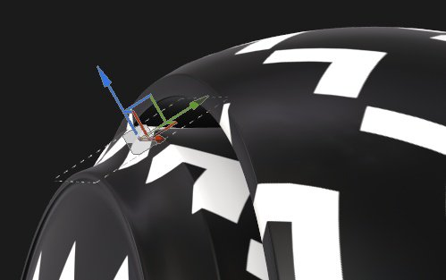

# Proyección de plano

La proyección Plana del relleno es una proyección 3D que proyecta una imagen en una dirección como un plano. Se puede utilizar para proyectar signos, pegatinas y otros patrones en la superficie o a través del modelo 3D.

## Propiedades

| *Configuración* | *Descripción* |
| --- | --- |
| **Filtrado** | Controla cómo se filtrará la textura o el material. Este ajuste puede afectar al aspecto de la textura cuando se repite varias veces. Si los valores de escala son altos y se utiliza un filtro diferente al predeterminado, el resultado puede ser más atractivo. Configuración actual disponible:<ul data-preserve-html="true"><li data-preserve-html="true"><strong>HQ `\|` bilineal</strong> (predeterminado): Filtro bilineal avanzado que intenta mejorar la calidad de la textura cuando los valores de mosaico son altos.</li><li data-preserve-html="true"><strong>Bilineal `\|` Agudo</strong>: Filtro bilineal simple que suaviza ligeramente la textura pero intenta conservar los detalles.</li><li data-preserve-html="true"><strong>Más cercano</strong>: Sin filtrado, útil si el filtrado bilineal proporciona un resultado borroso y rompe detalles precisos. Puede introducir el suavizado en la textura.</li></ul> |
| **Envolvimiento de UV** | Controle cómo se repite la textura dentro de la proyección. Los valores posibles son:<ul data-preserve-html="true"><li data-preserve-html="true"><strong>Ninguno</strong>: la textura no se repite. Cualquier cosa fuera de la textura es negro/transparente.</li><li data-preserve-html="true"><strong>Repetir horizontalmente</strong>: la textura solo se repite horizontalmente.</li><li data-preserve-html="true"><strong>Repetir verticalmente</strong>: la textura solo se repite verticalmente.</li><li data-preserve-html="true"><strong>Repetir</strong> (predeterminado): la textura se repite en ambos ejes.</li></ul>  

 |
| **Recorte de forma** | Defina si la textura proyectada debe ser visible fuera del área de proyección. Los valores posibles son:<ul data-preserve-html="true"><li data-preserve-html="true"><strong>Proyecto recortado a la forma</strong>: la proyección está confinada dentro del área de proyección.</li><li data-preserve-html="true"><strong>La proyección se extiende fuera de la forma</strong> (predeterminado): la proyección continúa más allá del área de proyección.</li></ul>  

 |
| **Selección de profundidad** | Si se activa, la proyección se desvanecerá o cortará a lo largo de su eje de proyección en lugar de ser infinita.  <ul class="steps" data-preserve-html="true"> <li class="step" data-preserve-html="true">    <strong>Habilitado</strong>:           </li> <li class="step" data-preserve-html="true">    <strong>Deshabilitado</strong>:         </li> </ul>  Hay un parámetro disponible:<ul data-preserve-html="true"><li data-preserve-html="true">El ajuste <strong>dureza</strong> controla el grado de suavidad o dureza de la selección de profundidad a lo largo del eje de proyección.</li></ul>  

 |
| **Sacrificio posterior** | Si se activa, la proyección no aparecerá en las caras del modelo 3D que miran hacia otro lado del eje de proyección.Hay dos parámetros disponibles:<ul data-preserve-html="true"><li data-preserve-html="true"><strong>Ángulo</strong>: defina el ángulo mínimo que determina cuándo deben ignorarse las caras que miran hacia otro lado.</li><li data-preserve-html="true"><strong>Dureza</strong>: defina qué tan dura o suave debe ser la transición.</li></ul>  

 |

>[!NOTE]
>
> El ajuste de la escala de transformación también permite controlar la profundidad de la proyección:
> 
> 

### Transformación UV

Los ajustes de transformación UV controlan la textura/material dentro de la proyección.

<table data-preserve-html="true" style="width: 100.0%;"><colgroup> <col style="width: 40.0%;"/> <col style="width: 20.0%;"/> <col style="width: 40.0%;"/> </colgroup><tbody><tr><th>Modo de escala</th><th>Configuración</th><th>Descripción</th></tr><tr><td>
<strong>Mosaico</strong> (predeterminado)<strong>  </strong>

Permite definir manualmente la cantidad repetida para la textura actual.
</td><td><strong>Mosaico</strong></td><td>Controla el número de veces que se repite la textura.</td></tr><tr><td rowspan="2">  </td><td colspan="1"><strong>Rotación</strong></td><td colspan="1">Controla el ángulo en el que la textura se proyecta sobre la malla.</td></tr><tr><td colspan="1"><strong>Desplazamiento</strong></td><td colspan="1">Controla desde dónde se proyectará la textura. El valor predeterminado significa que el centro de textura se encuentra en el centro de los UV de la malla.</td></tr><tr><th colspan="1"> </th><th colspan="1"> </th><th colspan="1"> </th></tr><tr><td rowspan="4">
<strong>Tamaño físico</strong>

Ajuste automático de una textura según el tamaño de malla y el tamaño físico incrustado. Utiliza la anchura y la longitud (medidas X e Y) para calcular el tamaño físico correcto. La medición Z no se tiene en cuenta.

(Para obtener más información, consulte la [página de documentación] (https://experienceleague.adobe.com/es/docs/substance-3d-painter/using/features/physical-size)
</td><td><strong>Tamaño personalizado</strong></td><td>
Si está activada, permite introducir un tamaño físico manualmente y sustituir el proporcionado por un activo.

Se selecciona automáticamente si no se detecta ningún tamaño físico o si se utilizan varios recursos con diferentes tamaños físicos en la misma capa o efecto.
</td></tr><tr><td colspan="1"><strong>Tamaño (cm)</strong></td><td colspan="1">Los tamaños físicos incrustados se expresan en centímetros. Es posible trabajar con un archivo de malla que se creó utilizando diferentes unidades de medida: conservará las proporciones correctas. Sin embargo, el tamaño del activo actualmente solo se muestra en centímetros.</td></tr><tr><td colspan="1"><strong>Rotación</strong></td><td colspan="1">Controla el ángulo en el que la textura se proyecta sobre la malla.</td></tr><tr><td colspan="1"><strong>Desplazamiento</strong></td><td colspan="1">
Controla desde dónde se proyectará la textura. El valor predeterminado significa que el centro de textura se encuentra en el centro de los UV de la malla.
</td></tr></tbody></table>

### Configuración de proyección 3D

Los ajustes de proyección 3D controlan la transformación de la proyección en el espacio 3D.

| Configuración | Descripción |
| --- | --- |
| **Desplazamiento** | Posición del origen de la proyección en el espacio 3D. Las unidades se basan en el cuadro delimitador de toda la escena. 0 es el centro de esta caja. |
| **Rotación** | Ángulos en grados para rotar toda la proyección en cada eje. |
| **Escala** | Tamaño de toda la proyección en cada eje. |

## Barra de herramientas contextual

Hay varias configuraciones y herramientas disponibles en la [barra de herramientas contextual](../../interface/toolbars.md) situada en la parte superior de la ventana gráfica que proporciona controles sobre el manipulador y la proyección:

| Icono | Nombre | Descripción |
| --- | --- | --- |
| 

 | Mostrar/ocultar manipulador | Si se habilita, el manipulador es visible y controlable en la ventana gráfica. |
| 

 | Configuración del manipulador | Este menú contiene tres ajustes:<ul data-preserve-html="true"><li data-preserve-html="true"><strong>Tamaño de Manipulador</strong>: controle el tamaño del manipulador en la ventana gráfica.</li><li data-preserve-html="true"><strong>Pasos de cuadrícula</strong>: defina el tamaño del paso al realizar la conversión con una restricción.</li><li data-preserve-html="true"><strong>Pasos angulares</strong>: defina el ángulo del paso al rotar con una restricción.</li></ul> |
| 

 | Manipulador de traducción | Permita mover la proyección en la escena a lo largo de los ejes principales (X, Y, Z). |
| 

 | Manipulador de rotación | Permita girar la proyección en la escena a lo largo de los ejes principales (X, Y, Z). |
| 

 | Manipulador de escala | Permite escalar la proyección en la escena a lo largo de los ejes principales (X, Y, Z). |
| 

 | Manipulador de superficie | Permita mover la proyección ajustándola a la superficie del modelo 3D.  **Nota:** Este manipulador solo está disponible con los tipos de proyección Plano y Deformación. |
| 

 | espacio del manipulador | Defina en qué espacio se realiza la transformación. Los valores posibles son:<ul data-preserve-html="true"><li data-preserve-html="true"><strong>Espacio local</strong>: los ejes se alinean con la transformación actual.</li><li data-preserve-html="true"><strong>Espacio mundial</strong>: los ejes se alinean con la escena.</li></ul> |
| 

 | Reflejar en X | Voltear la transformación en el eje X. |
| 

 | Espejo en Y | Voltear la transformación en el eje Y. |
| 

 | Reflejar en Z | Voltear la transformación en el eje Z. |
| 

 | Restablecer transformación | Restaurar la transformación de la proyección a su estado predeterminado. |

## Manipulador

Este manipulador de proyección solo está disponible en la [ventana gráfica 3D](../../interface/viewport/3d-view.md).

| Acción | Método abreviado | Descripción |
| --- | --- | --- |
| **Traducción** | Clic del ratón | Con el manipulador de Traducción, al hacer clic en los ejes se mueve la proyección:<ul data-preserve-html="true"><li data-preserve-html="true"><strong>Un eje</strong>: solo se mueve en una dirección de la proyección.</li><li data-preserve-html="true"><strong>Dos ejes</strong>: mueva la proyección en los planos alineados con los ejes.</li><li data-preserve-html="true"><strong>Tres ejes</strong>: mueva la proyección en el espacio de la cámara (plano orientado).</li></ul>   <table> <tr style="border: 0;"> <td style="border: 0;" valign="top">  

  </td> <td style="border: 0;" valign="top">  

  </td> <td style="border: 0;" valign="top">  

  </td> </tr> </table> |
| **Traducción restringida** | MAYÚS+Clic del ratón | Con el manipulador de traslación, mueva la proyección a lo largo de los ejes seleccionados, pero solo a intervalos específicos (paso a paso). El tamaño del intervalo se define mediante la configuración del manipulador.  

 |
| **Rotación** | Clic del ratón | Con el manipulador Rotación, al hacer clic en uno de los ejes, se gira la proyección. Haga clic entre los ejes para poder rotar todos los ejes al mismo tiempo.   <table> <tr style="border: 0;"> <td style="border: 0;" valign="top">  

  </td> <td style="border: 0;" valign="top">  

  </td> </tr> </table> |
| **Restricción de rotación** | MAYÚS+Clic del ratón | Con el manipulador Rotación, al hacer clic en un eje para rotar la proyección, solo se producirá a intervalos específicos. El paso se define mediante un ángulo a través de los ajustes del manipulador.  

 |
| **Escala** | Clic del ratón | Con el manipulador Escala, al hacer clic en un manejador de eje, se cambia el tamaño de la proyección a lo largo del eje dado.   <table> <tr style="border: 0;"> <td style="border: 0;" valign="top">  

  </td> <td style="border: 0;" valign="top">  

  </td> <td style="border: 0;" valign="top">  

  </td> </tr> </table> |
| **Escala restringida** | MAYÚS+Clic del ratón | Con el manipulador Escala, al hacer clic en un manejador de eje mientras mantiene el método abreviado, la proyección cambiará de tamaño en pasos. El tamaño del paso es el mismo que para el manipulador de traducción.  

 |
| **Superficie** | Clic del ratón | Con el manipulador Superficie (Surface), si se pulsa y se arrastra sobre el modelo 3D, se ajustará a la superficie.  

  **Nota:** Este manipulador solo está disponible con los tipos de proyección **Plana** y **Deformación**. |
