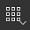
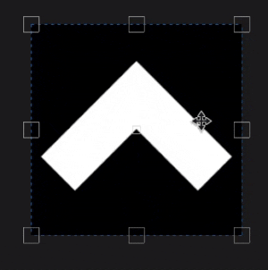

# Proyección de UV

La Proyección de UV del relleno es una proyección 2D que solo funciona en el espacio de textura 2D. Ofrece controles para mover, rotar y escalar una imagen.

## Propiedades

| *Configuración* | *Descripción* |
| --- | --- |
| **Filtrado** | Controla cómo se filtrará la textura o el material. Esta configuración puede afectar al aspecto de la textura cuando se repite varias veces. Con valores de escala altos, el uso de un método de filtrado diferente al predeterminado puede producir resultados más atractivos. Configuración disponible actualmente:<ul data-preserve-html="true"><li data-preserve-html="true"><strong>Bilineal | HQ </strong>: (predeterminado) Filtro bilineal avanzado que intenta mejorar la calidad de la textura cuando los valores de mosaico son altos.</li><li data-preserve-html="true"><strong>Bilineal | Agudo </strong>: Filtro bilineal simple que suaviza ligeramente la textura pero intenta conservar los detalles.</li><li data-preserve-html="true"><strong>Más cercano a </strong>: Sin filtrado, útil si el filtrado bilineal proporciona un resultado borroso y rompe detalles precisos. Puede introducir suavizado en la textura.</li></ul> |
| **Envolvimiento de UV** | Controla cómo debe repetirse el material/imagen proyectado dentro de la forma de proyección. Los valores posibles son:<ul data-preserve-html="true"><li data-preserve-html="true"><strong>Ninguno</strong> : No hay repetición de la proyección.</li><li data-preserve-html="true"><strong>Repetir horizontalmente</strong> : Repetir sólo horizontalmente.</li><li data-preserve-html="true"><strong>Repetir verticalmente</strong> : Repetir sólo verticalmente.</li><li data-preserve-html="true"><strong>Repetir</strong> (predeterminado) : Repetir horizontal y verticalmente.</li></ul> 

 |

### Transformación UV

Los ajustes de transformación UV controlan la textura/el material dentro de la proyección.

<table data-preserve-html="true" style="width: 100.0%;"><colgroup> <col style="width: 40.0%;"/> <col style="width: 20.0%;"/> <col style="width: 40.0%;"/> </colgroup><tbody><tr><th>Modo de escala</th><th>Configuración</th><th>Descripción</th></tr><tr><td>
<strong>Mosaico</strong> (predeterminado)<strong>  </strong>

Permite definir manualmente la cantidad repetida para la textura actual.
</td><td><strong>Mosaico</strong></td><td>Controla el número de veces que se repite la textura.</td></tr><tr><td rowspan="2">  </td><td colspan="1"><strong>Rotación</strong></td><td colspan="1">Controla el ángulo en el que la textura se proyecta sobre la malla.</td></tr><tr><td colspan="1"><strong>Desplazamiento</strong></td><td colspan="1">Controla desde dónde se proyectará la textura. El valor predeterminado significa que el centro de textura se encuentra en el centro de los UV de la malla.</td></tr><tr><th colspan="1"> </th><th colspan="1"> </th><th colspan="1"> </th></tr><tr><td rowspan="4">
<strong>Tamaño físico</strong>

Ajuste automático de una textura según el tamaño de malla y el tamaño físico incrustado. Utiliza la anchura y la longitud (medidas X e Y) para calcular el tamaño físico correcto. La medición Z no se tiene en cuenta.

(Para obtener más información, consulte la [página de documentación] (https://experienceleague.adobe.com/en/docs/substance-3d-painter/using/features/physical-size)
</td><td><strong>Tamaño personalizado</strong></td><td>
Si está activada, permite introducir un tamaño físico manualmente y sustituir el proporcionado por un activo.

Se selecciona automáticamente si no se detecta ningún tamaño físico o si se utilizan varios recursos con diferentes tamaños físicos en la misma capa o efecto.
</td></tr><tr><td colspan="1"><strong>Tamaño (cm)</strong></td><td colspan="1">Los tamaños físicos incrustados se expresan en centímetros. Es posible trabajar con un archivo de malla que se creó utilizando diferentes unidades de medida: conservará las proporciones correctas. Sin embargo, el tamaño del activo actualmente solo se muestra en centímetros.</td></tr><tr><td colspan="1"><strong>Rotación</strong></td><td colspan="1">Controla el ángulo en el que la textura se proyecta sobre la malla.</td></tr><tr><td colspan="1"><strong>Desplazamiento</strong></td><td colspan="1">
Controla desde dónde se proyectará la textura. El valor predeterminado significa que el centro de textura se encuentra en el centro de los UV de la malla.
</td></tr></tbody></table>

## Barra de herramientas contextual

Hay varias configuraciones y herramientas disponibles en la [barra de herramientas contextual](../../interface/toolbars.md) situada en la parte superior de la ventana gráfica que da control sobre el manipulador y la proyección:

| Icono | Nombre | Descripción |
| --- | --- | --- |
| 

 | Mostrar/ocultar manipulador | Si está activado, el manipulador es visible y controlable en la ventana gráfica. |
| 

 | Manipulador maneja el tamaño | Este menú contiene tres ajustes que definen el tamaño de los controles de la transformación en la ventana gráfica:<ul data-preserve-html="true"><li data-preserve-html="true"><strong>Pequeño</strong></li><li data-preserve-html="true"><strong>Medio</strong></li><li data-preserve-html="true"><strong>Grande</strong></li></ul> |
| 

 | Reflejar en X | Voltear la transformación en el eje X. |
| 

 | Espejo en Y | Voltear la transformación en el eje Y. |
| 

 | Restablecer el punto de pivote | Restaure el punto de giro al centro de la transformación. |
| 

 | Restablecer transformación | Restaurar la transformación de la proyección a su estado predeterminado. |

## Manipulador

La Proyección de UV usa un manipulador que solo está disponible en la [vista 2D](../../interface/viewport/2d-view.md).

| Acción | Método abreviado | Descripción |
| --- | --- | --- |
| **Traducir** | Clic del ratón | Haga clic y arrastre cualquier área dentro de la transformación para moverla. 

 |
| **Traducir restringido** | MAYÚS+Clic del ratón | Haga clic y arrastre cualquier área dentro de la transformación mientras presiona y mantiene el método abreviado para moverla a lo largo de un solo eje. El eje puede ser horizontal o vertical y estar alineado con la cámara, según la dirección del ratón. 

 |
| **Rotación** | Clic del ratón | Hacer clic y arrastrar desde fuera de la transformación permite rotarla. Si se mueve el punto de giro, también se puede cambiar el punto de origen de rotación.   <table> <tr style="border: 0;"> <td style="border: 0;" valign="top">  

  </td> <td style="border: 0;" valign="top">  

  </td> </tr> </table> |
| **Restricción de rotación** | MAYÚS+Clic del ratón | Hacer clic y arrastrar desde fuera de la transformación mientras se pulsa y mantiene el método abreviado permite girarlo solo cada 45 grados. 

 |
| **Escala** | Clic del ratón | Hacer clic y arrastrar cualquier control del manipulador permite deformar la transformación.   <table> <tr style="border: 0;"> <td style="border: 0;" valign="top">  

  </td> <td style="border: 0;" valign="top">  

  </td> </tr> </table> |
| **Escala restringida** | MAYÚS+Clic del ratón | Al presionar y mantener el método abreviado mientras se arrastra un control, la transformación se ve forzada a mantener su proporción.   <table> <tr style="border: 0;"> <td style="border: 0;" valign="top">  

  </td> <td style="border: 0;" valign="top">  

  </td> </tr> </table> |
| **Escala reflejada** | CTRL+Clic del ratón | Al mover cualquier control mientras se pulsa el método abreviado, los otros controles realizan un movimiento similar. Permite deformar la transformación en simetría alrededor del punto de giro.   <table> <tr style="border: 0;"> <td style="border: 0;" valign="top">  

  </td> <td style="border: 0;" valign="top">  

  </td> </tr> </table> |
| **Escala reflejada y restringida** | MAYÚS+CTRL+Clic del ratón | La combinación de ambos métodos abreviados permite deformar la transformación en simetría al tiempo que se conserva la proporción. 

 |
