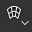
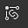
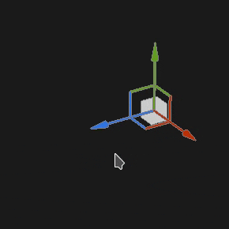
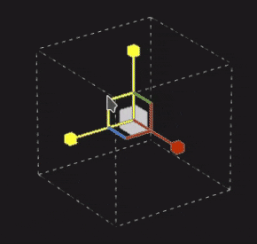
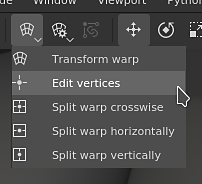

# Proyección de deformación

La proyección de deformación del relleno es una proyección 3D que permite deformar una textura editando los puntos de una cuadrícula. Se puede utilizar para ajustar patrones y logotipos en una superficie no plana.

## Configuración rápida

Es posible configurar rápidamente una capa con la proyección de deformación arrastrando y soltando un recurso desde la [ventana de Recursos](../../interface/assets/assets.md) en la malla. Al soltar el ratón se abrirá un menú que permite elegir en qué canal se debe asignar el recurso.

Los tipos de recursos compatibles son:

* **Alpha**
* **Procedimiento**
* **Textura**
* **Material** (requiere presionar la tecla ALT)

## Propiedades

| Configuración | Descripción |
| --- | --- |
| **Filtrado** | Controla cómo se filtrará la textura o el material. Este ajuste puede afectar al aspecto de la textura cuando se repite varias veces. Si los valores de escala son altos y se utiliza un filtro diferente al predeterminado, el resultado puede ser más atractivo. Configuración actual disponible:<ul data-preserve-html="true"><li data-preserve-html="true"><strong>HQ `\|` bilineal</strong> (predeterminado): Filtro bilineal avanzado que intenta mejorar la calidad de la textura cuando los valores de mosaico son altos.</li><li data-preserve-html="true"><strong>Bilineal `\|` Agudo</strong>: Filtro bilineal simple que suaviza ligeramente la textura pero intenta conservar los detalles.</li><li data-preserve-html="true"><strong>Más cercano</strong>: Sin filtrado, útil si el filtrado bilineal proporciona un resultado borroso y rompe detalles precisos. Puede introducir el suavizado en la textura.</li></ul> |
| **Envolvimiento de UV** | Controle cómo se repite la textura dentro de la proyección. Los valores posibles son:<ul data-preserve-html="true"><li data-preserve-html="true"><strong>Ninguno</strong>: la textura no se repite. Cualquier cosa fuera de la textura es negro/transparente.</li><li data-preserve-html="true"><strong>Repetir horizontalmente</strong>: la textura solo se repite horizontalmente.</li><li data-preserve-html="true"><strong>Repetir verticalmente</strong>: la textura solo se repite verticalmente.</li><li data-preserve-html="true"><strong>Repetir</strong> (predeterminado): la textura se repite en ambos ejes.</li></ul> |
| **Recorte de forma** | Defina si la textura proyectada debe ser visible fuera del área de proyección. Los valores posibles son:<ul data-preserve-html="true"><li data-preserve-html="true"><strong>Proyecto recortado a la forma</strong>: la proyección está confinada dentro del área de proyección.</li><li data-preserve-html="true"><strong>La proyección se extiende fuera de la forma</strong> (predeterminado): la proyección continúa más allá del área de proyección.</li></ul> 

 |
| **profundidad de proyección** | Controle hasta dónde llega la proyección a lo largo de su eje Z. Este ajuste ayuda a alcanzar la superficie de la malla cuando el punto de la cuadrícula o el plano de proyección están demasiado lejos.Las flechas verdes indican la dirección y la distancia de la proyección para cada punto de la cuadrícula. 

 **Alerta:** Un valor alto puede afectar gravemente al rendimiento. Se recomienda mantener este parámetro bajo tanto como sea posible. |
| **Selección de profundidad** | Desvanecer la proyección según la distancia. Hay un parámetro disponible:<ul data-preserve-html="true"><li data-preserve-html="true"><strong>Dureza</strong>: controle lo dura o suave que es la transición de atenuación.</li></ul> 

 |

### Transformación UV

Los ajustes de transformación UV controlan la textura/material dentro de la proyección.

<table data-preserve-html="true" style="width: 100.0%;"><colgroup> <col style="width: 40.0%;"/> <col style="width: 20.0%;"/> <col style="width: 40.0%;"/> </colgroup><tbody><tr><th>Modo de escala</th><th>Configuración</th><th>Descripción</th></tr><tr><td>
<strong>Mosaico</strong> (predeterminado)<strong>  </strong>

Permite definir manualmente la cantidad repetida para la textura actual.
</td><td><strong>Mosaico</strong></td><td>Controla el número de veces que se repite la textura.</td></tr><tr><td rowspan="2">  </td><td colspan="1"><strong>Rotación</strong></td><td colspan="1">Controla el ángulo en el que la textura se proyecta sobre la malla.</td></tr><tr><td colspan="1"><strong>Desplazamiento</strong></td><td colspan="1">Controla desde dónde se proyectará la textura. El valor predeterminado significa que el centro de textura se encuentra en el centro de los UV de la malla.</td></tr><tr><th colspan="1"> </th><th colspan="1"> </th><th colspan="1"> </th></tr><tr><td rowspan="4">
<strong>Tamaño físico</strong>

Ajuste automático de una textura según el tamaño de malla y el tamaño físico incrustado. Utiliza la anchura y la longitud (medidas X e Y) para calcular el tamaño físico correcto. La medición Z no se tiene en cuenta.

(Para obtener más información, consulte la [página de documentación] (https://experienceleague.adobe.com/es/docs/substance-3d-painter/using/features/physical-size)
</td><td><strong>Tamaño personalizado</strong></td><td>
Si está activada, permite introducir un tamaño físico manualmente y sustituir el proporcionado por un activo.

Se selecciona automáticamente si no se detecta ningún tamaño físico o si se utilizan varios recursos con diferentes tamaños físicos en la misma capa o efecto.
</td></tr><tr><td colspan="1"><strong>Tamaño (cm)</strong></td><td colspan="1">Los tamaños físicos incrustados se expresan en centímetros. Es posible trabajar con un archivo de malla que se creó utilizando diferentes unidades de medida: conservará las proporciones correctas. Sin embargo, el tamaño del activo actualmente solo se muestra en centímetros.</td></tr><tr><td colspan="1"><strong>Rotación</strong></td><td colspan="1">Controla el ángulo en el que la textura se proyecta sobre la malla.</td></tr><tr><td colspan="1"><strong>Desplazamiento</strong></td><td colspan="1">
Controla desde dónde se proyectará la textura. El valor predeterminado significa que el centro de textura se encuentra en el centro de los UV de la malla.
</td></tr></tbody></table>

### Configuración de proyección 3D

Los ajustes de proyección 3D controlan la transformación de la proyección en el espacio 3D.

| Configuración | Descripción |
| --- | --- |
| **Desplazamiento** | Posición del origen de la proyección en el espacio 3D. Las unidades se basan en el cuadro delimitador de toda la escena. 0 es el centro de esta caja. |
| **Rotación** | Ángulos en grados para rotar toda la proyección en cada eje. |
| **Escala** | Tamaño de toda la proyección en cada eje. |

## Barra de herramientas contextual

Hay varias configuraciones y herramientas disponibles en la [barra de herramientas contextual](../../interface/toolbars.md) situada en la parte superior de la ventana gráfica que proporciona controles sobre el manipulador y la proyección:

| Icono | Nombre | Descripción |
| --- | --- | --- |
| 

 | Mostrar/ocultar manipulador | Si está activado, el manipulador es visible y controlable en la ventana gráfica para editar la transformación de la proyección o los puntos de la cuadrícula. Si está desactivada, tanto el manipulador como la cuadrícula están ocultos. |
| 

 | Configuración del manipulador | Este menú contiene tres ajustes:<ul data-preserve-html="true"><li data-preserve-html="true"><strong>Tamaño de Manipulador</strong>: controle el tamaño del manipulador en la ventana gráfica.</li><li data-preserve-html="true"><strong>Pasos de cuadrícula</strong>: defina el tamaño del paso al realizar la conversión con una restricción.</li><li data-preserve-html="true"><strong>Pasos angulares</strong>: defina el ángulo del paso al rotar con una restricción.</li></ul> |
| 

 | Menú Deformar edición | Este menú contiene cinco acciones:<ul data-preserve-html="true"><li data-preserve-html="true"><strong>Deformación de transformación</strong>: edite la transformación de deformación. Permite manipular la posición, rotación y escala de la cuadrícula global.</li><li data-preserve-html="true"><strong>Editar vértices</strong>: edite los puntos de la cuadrícula de deformación individualmente (o en grupo).</li><li data-preserve-html="true"><strong>Deformación dividida en sentido transversal</strong>: inicie la herramienta dividir deformación para insertar una nueva división de cuadrícula horizontal y verticalmente.</li><li data-preserve-html="true"><strong>Dividir deformación horizontalmente</strong>: inicie la herramienta dividir deformación para insertar una nueva división de cuadrícula horizontalmente.</li><li data-preserve-html="true"><strong>Dividir deformación verticalmente</strong>: inicie la herramienta dividir deformación para insertar una nueva división de cuadrícula verticalmente.</li></ul> |
| 

 | Ajustes de proyección de deformación | Este menú reagrupa los ajustes que afectan solo a la proyección de deformación actual:<ul data-preserve-html="true"><li data-preserve-html="true"><strong>Fila y columnas</strong>: especifique el número de divisiones que tiene la cuadrícula de deformación. Este ajuste solo se puede editar si no se ha modificado ningún punto de la cuadrícula.</li><li data-preserve-html="true"><strong>Tamaño de identificador</strong>: defina el tamaño de los puntos de cuadrícula en el modo <strong>Editar vértices</strong>.</li><li data-preserve-html="true"><strong>Color de cuadrícula</strong>: defina el color de las líneas de la cuadrícula de deformación.</li></ul> |
| 

 | Tangentes automáticas | Si está activada, alinee las tangentes de un punto automáticamente hacia sus puntos vecinos cuando se mueva. |
| 

 | Manipulador de traducción | Permita mover la proyección o los puntos de la cuadrícula a lo largo de los ejes principales (X, Y, Z). |
| 

 | Manipulador de rotación | Permita girar la proyección o los puntos de la cuadrícula en el eje principal (X, Y, Z). |
| 

 | Manipulador de escala | Permite escalar la proyección en la escena a lo largo de los ejes principales (X, Y, Z). |
| 

 | Manipulador de superficies | Permita mover los puntos de proyección o de cuadrícula ajustándolos en la superficie del modelo 3D. |
| 

 | espacio del manipulador | Defina en qué espacio se realizan las transformaciones. Valores posibles:<ul data-preserve-html="true"><li data-preserve-html="true"><strong>Espacio local</strong>: los ejes se alinean con la transformación actual.</li><li data-preserve-html="true"><strong>Espacio mundial</strong>: los ejes se alinean con la escena.</li></ul> |
| 

 | Reflejar en X | Voltear la transformación en el eje X. |
| 

 | Espejo en Y | Voltear la transformación en el eje Y. |
| 

 | Reflejar en Z | Voltear la transformación en el eje Z. |
| 

 | Restablecer transformación | Este menú contiene tres acciones:<ul data-preserve-html="true"><li data-preserve-html="true"><strong>Restaurar la transformación global</strong>: restablecer la posición, la rotación y la escala de la proyección a los valores iniciales. Esta acción no afecta a los propios puntos de la cuadrícula.</li><li data-preserve-html="true"><strong>Restablecer todos los vértices</strong>: restablezca todas las posiciones y tangentes de los puntos de rejilla de la rejilla de deformación.</li><li data-preserve-html="true"><strong>Restablecer vértices seleccionados</strong>: restablezca la posición y las tangentes solo de los puntos seleccionados de la cuadrícula de deformación.</li></ul> |

## Manipulador

Este manipulador de proyección solo está disponible en el [punto de visión 3D](../../interface/viewport/3d-view.md).

| Acción | Método abreviado | Descripción |
| --- | --- | --- |
| **Traducción** | Clic del ratón | Con el manipulador de Traducción, al hacer clic en los ejes se mueve la proyección:<ul data-preserve-html="true"><li data-preserve-html="true"><strong>Un eje</strong>: solo se mueve en una dirección de la proyección.</li><li data-preserve-html="true"><strong>Dos ejes</strong>: mueva la proyección en los planos alineados con los ejes.</li><li data-preserve-html="true"><strong>Tres ejes</strong>: mueva la proyección en el espacio de la cámara (plano orientado).</li></ul>   <table> <tr style="border: 0;"> <td style="border: 0;" valign="top">  

  </td> <td style="border: 0;" valign="top">  

  </td> <td style="border: 0;" valign="top">  

  </td> </tr> </table> |
| **Traducción restringida** | MAYÚS+Clic del ratón | Con el manipulador de traslación, mueva la proyección a lo largo de los ejes seleccionados, pero solo a intervalos específicos (paso a paso). El tamaño del intervalo se define mediante la configuración del manipulador. 

 |
| **Rotación** | Clic del ratón | Con el manipulador Rotación, al hacer clic en uno de los ejes, se gira la proyección. Haga clic entre los ejes para poder rotar todos los ejes al mismo tiempo.   <table> <tr style="border: 0;"> <td style="border: 0;" valign="top">  

  </td> <td style="border: 0;" valign="top">  

  </td> </tr> </table> |
| **Restricción de rotación** | MAYÚS+Clic del ratón | Con el manipulador de rotación, hacer clic en un eje para rotar la proyección solo se producirá a intervalos específicos. El paso se define mediante un ángulo a través de los ajustes del manipulador. 

 |
| **Escala** | Clic del ratón | Con el manipulador Escala (Scale), al pulsar en un manejador de eje se cambia el tamaño de la proyección a lo largo del eje dado.   <table> <tr style="border: 0;"> <td style="border: 0;" valign="top">  

  </td> <td style="border: 0;" valign="top">  

  </td> <td style="border: 0;" valign="top">  

  </td> </tr> </table> |
| **Escala restringida** | MAYÚS+Clic del ratón | Con el manipulador Escala, al hacer clic en un manejador de eje mientras mantiene el método abreviado, la proyección cambiará de tamaño en pasos. El tamaño del paso es el mismo que para el manipulador de traducción. 

 |
| **Superficie** | Clic del ratón | Con el manipulador Superficie (Surface), si se pulsa y se arrastra sobre el modelo 3D, se ajustará a la superficie. 

 **Nota:** Este manipulador solo está disponible con los tipos de proyección **Planar** y **Deformar**. |

## Edición de puntos de cuadrícula

La proyección de deformación se representa mediante un plano y una cuadrícula de puntos. Cada punto se puede modificar para que la proyección se ajuste mejor al modelo 3D, pero también para distorsionar la textura.

Para editar el punto de cuadrícula, cambie el modo de edición a **Editar vértices** desde la barra de herramientas contextual:

>[!NOTE]
>
> Hay un método abreviado de teclado disponible para cambiar rápidamente entre **Transformar deformación** y **Editar vértices**. Vea **Alternar modo de edición de deformación** en la página [Accesos directos](../../interface/settings/shortcuts.md).

### Selección de puntos

| Acción | Descripción |
| --- | --- |
| 

 | <ul data-preserve-html="true"><li data-preserve-html="true">Un solo clic en un punto lo seleccionará.</li><li data-preserve-html="true">Si hace clic fuera de un punto, el manipulador anulará la selección de puntos.</li><li data-preserve-html="true">Hacer clic en los puntos mientras presiona <strong>MAYÚS</strong> permite seleccionar varios puntos.</li><li data-preserve-html="true">Al hacer clic en un punto mientras presionas <strong>CTRL</strong>, puedes anular la selección de este punto y no del otro.</li></ul> |
| 

 | <ul data-preserve-html="true"><li data-preserve-html="true">Hacer clic y arrastrar permiten hacer una selección rectangular. Los puntos dentro del rectángulo se seleccionarán cuando se suelte el ratón.</li><li data-preserve-html="true">Al hacer clic y arrastrar mientras presionas <strong>MAYÚS</strong>, puedes agregar más puntos a la selección actual.</li><li data-preserve-html="true">Hacer clic y arrastrar mientras se presiona <strong>CTRL</strong> permite quitar puntos de la selección actual.</li></ul> |

### Puntos de movimiento

| Acción | Descripción |
| --- | --- |
| 

 | <ul data-preserve-html="true"><li data-preserve-html="true">Utilice el manipulador Traducción para mover un punto.</li><li data-preserve-html="true">Utilice el manipulador Superficie (Surface) para desplazarse por el punto de la superficie del modelo 3D.</li></ul> |
| 

 | <ul data-preserve-html="true"><li data-preserve-html="true">Haga clic y arrastre un punto para moverlo rápidamente sin tener que seleccionarlo primero.</li><li data-preserve-html="true">Al pulsar y arrastrar un punto, se moverá como el manipulador de superficie.</li><li data-preserve-html="true">Al hacer clic y arrastrar un punto al presionar <strong>CTRL</strong>, se moverá como el manipulador de traducción (en el espacio de la cámara en tres ejes).</li></ul> |

### Ajuste de tangentes

La cuadrícula de proyección de deformación es un [parche Bezier](https://en.wikipedia.org/wiki/B%C3%A9zier_surface), lo que significa que cada punto tiene su propio conjunto de tangentes para controlar la curva de las líneas que unen puntos. El ajuste de tangentes proporciona más control sobre cómo se deforma la textura.

| Acción | Descripción |
| --- | --- |
| 

 | <ul data-preserve-html="true"><li data-preserve-html="true">Para modificar las tangentes de un punto (mostradas en rojo), simplemente seleccione el punto dado y luego utilice el manipulador Rotación o Escala.</li></ul> |

>[!NOTE]
>
> La tangente se restablecerá y ajustará automáticamente al mover puntos si está habilitada la opción **Tangentes automáticas** de la barra de herramientas contextual.
> 
> 

### Aumentar o reducir el número de puntos

La cuadrícula de deformación se puede subdividir para aumentar el número de puntos y proporcionar más control sobre cómo deformar la textura.

| Acción | Descripción |
| --- | --- |
| 

 | <ul data-preserve-html="true"><li data-preserve-html="true">Divida la cuadrícula por filas y columnas en el menú Ajustes de deformación. (Esto solo es posible si no se ha movido ningún punto)</li><li data-preserve-html="true">Subdivida la cuadrícula con una de las tres herramientas de división.</li><li data-preserve-html="true">Cualquiera de las herramientas de división se puede cancelar pulsando <strong>Escape</strong>.</li></ul> |
