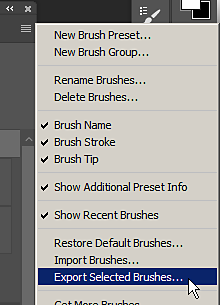

# Exportación de ajustes preestablecidos de pincel desde Photoshop

Los archivos ABR (ajustes preestablecidos de Photoshop Brush) solo se pueden crear a partir de Adobe Photoshop. Para crear un archivo ABR con ajustes preestablecidos, solo tiene que seguir los pasos siguientes:

1. <b>Abrir Adobe Photoshop.</b>

   Los archivos ABR solo se pueden crear desde Photoshop.
1. <b>Abra el panel Pinceles.</b>

   Abra el panel Pinceles desde <b>Ventana > Pinceles. </b>

   {width="500px"}
1. <b>Seleccione los ajustes preestablecidos (o grupos) de pinceles que desea exportar.</b>

   Mantenga presionada la tecla CTRL para seleccionar varios pinceles o ajustes preestablecidos.

   {width="500px"}
1. <b>Exportar a un archivo ABR.</b>

   Abra el menú de configuración de la ventana del pincel y seleccione <b>Exportar pinceles seleccionados</b>.

   Aparecerá un cuadro de diálogo en el que se le pedirá un nombre de archivo y una ubicación para guardar el archivo ABR exportado.

   
