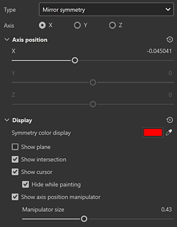

# Reflejar simetría

La simetría especular es una simetría basada en ejes que se puede activar en la barra de herramientas contextual :

## Utilice el manipulador para colocar el eje de simetría

Puede acceder a la configuración de visualización de Simetría desde el <b>botón de configuración de Simetría</b> de la barra de herramientas contextual en la parte superior de la vista 3D. En la configuración de visualización, puede habilitar y personalizar el manipulador. Arrastre los controles del manipulador en la vista 3D para cambiar la posición del eje de simetría.

## Reflejar parámetros de simetría

{width="300px"}

| *Parámetro* | *Descripción* |
| --- | --- |
| <b>Eje</b> | Define qué eje de la escena se utiliza para realizar la simetría. |
| <b>Posición del eje</b> | Define el desplazamiento del eje en el proyecto. Este valor se puede editar con los reguladores o con el manipulador (véase más arriba). |
| <b>Mostrar plano</b> | Si se activa, se mostrará un plano transparente en la ventana gráfica para delimitar cada lado de la simetría reflejada. |
| <b>Mostrar intersección</b> | Si se activa, se dibujará una línea en la malla de la ventana gráfica para delimitar cada lado de la simetría reflejada. |
| <b>Mostrar cursor</b> | Si se habilita, se mostrará un segundo cursor al otro lado de la simetría para indicar cuándo se realizará el dibujo. |
| <b>Ocultar mientras se pinta</b> | Si se habilita, el segundo cursor se ocultará mientras se pinta (hasta que se suelte el clic del ratón). |
| <b>Tamaño del manipulador</b> | Controla el tamaño del Manipulador en la ventana gráfica. |
