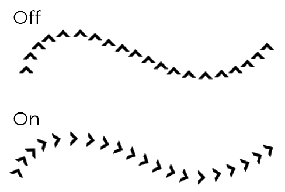
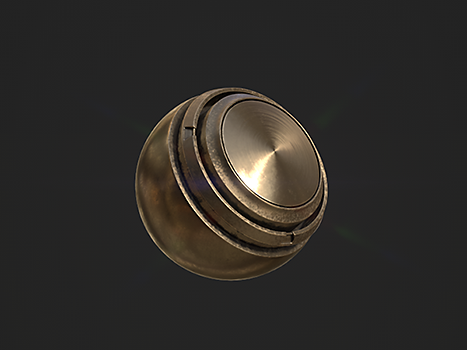
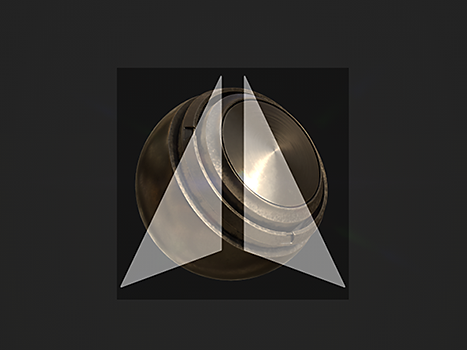
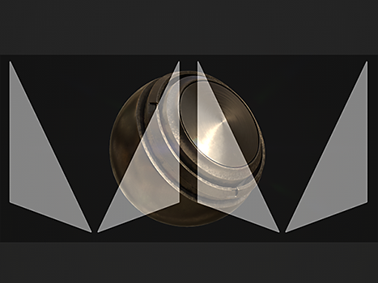
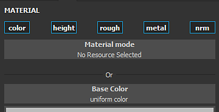

# Pincel

La herramienta Pintura es la herramienta predeterminada de Substance 3D Painter para aplicar colores y propiedades de material en una malla 3D. Tiene parámetros específicos que se pueden editar a través de [Propiedades](../../interface/properties.md) .

La herramienta Pintura simula trazos de pincel mediante distintos comportamientos y ajustes para dar la sensación de pintar en la malla 3D.

## Barra de herramientas

[Barras de herramientas](../../interface/toolbars.md) mostrará los siguientes accesos directos (consulte su explicación en las siguientes secciones):

* Tamaño
* Flujo
* Opacidad del trazo
* Espaciado

Hay disponibles métodos abreviados adicionales que son comunes en otras herramientas :

* [Ratón perezoso](../lazy-mouse.md)
* [Simetría](../symmetry/symmetry.md)

## Vista previa

En la parte superior de [Propiedades](../../interface/properties.md) se encuentran las vistas previas de pinceles y materiales. Se pueden utilizar para observar rápidamente cómo se configura la herramienta actual.

| *Nombre* | *Descripción* |
| --- | --- |
| **Vista previa del pincel** | La vista previa del pincel muestra el comportamiento del pincel en función de los parámetros del pincel. Es posible hacer clic en la previsualización para dibujar un trazo personalizado.   <table> <tr style="border: 0;"> <td style="border: 0;" valign="top">  

  </td> <td style="border: 0;" valign="top">  

  </td> </tr> </table>   **Nota:** La vista previa del pincel no admite la presión del lápiz. |
| **Vista previa de material** | La vista previa del material muestra las propiedades del material que se está usando para pintar. Es posible hacer clic en la previsualización para girar la iluminación y ver mejor cómo se comportará el material antes de pintar.   <table> <tr style="border: 0;"> <td style="border: 0;" valign="top">  

  </td> <td style="border: 0;" valign="top">  

  </td> </tr> </table> |

## Pincel

Los parámetros de Pincel son los que definen el aspecto y la sensación del trazo del pincel cuando se realiza en la malla 3D.

>[!NOTE]
>
> Algunos parámetros se pueden controlar con la presión del lápiz cuando se utiliza una tableta gráfica. Esta información también se puede guardar en [Ajustes preestablecidos](../presets/presets.md) .\
> Haga clic en el botón dedicado para activar o desactivar la presión :
> 
> 

| Nombre | Descripción |
| --- | --- |
| **Tamaño** | Controla el tamaño de los sellos dentro de un trazo de pincel. El tamaño del pincel es relativo y se puede cambiar en función del espacio relativo definido en (consulte el parámetro Espacio de tamaño de alineación a continuación). *Este parámetro se puede controlar mediante la presión del lápiz.* |
| **Flujo** | Intensidad u opacidad de los sellos individuales dentro del trazo del pincel. *Este parámetro se puede controlar mediante la presión del lápiz.* |
| **Opacidad del trazo** | Opacidad global máxima de una pincelada. A diferencia del parámetro Flujo, la opacidad del trazo no se puede controlar mediante la presión de la pluma, ya que se aplica al final del proceso de dibujo del trazo.Diferencia entre el flujo y la opacidad del trazo :<ul data-preserve-html="true"><li data-preserve-html="true"><strong> dejó </strong> : Flujo al 50 %, Opacidad del trazo al 100 %</li><li data-preserve-html="true"><strong> Derecha </strong> : Flujo al 100 %, Opacidad del trazo al 50 %</li></ul> 

 **Nota:** Es posible continuar un trazo anterior como en la animación anterior presionando el método abreviado &quot;A&quot;. |
| **Espaciado** | Distancia entre los sellos individuales de una pincelada. Los valores pequeños permiten crear líneas continuas, pero son más amplios de calcular, ya que dibujan mucho más sellos en total. Los valores altos permiten crear un espacio entre el sello que puede ser más adecuado para patrones específicos (como Uñas en madera). |
| **Ángulo** | Orientación de los sellos dentro de la pincelada. Resulta útil girar el Alpha si no está bien alineado. Se puede combinar con Seguir trazado. |
| **Seguir ruta** | Orienta los sellos dentro del trazo del pincel para seguir la dirección de pintura. 

 **Nota:** Para calcular la dirección del trazo, Substance 3D Painter compara el sello anterior con el actual, por lo que si se habilita Seguir trazado con un solo clic para pintar no se obtendrán resultados. Se requiere un mínimo de dos sellos para pintar un trazo de pincel con esta función activada. |
| Variación de tamaño **1&rbrace;** | Aplique un valor de tamaño aleatorio por sello dentro del trazo del pincel. Un valor de 0 significa que no hay aleatoriedad; un valor de 1 significa total aleatoriedad. 

 |
| **Variación del flujo** | Aplique un valor de flujo aleatorio por sello dentro del trazo de pincel. Un valor de 0 significa que no hay aleatoriedad; un valor de 1 significa total aleatoriedad. 

 |
| **Variación del ángulo** | Aplique un ángulo de rotación adicional aleatorio por sello dentro del trazo del pincel. Un valor de 0 significa que no hay aleatoriedad; un valor de 1 significa total aleatoriedad. 

 |
| **Variación de posición** | Aplique un desplazamiento de posición aleatorio por sello dentro del trazo del pincel. Un valor de 0 significa que no hay aleatoriedad; un valor de 1 significa total aleatoriedad. 

 |
| **Alineación** | Determina cómo se proyectarán/orientarán los sellos dentro del trazo del pincel en la superficie de la malla 3D. Están disponibles los siguientes valores:<ul data-preserve-html="true"><li data-preserve-html="true"><strong> Cámara </strong> : Orientar el sello hacia el punto de vista de la ventana gráfica</li><li data-preserve-html="true">Tangente de <strong> | Ajustar (predeterminado) </strong> : Oriente el sello para alinearlo con la superficie de la malla 3D. El sello también se deformará para ajustarse a la superficie.</li><li data-preserve-html="true">Tangente de <strong> | Plano </strong> :  Oriente el sello para alinearlo con la superficie de la malla 3D. El sello se desvanecerá si su borde está demasiado lejos de la superficie de la malla 3D. </li><li data-preserve-html="true"><strong> UV </strong> : Oriente el sello en función de las UV de la malla 3D.</li></ul> |
| **Sacrificio de cara posterior** | Permite ignorar las superficies de la malla 3D que no estén alineadas con el sello. Para calcular qué partes de la malla 3D deben ignorarse, el motor de pintura observa la normal en la superficie de la malla 3D y compara su ángulo con el valor definido. |
| **Espacio de tamaño** | Controla en qué espacio relativo se calcula el tamaño del pincel. Los valores posibles son:<ul data-preserve-html="true"><li data-preserve-html="true">Objeto <strong> (predeterminado) </strong> : El tamaño del pincel se sincroniza con el tamaño de malla 3D. Si mueve la cámara en la ventana gráfica, el tamaño se verá afectado para mantenerlo en relación con la malla 3D.</li><li data-preserve-html="true">Ventana gráfica </strong> de <strong> : El tamaño del pincel está vinculado a la ventana gráfica. Cambiar el tamaño de la interfaz afectará al tamaño del pincel. Mover la cámara no tendrá ningún efecto.</li><li data-preserve-html="true"><strong> Textura </strong> : El tamaño del pincel está vinculado al nivel de zoom de la ventana gráfica 2D.</li></ul> |

## Alfa

El Alpha es la máscara de escala de grises que se aplica sobre cada sello dentro del trazo del pincel. Puede ser un archivo de Substance o un mapa de bits.

>[!NOTE]
>
> Si un gráfico de Substance tiene expuesto un parámetro &quot;hardness&quot; (identificador), se puede controlar con la dureza [Shortcuts](../../interface/settings/shortcuts.md).

## Física

Las propiedades de Física permiten controlar las partículas que se proyectan al pintar.

De forma predeterminada, las propiedades de Física no están disponibles, pero se pueden activar de dos formas:

* Cambiando la herramienta a &quot;Física&quot; en [Barras de herramientas](../../interface/toolbars.md) (o mediante el método abreviado de teclado).
* Haciendo clic en un ajuste preestablecido de pincel de objetos en la ventana [Activos](../../interface/assets/assets.md).

## Plantilla

La galería de símbolos es una máscara adicional de escala de grises para el trazo del pincel. A diferencia del alfa que se aplica a cada sello individual, la galería de símbolos es una máscara global aplicada desde el punto de vista de [Ventana gráfica](../../interface/viewport/viewport.md).

>[!NOTE]
>
> Es posible restablecer la transformación de galería de símbolos pulsando la tecla **S** y haciendo clic en el botón &quot;**Restablecer**&quot; situado en la parte superior derecha de la ventana gráfica:
> 
> 

| *Modo* | *Ventana* |
| --- | --- |
| **No se cargó ningún recurso** | Cuando no se carga ningún recurso, la galería de símbolos no tiene ningún efecto. 

 **Nota:** Es posible deshabilitar temporalmente la máscara de galería de símbolos sin quitar el recurso presionando y manteniendo [Accesos directos](../../interface/settings/shortcuts.md) &quot;N&quot;. |
| **Mover galería de símbolos** | Para mover la galería de símbolos, pulsa la tecla **S**, haz clic y arrastra con el botón **Middle Mouse**. 

 |
| **Rotar galería de símbolos** | Para girar la galería de símbolos, pulsa la tecla **S**, haz clic y arrastra con el botón **Ratón izquierdo**. Además, al pulsar la tecla **Mayús**, se puede ajustar la rotación cada **90 grados** . 

 |
| **Cambiar tamaño de galería de símbolos** | Para cambiar el tamaño de la galería de símbolos, pulsa la tecla **S**, haz clic y arrastra con el botón **Ratón derecho**. 

 |

El ajuste del modo de mosaico controla cómo se repite la máscara de galería de símbolos en la ventana gráfica (este ajuste también afecta a las texturas):

| *Modo de segmentación* | *Descripción* |
| --- | --- |
| **Sin segmentación (predeterminado)** | La máscara de plantilla no se repite. 

 |
| **Mosaico horizontal** | Repita la máscara de galería de símbolos solo en el eje horizontal. 

 |
| **Mosaico vertical** | Repita la máscara de galería de símbolos solo en el eje vertical. 

 |
| **Mosaico H y V** | Repita la máscara de galería de símbolos en los ejes horizontal y vertical. 

 |

## Material

Un material se compone de varios canales, cada uno de los cuales conserva propiedades específicas. La lista de canales depende de los definidos en [Configuración del conjunto de texturas](../../interface/texture-set/texture-set-settings.md) .

El botón **Modo material** es una forma fácil de cargar archivos de Substance o un ajuste preestablecido para asignar y editar rápidamente varios canales a la vez.

Hacer clic en un botón de canal lo seleccionará o deseleccionará. Cuando se anula la selección de la propiedad del canal, esta no se puede modificar y no se utilizará durante el proceso de pintura.

