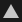

# Relleno poligonal

La herramienta **Relleno de polígono** () le permite dibujar máscaras rápidamente convirtiendo los polígonos seleccionados en una máscara de píxeles. Puede parecer una herramienta de selección 3D de otras aplicaciones de 3D CC, pero en realidad es una herramienta de relleno de pintura que genera datos de píxeles. Eso significa seleccionar y anular la selección de las obras mediante su uso para la pintura de blanco o negro.

La herramienta Relleno poligonal funciona en [Capas de pintura](../../interface/layer-stack/layer-stack.md), pero está limitada a solo color base y no está diseñada para este fin. [Utilícelo solo para máscaras](../../interface/layer-stack/masking-and-effects.md).

Dispone de 4 modos de selección:

*  **Relleno de triángulo**: llena los tri de malla individuales.
*  **Relleno de polígono**: rellena polígonos completos. No realiza ninguna acción diferente de Relleno triangular si la malla ya se trianguló al exportar.
* **Relleno de malla**: llena todas las submallas conectadas. Al igual que el modo &quot;subobjeto&quot; en las aplicaciones 3D, rellenará todos los polígonos conectados al que se ha hecho clic.
* **Relleno de fragmentos UV**: llena todo el fragmento UV o &quot;isla&quot;. Funciona como relleno de malla, pero observando polígonos conectados en el espacio UV. El relleno se detiene en los bordes UV.

Estos 4 modos se pueden combinar y cambiar, lo que significa que un uso inteligente le permite marcar y desmarcar rápidamente secciones en una máscara usando el modo de fragmentos de malla y UV.

Los métodos abreviados de teclado (predeterminados) asociados a la herramienta Relleno poligonal son:

* *Clave numérica 4*: selecciona la herramienta Relleno poligonal.
* *X*: Invierte el color actual al pintar máscaras. Cambiará rápidamente negro por blanco. En el modo de pintura de materiales, esta tecla de acceso rápido no tiene efecto.
