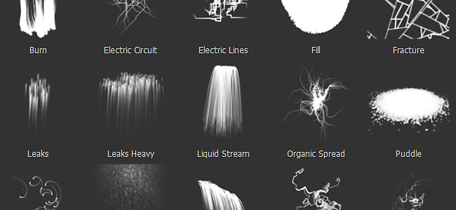

# Versión 2.4

**Substance Painter 2.4** se centra en mejorar la ventana de la estantería, así como la administración de los recursos.

Fecha de lanzamiento : *27 de octubre de 2016*

## Funciones principales

### Nueva ventana de estante con filtrado avanzado

La nueva ventana de la estantería ofrece una **mejor organización** de recursos junto con **nuevas formas de filtrar contenido**. Hemos añadido la posibilidad de crear **ajustes preestablecidos personalizados**, en los que cada ajuste preestablecido tiene su propio filtrado (lo que permite cambiar rápidamente entre diferentes consultas). Estos ajustes preestablecidos también se pueden **aislar en una nueva ventana**, lo que ofrece una forma de tener **varias vistas** de la estantería y no solo una como antes. El filtrado también ofrece una forma de **examinar la jerarquía de carpetas en el disco**, lo que resulta útil al refinar una consulta más general. También hemos mejorado el **menú contextual** (al hacer clic con el botón derecho en un recurso) para proporcionar **más información útil**.

Para crear consultas avanzadas, consulte la parte dedicada de la documentación : [Consultas de búsqueda avanzada](../../interface/assets/advanced-search-queries.md)

### Nueva ventana de recursos de importación

Con el retrabajo de la estantería también **mejoramos la ventana de importación de recursos**. La ventana ahora es más coherente y se puede **llamar de tres formas diferentes**: a través del menú archivo, a través del botón de la ventana de la estantería o, como antes, arrastrando y soltando un recurso en la ventana de la estantería. La nueva ventana permite **establecer rápidamente el uso** de **varios recursos** a la vez, lo que significa que ya no tienes que arrastrar y soltar recursos en la ubicación correcta primero. También hemos agregado la posibilidad de **especificar una ruta de acceso personalizada** para crear subcarpetas con el fin de aprovechar la nueva vista de árbol.

Para obtener más información, consulte la parte dedicada de la documentación : [Agregando recursos mediante la ventana de importación](https://helpx.adobe.com/es/substance-3d/unlisted/documentation/spdoc/adding-content-via-the-import-window-151584824.html)

### Nuevos ajustes preestablecidos de partículas

Hemos **modificado** el anterior **ajuste preestablecido de partículas** para que esté más listo para usar (especialmente el ajuste preestablecido **Lluvia**). También aprovechamos esta oportunidad para **añadir nuevos ajustes preestablecidos** con nuevos comportamientos : Eche un vistazo a **Electric Circuit, Electric Lines, Rococo and Veins Small** !

## Tutorial

Las nuevas funciones y el uso de las estanterías se describen en nuestro último tutorial :

## Notas de la versión

### 2.4.1

(Publicado el 28 de octubre de 2016)

**Solucionado :**

* Bloqueo al crear un proyecto con una plantilla
* Bloqueo al cerrar el cuadro de diálogo de exportación durante una exportación
* [Mac] Errores al guardar el proyecto (error al guardar el ajuste preestablecido de exportación)
* [Shelf] Al crear un nuevo ajuste preestablecido, este se mostrará dos veces
* [Estante] Los ajustes preestablecidos no se pueden cargar en modo de solo lectura sin derechos de administrador

### 2.4.0

(Publicado el 27 de octubre de 2016)

**Agregado :**

* [Shelf] Nueva interfaz para examinar los recursos (vista de árbol, filtros, etc.)
* [Estante] Permitir guardar una búsqueda como ajuste preestablecido
* [Estante] Permite crear una nueva ventana a partir de un ajuste preestablecido
* [Shelf] Nueva interfaz para importar recursos
* [Shelf] No copiar la bandeja algorítmica predeterminada en la carpeta Documentos
* [Shelf] Nuevos ajustes preestablecidos de partículas : Circuito eléctrico, Líneas eléctricas, Rococó, Venas pequeñas
* [Estante] Se han mejorado los ajustes preestablecidos de partículas antiguas para que sean más fáciles de usar (como &quot;Lluvia&quot;).
* [Shelf] Añadir nueva información en el menú contextual de recursos
* [Viewport] Mejora del rendimiento al cargar mapas de entorno
* [Viewport] Añada compatibilidad con mapas de entorno que no sean potencia de dos

**Solucionado :**

* Bloqueo al quitar una máscara
* Bloqueo al pintar después de guardar un ajuste preestablecido
* Bloqueo con el desenfoque de entorno en algunas GPU
* Bloqueo al asignar un recurso incorrecto con el estante mini
* [Estante] Limpiar y guardar las etiquetas y los metadatos de eliminación de los recursos del proyecto
* [Estante] al importar un ajuste preestablecido, sus recursos se mostrarán en el estante
* [Exportar] El mapa normal generado a partir del canal de height tiene una intensidad baja
* [Exportar] Normal desde malla no siempre está presente en el mapa normal final
* [Exportar] La dilación con transparencia puede resultar en ocasiones sin transparencia
* [Scripting] &quot;alg.plugin\_root\_directory&quot; puede devolver una ruta de red truncada
* El botón Bloquear [TextureSet] se activa al volver a abrir proyectos no cuadrados
